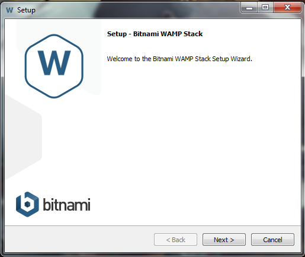
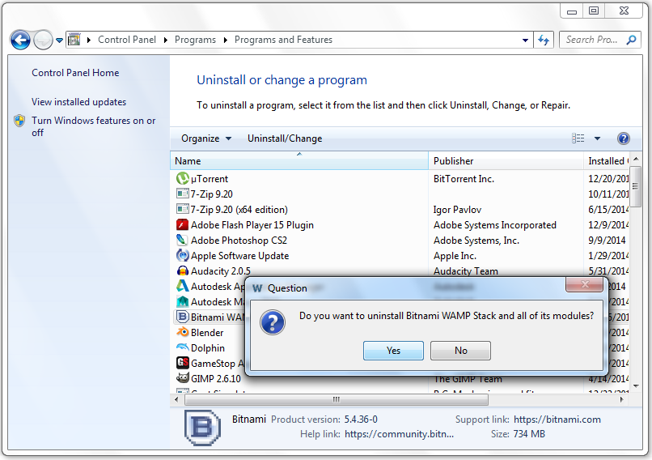
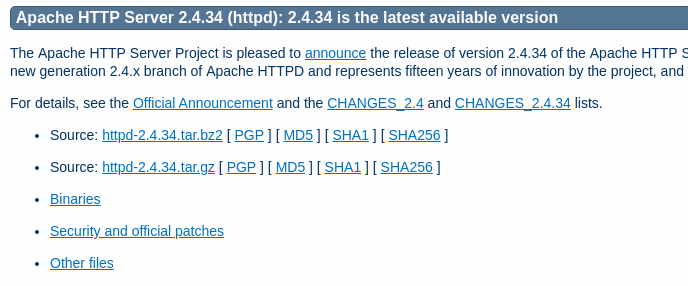
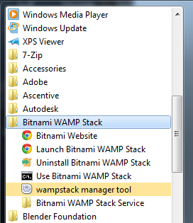
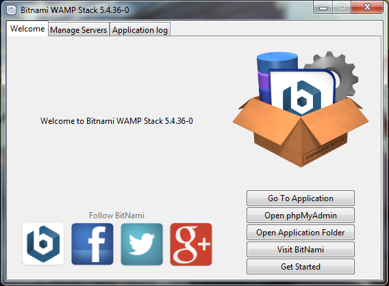
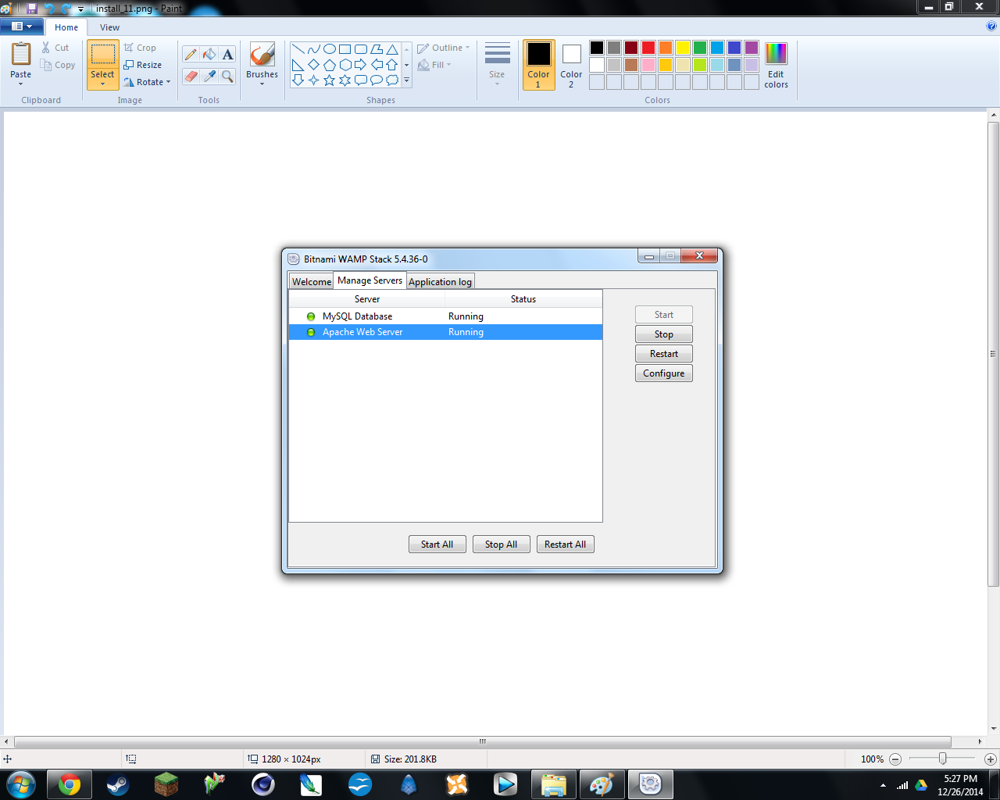
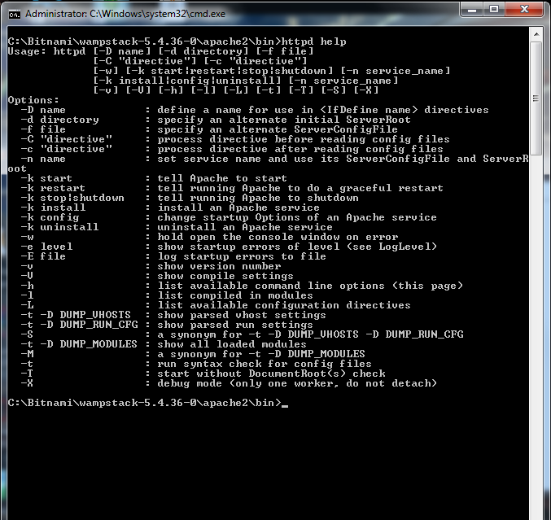
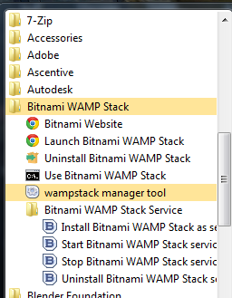

.. raw:: latex

   \part{Getting Started}

.. _Chapter_Installation:

============
Installation
============

.. epigraph::

   We built this city on rock and roll.

   -- Starship, *We Built This City*

.. index:: Installation

.. index:: stanza or stanzata; see containers

For this book to be useful, you need to install the Apache HTTP Server
software. So what better way to start than with a set of recipes
that deal with the installation?

Because most Open Source projects deliver source code, rather than
binaries -- that is, executable files -- there are always
third parties that provide a variety of packages for installing the
product. As a result, there are a number of different ways that you
might end up installing the Apache httpd.

I'll cover the most common ones in this chapter. The differences may be
subtle, but they end up being important to understand before you
move on to future chapters, as they affect things like where files
get put, where configuration directives get put, and what the
default configuration is.

In addition to installing it from a prepackaged kit, of which the
variations are legion, there's always the option of building and
installing it from the source yourself. This has both advantages and
disadvantages; on the one hand, you know **exactly** what
you installed and where you put it. On the other hand, you have to
manage upgrades yourself, and remember to do those upgrades. And
various modules and add-ons that you add later may expect things to
be in certain places, other than those that you have chosen.

While in past times, the httpd project strongly recommended that you always
build from source, times have changed. Many web server
administrators have tens or hundreds of servers to maintain, rather
than one. And security bugs on software such as httpd
need to be addressed in hours, rather than weeks or months,
if you want your servers to remain uncompromised. These, and many
other reasons, have changed the landscape of server maintenance, and
I now recommend that, unless you have a compelling reason to do
otherwise, you install using the packages that are available for your
particular operating system distribution of choice.

Such compelling reasons include, for example, actively hacking on the
httpd source code (or its documentation), or writing your own modules 
for httpd.

This chapter can be roughly divided into four parts. The first set of
recipes deal with installing (and uninstalling) httpd
from various packages. Next, I discuss installing from source. The
third set of recipes are about starting and stopping the server once
it's installed. Finally, there are several recipes dealing with some
basic configuration, and other things you'll need to know to get
started running a server.

.. _Recipe_Which_Version:

Which Version of Apache HTTP Server to Use
------------------------------------------

.. index:: Version

.. index:: Which version

.. _Problem_Which_Version:

Problem
~~~~~~~

You want to know which version of httpd is the right
one for you.

.. _Solution_Which_Version:

Solution
~~~~~~~~

Although there is not necessarily one right answer for everyone,
the Apache HTTP Server development team works very hard to ensure that
every release of the software is the best, most stable, most secure
product that they are able to put together, and each release of the
product fixes problems that were found in earlier releases. So, it's
always our position that the latest version of the server is the one
that you should be running.

That means the latest release of the 2.4.x branch. Check
https://httpd.apache.org/download.cgi for the current release number.

.. _Discussion_Which_Version:

Discussion
~~~~~~~~~~

This question is not always quite as simple as one would like it
to be. I want to give the One Right Answer, but there are sometimes
very good reasons for sticking with an older version of the software.
However, these reasons are less frequently valid than they were a few
years ago.

There are certainly times when you are running a custom module
which is only available for an older version. In these cases, of course you
have to stick with what works. But make sure you have a good reason.

Finally, if you have a large install base running an older version of
the server, it can indeed be a large undertaking to move those
servers to the latest version, with the subtle changes to the
configuration syntax that would need to be made to your
configuration files. You will find, however, that it is worth the
effort.

If, however, you are doing a new Web server installation, there
is absolutely no good reason not to do with the latest version of the
product. You'll benefit from all of the bug fixes, security
patches, and new features that come with the latest release.

.. _See_Also_Which_Version:

See Also
~~~~~~~~

* https://httpd.apache.org/docs/2.4/new_features_2_4.html
          
* The Apache HTTP Server download page at
  https://httpd.apache.org/download.cgi

.. _Recipe_Package_or_source:

Should I install from source, or use a package?
-----------------------------------------------

.. index:: Package or source

.. index:: Installation,Package or source?

.. index:: Should I install from source, or use a package

.. _Problem_Package_or_source:

Problem
~~~~~~~

You need to decide whether to install httpd from
source, or to use a package provided for your particular Operating
System (OS).

.. _Solution_Package_or_source:

Solution
~~~~~~~~

Under almost all circumstances, you'll want to use a package rather
than building from source.

.. _Discussion_Package_or_source:

Discussion
~~~~~~~~~~

The time has long passed where system administrators were encourage to
download, configure, build, and install their services from source code.
While in the past that was a reasonable and responsible thing to do, in
order to ensure that you knew what you were running, and where it came
from, this is no longer either practical or responsible in today's
world.

+Building from source has certain advantages - you can make your own
mind up about things like directory layout and file placement, what
modules you want to build statically vs. dynamically, and so on. But
this very advantage can become a disadvantage very quickly if more
than one person has to maintain a server, and doesn't know, or agree
with, your preferences.

Installing from packages ensures that all of your servers are set up
the same way. It ensures that if someone else needs to work on your
server, they don't have to guess where things are located.

Perhaps more importantly, it ensures that updating a server requires
nothing more than ``apt update`` or ``dnf update``. This will
obtain necessary dependencies (which can change from one version to
another), and take care of all of the details of getting files
installed and configured.

You can also be assured that the version in the package has been
tested on exactly the version of OS that you're running, and any
**per**-platform idiosyncracies have been accounted for.

Finally, using a package from a distribution means that there will be
a community that can help you when things go wrong. If you roll your
own, when things break, you'll probably be told to switch to a tested,
supported, packaged version.

There is one specific certain scenario in which I recommend that you
build from source. This is if you're actively involved in code or documentation  development
of httpd. In that case, you're likely building from the latest development branch out of svn
You'll want to build and test changes as you work on them. If that's your situation, you
probably don't need this chapter.

.. _See_Also_Package_or_source:

See Also
~~~~~~~~

* :ref:`Recipe_Build_from_source`

* :ref:`Recipe_Source_from_svn`

.. _Recipe_Which_MPM:

Which MPM should I use?
-----------------------

.. index:: MPM

.. index:: Which MPM should I use?

.. index:: Multi-processing Module

.. _Problem_Which_MPM:

Problem
~~~~~~~

There are several MPMs (Multi-Processing Modules) available when you
install httpd, and you're not sure which one you
should choose.

.. _Solution_Which_MPM:

Solution
~~~~~~~~

While there is no right answer for this, it's usually best to accept
the default MPM for your particular platform.

These defaults are:

* Unix - event, worker, or prefork, depending on platform
  capabilities. In most cases, the default is event.
* Windows - mpm_winnt

.. _Discussion_Which_MPM:

Discussion
~~~~~~~~~~

MPMs - Multi-Processing Modules - are the code that determines how the
httpd responds to multiple requests at the same
time. Some of these handle multiprocessing with threads, while others
run multiple processes, each of which handles requests. And some MPMs
use a mixture of both approaches.

It is not critical, for the purpose of this recipe, to explain in
great detail how each MPM works, particularly if you're unfamiliar
with the concepts of multi-threading. However, if you do wish to read
about them more, there's more information in the documentation at
https://httpd.apache.org/docs/mpm.html and the pages 
linked from there.

On non-Unix platforms, you don't have a choice of MPM, and so this
question isn't relevant. On Unix plaforms, you have several choices,
based on platform capabilities, and on your particular preferences or
needs.

Here, 'Unix' is used to mean Unix-like operating systems, such as
Linux, BSD, Solaris, macOS, etc.

In the case of Unix, the decision as to which MPM is installed is
based on two questions:

1. Does the system support threads?

2. Does the system support thread-safe polling (Specifically, the
   kqueue and epoll functions)?

If the answer to both questions is 'yes', the default MPM is event.

If The answer to #1 is 'yes', but the answer to #2 is 'no', the
default will be worker.

If the answer to both questions is 'no', then the default MPM will
be prefork.

In practical terms, this means that the default will almost always
be event, as all modern operating systems support these two
features.

.. index:: PHP

.. index:: Threading

.. index:: Worker

.. index:: php-fpm

.. index:: Prefork

.. index:: Event

There is a commonly held belief that if you're running PHP code on
your server, you should run the prefork MPM, due to threading issues.
This is old information, and no longer true. You should instead, in
most cases, be running the event MPM, and running PHP under PHP-FPM,
the PHP FastCGI Process Manager. This is discussed in greater detail
in :ref:`Recipe_php-fpm`.

.. _See_Also_Which_MPM:

See Also
~~~~~~~~

* :ref:`Recipe_php-fpm`

* https://httpd.apache.org/docs/mpm.html

.. _Recipe_Install_redhat:

Installing on RPM-based Linux distributions
-------------------------------------------

.. index:: Installation,Red Hat

.. index:: Installation,RPM

.. index:: dnf

.. index:: RPM

.. index:: Fedora

.. index:: RHEL

.. index:: Installing on RPM-based Linux distributions

.. _Problem_Install_redhat:

Problem
~~~~~~~

You want to install or upgrade httpd on a Linux
distribution which is RPM-based, such as Fedora, AlmaLinux, Rocky Linux, or
Red Hat Enterprise Linux (RHEL).

.. _Solution_Install_redhat:

Solution
~~~~~~~~

Use the **dnf** utility to install the necessary packages:

.. code-block:: text

   % sudo dnf install httpd

If ``httpd`` is already installed, **dnf** will respond with a message
something like:

.. code-block:: text

   Package httpd-2.4.x already installed.
   Nothing to do

To upgrade an existing install, use the ``update`` command, rather than
``install``:

.. code-block:: text

   % sudo dnf update httpd

.. _Discussion_Install_redhat:

Discussion
~~~~~~~~~~

The **dnf** utility manages package installation on Linux distributions in
the Red Hat family - that is, primarily, Fedora, AlmaLinux, Rocky Linux, and Red Hat
Enterprise Linux (RHEL). It knows where to fetch the latest versions of
packages, and it keeps track of what you've got installed, as well as
dependencies between different packages.

In addition to the **httpd** packages, you may wish to install several
packages, including **httpd-devel**, **httpd-manual**, and **httpd-tools**.
**httpd-devel** contains programs related to developing httpd,
as well as utilities such as **apxs**, which you might use to
install third-party modules. **httpd-manual** contains the
documentation (**i.e.**, the manual) for the server. And **httpd-tools**
contains a variety of tools that are useful in managing your httpd,
such as **ab**, the performance tester, **htpasswd**, which
allows you to create password files for authentication, and
**logresolve**, which is used for resolving IP addresses in server log
files.

.. code-block:: text

   % sudo dnf install httpd httpd-devel httpd-manual httpd-tools

Note that packages of httpd have to be prepared by
members of the various Linux distribution communities, and so may
lag behind the latest version of httpd released by
the httpd project. 

Decisions about where to place files on your system are made by the
packagers for the various platforms, and may vary from examples in this
book. For a full description of where Fedora and RHEL
packages place files and directories, you should consult
https://wiki.apache.org/httpd/DistrosDefaultLayout.

.. _See_Also_Install_redhat:

See Also
~~~~~~~~

* https://wiki.apache.org/httpd/DistrosDefaultLayout

* **``man dnf``**

* :ref:`Recipe_Uninstall_redhat`

.. _Recipe_Uninstall_redhat:

Uninstalling on RPM-based distributions
---------------------------------------

.. index:: Uninstall,Red Hat

.. index:: Uninstall,RPM

.. index:: dnf

.. index:: Fedora

.. index:: RHEL

.. index:: Uninstalling on RPM-based distributions

.. _Problem_Uninstall_redhat:

Problem
~~~~~~~

You want to uninstall httpd from a system running an
RPM-based distribution, such as Fedora, AlmaLinux, Rocky Linux, or Red Hat Enterprise
Linux (RHEL).

.. _Solution_Uninstall_redhat:

Solution
~~~~~~~~

Use the **dnf** utility to remove the package

.. code-block:: text

   % sudo dnf remove httpd

.. _Discussion_Uninstall_redhat:

Discussion
~~~~~~~~~~

The above command will remove the **httpd** package, and 
anything else you may have installed which depends on it.

The **dnf** utility, as mentioned above in
:ref:`Discussion_Install_redhat`, manages package installation, and also
keeps track of package dependencies. If you've installed supplementary
packages such as **httpd-manual** or **httpd-devel**, **dnf** will uninstall
them when you uninstall **httpd**, because they depend upon it, and
cannot function without it.

Any files that you have modified, such as configuration files or web
site content, will not be removed.

.. _See_Also_Uninstall_redhat:

See Also
~~~~~~~~

* **man dnf**

* :ref:`Recipe_Install_redhat`

.. _Recipe_Install_debian:

Installing from Debian Packages
-------------------------------

.. index:: Install,Debian

.. index:: apt-get

.. index:: Debian,Install

.. index:: Ubuntu,Install

.. index:: Installing from Debian packages

.. _Problem_Install_debian:

Problem
~~~~~~~

You have a computer running Debian, or one of the Debian-based
distributions, such as Ubuntu, and wish to install httpd.

.. _Solution_Install_debian:

Solution
~~~~~~~~

Using **apt-get**, install the ``apache2`` package:

.. code-block:: text

   % sudo apt-get install apache2

.. _Discussion_Install_debian:

Discussion
~~~~~~~~~~

As with any package-based Linux distribution, it's usually best
to stick with the packages supplied by that distribution in order to
have ease of updates, and maximum interoperability with other packages
installed on the same system. On Debian, this means using **apt-get**.

It's a good idea to install the **apache2-dev** package as well, as it provides
utilities, such as **apxs**, which
will be useful in installing third-party modules, should the need
arise.

Debian has its own unique arragement of configuration files,
which is unlike that of any other distribution. Both modules and sites
(virtual hosts) are arranged in subdirectories so that they can be
enabled or disabled at will using utilities that come with Debian's
version of httpd. For example, to enable a particular module, you
will use the **a2enmod** command, which
makes the appropriate changes to the server configuration file to
cause that module to be loaded. For example:

.. code-block:: text

   % sudo a2enmod rewrite

For a full description of where Debian places its files and
        directories, you should consult https://wiki.apache.org/httpd/DistrosDefaultLayout.

.. _See_Also_Install_debian:

See Also
~~~~~~~~

* https://wiki.apache.org/httpd/DistrosDefaultLayout
          
* **man a2enmod**

* **man a2ensite**

* **man apt-get**   

.. _Recipe_Uninstall_debian:

Uninstalling on Debian
----------------------

.. index:: Uninstall,Debian

.. index:: Debian,Uninstall

.. index:: Ubuntu,Uninstall

.. index:: apt-get

.. index:: Uninstalling on Debian

.. _Problem_Uninstall_debian:

Problem
~~~~~~~

You've installed Apache httpd on your Debian or Ubuntu system and now
  want to uninstall it

.. _Solution_Uninstall_debian:

Solution
~~~~~~~~

Use the _apt_get_ utility to remove the package and its dependencies:

.. code-block:: text

   % sudo apt-get remove apache2

.. _Discussion_Uninstall_debian:

Discussion
~~~~~~~~~~

The above command will remove the **apache2** package, and anything else
you may have installed which depends on it.

**apt** keeps track of package dependencies, so if you've installed
supplementary packages, such as **apache2-dev**, those will also be
uninstalled, since they won't work without the base package.

Any files that you've modified, such as configuration files or website
content, will not be removed. If you wish to do so, `apt-get purge
apache2` will take care of that for you.

.. _See_Also_Uninstall_debian:

See Also
~~~~~~~~

:ref:`Recipe_Install_debian`

.. _Recipe_Install_Windows:

Installing httpd on Microsoft Windows
-------------------------------------

.. index:: Install,Microsoft Windows

.. index:: Windows,Install

.. index:: Microsoft Windows,Install

.. index:: WAMP

.. index:: Installing Apache on Microsoft Windows

.. _Problem_Install_Windows:

Problem
~~~~~~~

You want to install httpd software on a Windows platform.

.. _apacheckbk-CHP-1-NOTE-69:

.. tip::

   If you already have httpd installed on your Windows system,
   remove it before installing a new version. Failure to do this
   results in unpredictable behavior. See :ref:`Recipe_Uninstall_windows`.

.. _Solution_Install_Windows:

Solution
~~~~~~~~

Since the Apache httpd project does not provide installation packages 
for Microsoft Windows, you will need to use one of the third party
distributions, which are listed at 
https://httpd.apache.org/docs/platform/windows.html#down

Once you select one of these, the installation processes are very
similar. You download the installation package, and double-click on it
to launch it, and then make various decisions about how it will be
installed.

For example, if you select a WAMP distribution, you'll be
led through a series of steps to install httpd, and various other
supporting packages, and configure it.

.. _First_screen_of_WAMP_install:

   First screen of a WAMP install

.. _Discussion_Install_Windows:

Discussion
~~~~~~~~~~

As with many Open Source projects, the Apache httpd project releases
source code, rather than compiled executables. That's why there are
third-party packages to install on various platforms.

On Microsoft Windows, as with Linux, there are several third-party
distributions of httpd, and these are listed on the
download page at 
https://httpd.apache.org/docs/platform/windows.html#down

Since the httpd project does not officially endorse one particular
distribution over another, there are several vendors listed on that
page, in alphabetical order.

For the purpose of this recipe, I've picked one of these
distributions, but the installation process will be very
similar for the other packages listed.

Some of these are 'WAMP' (Windows, Apache, MySQL, PHP)
distributions: integrated packages containing Apache httpd, MySQL, and PHP, for the
Windows platform. Others contain only the Apache httpd
binaries.

.. _See_Also_Install_Windows:

See Also
~~~~~~~~

.. _Recipe_Uninstall_windows:

Uninstalling on Microsoft Windows
---------------------------------

.. index:: Uninstall

.. index:: Uninstall,Microsoft Windows

.. index:: Windows,Uninstall

.. index:: Microsoft Windows,Uninstall

.. index:: Uninstalling in Microsoft Windows

.. _Problem_Uninstall_windows:

Problem
~~~~~~~

You installed Apache httpd on Microsoft Windows, and now you wish to
  uninstall it.

.. _Solution_Uninstall_windows:

Solution
~~~~~~~~

On Windows, httpd can typically be removed like any other
MSI-installed software. Go to the 'Add/Remove Programs'
portion of your Control Panel, select the entry for the version of
the Apache HTTP Server which you have installed,
and press the 'Remove' button.

.. _Uninstalling_Apache_httpd_on_Windows:

   Uninstalling httpd

The screenshot above shows uninstallation of a WAMP Stack
distribution of httpd, but the process will be the
same for other packages.

.. _Discussion_Uninstall_windows:

Discussion
~~~~~~~~~~

There are, as mentioned before, several third-party vendors who
provide httpd packages for Microsoft Windows. Each one of these will
make their own specific decisions about how they put that package
together, and will, therefore, have small differences in the
installation and uninstallation procedures.

However, for the most part, it will work pretty much the same way.
You'll find the application in the 'Add/Remove Programs' dialog,
right click on the name, and select 'Uninstall/Change' from the
options that appear. You'll then follow the prompts to remove the
software from your system.

As with any modern package management system, any components that you
have modified from their original state - such as configuration files
or web site content - will not be removed in the uninstallation
process, and you'll be responsible for removing those resources
yourself.

.. _See_Also_Uninstall_windows:

See Also
~~~~~~~~

* :ref:`Recipe_Install_Windows`

.. _Recipe_Install_OSX:

Installing on macOS
-------------------

.. index:: Installation,macOS

.. index:: macOS,Install

.. index:: macOS,Install

.. index:: Installing on macOS

.. _Problem_Install_OSX:

Problem
~~~~~~~

You want to install httpd on macOS.

.. _Solution_Install_OSX:

Solution
~~~~~~~~

Apache httpd is installed by default on macOS. To start it up, open
the Terminal app, and type:

.. code-block:: text

   sudo apachectl start

.. _Discussion_Install_OSX:

Discussion
~~~~~~~~~~

Apache httpd has been installed by default on macOS, and is kept up to date by the system update that runs regularly, so
you don't actually have to install it yourself.

However, if you want to install a different version of httpd, or
update more frequently than updates are available **via** the standard
mechanism, there are a few options available to you.

One is to download and build the source code yourself (See
:ref:`Recipe_Downloading` and :ref:`Recipe_Build_from_source`.

Another option is to use one of the third-party package managers which
is available for macOS.

One of these is Homebrew, which may be
found at http://brew.sh/. Once you've installed Homebrew
using the instructions on that site, install Apache httpd with:

.. code-block:: text

   brew install httpd24

An alternative to Homebrew is MacPorts, which can be found at
https://www.macports.org/, and provides a command line
package manager that might be more familiar to BSD users. If you're a
MacPorts user, install Apache httpd with:

.. code-block:: text

   sudo port install apache2

Further discussion of installing Apache httpd with MacPorts may be
found at https://trac.macports.org/wiki/howto/Apache2

.. _See_Also_Install_OSX:

See Also
~~~~~~~~

* :ref:`Recipe_Downloading`

* :ref:`Recipe_Build_from_source`

* https://trac.macports.org/wiki/howto/Apache2

.. _Recipe_Uninstall_OSX:

Uninstalling on macOS
---------------------

.. index:: Uninstallation,macOS

.. index:: macOS,Uninstall

.. index:: macOS,Uninstall

.. index:: Uninstalling on macOS

.. _Problem_Uninstall_OSX:

Problem
~~~~~~~

You want to disable Apache httpd that is installed on your macOS system.

.. _Solution_Uninstall_OSX:

Solution
~~~~~~~~

To disable the Apache httpd installation on your macOS
installation, type the following in a Terminal window:

.. code-block:: text

   sudo launchctl unload -w /System/Library/LaunchDaemons/org.apache.httpd.plist

.. _Discussion_Uninstall_OSX:

Discussion
~~~~~~~~~~

httpd is installed by default on macOS, as
mentioned in :ref:`Recipe_Install_OSX`. If you've configured it to run by
default, and wish to uninstall it, you need to tell **launchctl**, the
service manager, not to start it any more at boot. This is
accomplished by the command listed in the solution above.

If you've installed httpd using one of the third-party package
managers, such as HomeBrew or MacPorts, you'll need to consult the
documentation for those products for information on removing installed
packages.

.. _See_Also_Uninstall_OSX:

See Also
~~~~~~~~

:ref:`Recipe_Uninstalling_Apache`

.. _Recipe_Uninstalling_Apache:

Uninstalling httpd
------------------

.. index:: Uninstall

.. index:: Uninstall,manual

.. index:: Uninstalling Apache

.. _Problem_Uninstalling_Apache:

Problem
~~~~~~~

You have httpd installed on your system, and you
      want to remove it, but it wasn't installed **via** one of the
      standard methods.

.. _Solution_Uninstalling_Apache:

Solution
~~~~~~~~

If you installed **via** an installation package, there are recipes
  elsewhere in this chapter that show how to uninstall those.

* For RPM-based packages, see :ref:`Recipe_Uninstall_redhat`
* For deb-based packages, see :ref:`Recipe_Uninstall_debian`
* For Windows, see :ref:`Recipe_Uninstall_windows`

Other packaging systems may provide some similar mechanism. If
they don't, however, chances are that cleaning out all the files will
require a lot of manual work. Or, if you installed from source,
there's really not an automated way to uninstall, and you'll need
to clean up the files manually.

.. _Discussion_Uninstalling_Apache:

Discussion
~~~~~~~~~~

Unfortunately, there's no generic works-for-all removal method for the
httpd, because there are so many different ways that
you can install it.

I have provided recipes for the most common packaging systems. For
RPM-based packages, see :ref:`Recipe_Uninstall_redhat`. For
Debian-based packages, see :ref:`Recipe_Uninstall_debian`. And to
uninstall on Windows, see :ref:`Recipe_Uninstall_windows`.
      
However, if the software was installed by building from the sources (see
:ref:`Recipe_Build_from_source`), the burden of
knowing where files were put rests with the person who did the build
and install. The same applies if the software was installed from
source on a Windows system; it's only the MSI or InstallShield
packages that make the appropriate connections to allow the use of the
Add/Remove Software control panel.

For a Unixish system, if you have access to the directory in
which the server was built, look for the **--prefix**
option in the **config.nice** file.
That will give you a starting point, at least. Here is a list of the
directories an Apache httpd installation usually puts somewhere on 
your disks:

* **bin** 

* **build** 

* **cgi-bin** 

* **conf** 

* **error** 

* **htdocs** 

* **icons** 

* **include** 

* **lib** 

* **logs** 

* **man** 

* **manual** 

* **modules**

The location of some of these files can often be determined by typing
  the command:

.. code-block:: text

   % sudo httpd -V

The output of this will tell you, among other things, the following
  pieces of information:

.. code-block:: text

   -D HTTPD_ROOT="/etc/httpd"
   -D SUEXEC_BIN="/usr/sbin/suexec"
   -D DEFAULT_PIDLOG="/run/httpd/httpd.pid"
   -D DEFAULT_SCOREBOARD="logs/apache_runtime_status"
   -D DEFAULT_ERRORLOG="logs/error_log"
   -D AP_TYPES_CONFIG_FILE="conf/mime.types"
   -D SERVER_CONFIG_FILE="conf/httpd.conf"

In the example shown here, _HTTPD_ROOT_ is set to **/etc/httpd**, which
  indicates that other directories are likely to be in subdirectories
  of that location. the ``DEFAULT_ERRORLOG`` is in ``logs/error_log``, and
  the lack of a leading slash on that means that it is relative to the
  _HTTPD_ROOT_ directory - that is, that the error log is located at
  ``/etc/httpd/logs/error_log``, and the other log files are likely to
  be in that same directory.

Likewise, the configuration files are located in **/etc/httpd/conf**,
  which you can determine by combining the _HTTPD_ROOT_ and
  _SERVER_CONFIG_FILE_ values.

If you installed from source using all of the defaults, everything is
  likely to be in the same place, and that is usually going to be
  the directory **/usr/local/apache2**.

To uninstall, you'll need to locate and remove each of these component
  directories.

.. _See_Also_Uninstalling_Apache:

See Also
~~~~~~~~

* :ref:`Recipe_Build_from_source`

* :ref:`Recipe_Where_are_my_files`

* :ref:`Recipe_config.nice`

.. _Recipe_Downloading:

Downloading the httpd Sources
-----------------------------

.. index:: Downloading

.. index:: Source,Downloading

.. index:: Downloading the Apache sources

.. _Problem_Downloading:

Problem
~~~~~~~

You want to download the Apache httpd source code so that you can
build it yourself.

.. _Solution_Downloading:

Solution
~~~~~~~~

Download the source tarball from
https://httpd.apache.org/download.cgi#apache24 and unpack it
using the **tar** utility.

.. code-block:: text

   % tar vzxf httpd-2.4.62.tar.gz

.. tip::

   The version number in examples throughout this chapter (2.4.62) was
   current at the time of writing. Check
   https://httpd.apache.org/download.cgi for the latest release version,
   and substitute that version number in the commands below.

Alternatively, you can obtain the source directly from version
control (Git).

.. _Discussion_Downloading:

Discussion
~~~~~~~~~~

There are, in fact, a number of different ways to obtain the source
  code for httpd. These include the method shown
  above, obtaining a source package for your particular OS, and getting
  it straight from revision control. The most common of these is to
  get it from the httpd download site.

The page at https://httpd.apache.org/download.cgi lists the
  latest releases of httpd, and provides links to the
  mirror site that is geographically closest to you. httpd downloads
  are backed by a large network of mirror sites, located around the
  world to spread the load and make downloads faster. So, when you
  click on one of the file download links, you'll notice that the file
  is coming from somewhere other than **apache.org**.

Because these files come from a mirror site, and not from
  **apache.org**, you are encouraged to take additional steps to verify
  that the file hasn't been tampered with in transit from **apache.org**
  to the mirror network. See :ref:`Recipe_Verify_download` for details on
  how you do that.

Once you've downloaded the file and verified that it's valid, you can
  unpack the archive (the "tarball") using the **tar**
  utility.

.. code-block:: text

   % tar vzxf httpd-2.4.62.tar.gz

The ``vzxf`` argument supplied to **tar** is in fact four arguments. 

The ``v`` argument says to be verbose - that is, tell us everything that
  it is doing. This will cause it to list all of the files that it is
  unpacking as it unpacks them. 
  
The ``z`` argument says to undo the zip compression that has been
  applied to the archive.

``x`` indicates that you wish to extract the archive.

Finally, ``f`` indicates that the next argument is the name of a file -
in this case, **httpd-2.4.62.tar.gz**.

The archive contents will now be unpacked into a subdirectory named
  after the version that you've downloaded - in this case, the
  directory will be named **httpd-2.4.62**.

If your version of **tar**
  doesn't support the ``z`` option for processing zipped
  archives, use this command instead:

.. code-block:: text

   % gunzip -c <  httpd-2.4.62.tar.gz  | tar xvf -

For the next steps, go to the recipe :ref:`Recipe_Build_from_source`.

Another option is to obtain the source directly from version control.
  All of the Apache httpd source code is developed in public, in a
  Git repository hosted on GitHub. To obtain the
  source directly from version control, see
  :ref:`Recipe_Source_from_svn`.

No matter how you obtained the source, the directory tree will be
  ready for configuration and building. Once the source is in place, you
  should be able to move directly to building the package. (See
  :ref:`Recipe_Build_from_source`.)

.. _See_Also_Downloading:

See Also
~~~~~~~~

* :ref:`Recipe_Build_from_source`

* :ref:`Recipe_Install_Windows`

* httpd mirror sites: https://www.apache.org/mirrors/

* How to become a mirror site: https://www.apache.org/info/how-to-mirror.html

* :ref:`Recipe_Source_from_svn`

* :ref:`Recipe_Verify_download`

.. _Recipe_Verify_download:

Verifying the validity of a downloaded file
-------------------------------------------

.. index:: Verifying download

.. index:: GPG

.. index:: PGP

.. index:: SHA1

.. index:: MD5

.. index:: Verifying the validity of a downloaded file

.. _Problem_Verify_download:

Problem
~~~~~~~

You've downloaded httpd from a mirror server, and want
to be certain that it's unmodified from the original release.

.. _Solution_Verify_download:

Solution
~~~~~~~~

Use the gpg signature, the md5 hash, and the sha1 hash, available next
to the download link, to verify that the file is what it should be:

.. code-block:: text

   $ gpg --verify httpd-2.4.62.tar.gz.asc
   $ md5sum httpd-2.4.62.tar.gz && cat httpd-2.4.62.tar.gz.md5
   $ sha1sum httpd-2.4.62.tar.gz && cat httpd-2.4.62.tar.gz.sha1
   $ sha256sum httpd-2.4.62.tar.gz && cat sha256sum httpd-2.4.62.tar.gz.sha256

.. _Discussion_Verify_download:

Discussion
~~~~~~~~~~

.. _FIG_download_source:

   Download source

Next to each download link, there are three additional links, which
assist in ensuring that the file that you are downloading is in fact
the one that you intend to be downloading. While the httpd mirror
sites are presumed to be trusted sources for downloads, sometimes
files on mirror sites get changed in some way, malicious or
otherwise, and it's best to be safe.

While the source file (a **.gz** or **.bz2** compressed archive) comes
from a mirror site, in order to spread the bandwidth cost around
among generous resource donors, these three files, labeled **PGP**,
**MD5**, and **SHA1**, come directly from the **www.apache.org/dist**
site, as you can verify by hovering the mouse pointer over the link
and looking at the URL in the status bar. In that way, even though
the source file comes from a mirror site that you may never have
heard of, you know that these files come from a known trusted site.

Download the source compressed archive, and these three additional
files, into the same location, then verify each at the command line
using the commands listed in the recipe above.

First, use the **gpg** utility to check the PGP signature contained in
the **asc** file:

.. code-block:: text

   $ gpg --verify httpd-2.4.62.tar.gz.asc

Most likely, the first time you do this, you'lll receive the following
output:

.. code-block:: text

   gpg: Signature made Tue 15 Jul 2014 01:15:22 PM EDT using RSA key ID 791485A8
   gpg: Can't check signature: public key not found

This requires a little bit of explanation.

The PGP signature is created by the release manager - the individual
member of the Project Management Committee (PMC) who steps up to make
a particular release. The signature is applied using a PGP key,
which is a cryptographic file that represents that person's
identity. A full discussion of the mathematical details of PGP can
be found at https://en.wikipedia.org/wiki/Pretty_Good_Privacy

For the sake of simplicity, however, I'll just say that a PGP key is
like a seal, which people used in simpler times to mark a letter and
ensure that it came from them. It's more secure than that, though,
as it is validated by a pass code, and by sophisticated encryption.

In order to verify a signature, you need to have the public key that
goes with the key ID referenced in the signature above - in this
case, key ID 791485A8. You can obtain this from a key server, of
wihch there are several. Use the **--recv-keys** command to retrieve
that key:

.. code-block:: text

   $ gpg --recv-keys 791485A8

This results in the key being retrieved from your configured gpg key
server:

.. code-block:: text

   gpg: requesting key 791485A8 from hkp server pgp.mit.edu
   gpg: key 791485A8: public key "Jim Jagielski (Release Signing Key) <jim@apache.org>" imported
   gpg: 3 marginal(s) needed, 1 complete(s) needed, classic trust model
   gpg: depth: 0  valid:   1  signed: 136  trust: 0-, 0q, 0n, 0m, 0f, 1u
   gpg: depth: 1  valid: 136  signed: 101  trust: 122-, 0q, 0n, 3m, 11f, 0u
   gpg: depth: 2  valid:  20  signed:  51  trust: 20-, 0q, 0n, 0m, 0f, 0u
   gpg: next trustdb check due at 2016-02-17
   gpg: Total number processed: 1
   gpg:               imported: 1  (RSA: 1)

This particular key belongs to Jim Jagielski, who is the individual
  who made this particular release of httpd.

Now that you have the key, you'll try again to verify the signature:

.. code-block:: text

   $ gpg --verify httpd-2.4.62.tar.gz.asc
   gpg: Signature made Tue 15 Jul 2014 01:15:22 PM EDT using RSA key ID 791485A8
   gpg: Good signature from "Jim Jagielski (Release Signing Key) <jim@apache.org>"
   gpg:                 aka "Jim Jagielski <jim@jimjag.com>"
   gpg:                 aka "Jim Jagielski <jim@jaguNET.com>"
   gpg:                 aka "Jim Jagielski <jimjag@gmail.com>"
   gpg: WARNING: This key is not certified with a trusted signature!
   gpg:          There is no indication that the signature belongs to the owner.
   Primary key fingerprint: A93D 62EC C3C8 EA12 DB22  0EC9 34EA 76E6 7914 85A8

Well, that looks almost right. It says that the signature is good,
  which is what you cared about. That means that the file that you
  downloaded matches the signature file that you downloaded, and
  you've verified that you have a good (trustworthy) file.

If, on the other hand, you see something like:

.. code-block:: text

   $ gpg --verify httpd-2.4.62.tar.gz.asc
   gpg: Signature made Tue 15 Jul 2014 01:15:22 PM EDT using RSA key ID 791485A8
   gpg: BAD signature from "Jim Jagielski (Release Signing Key) <jim@apache.org>"

That would indicate that the file was tampered with between the time that Jim signed it
    and when you downloaded it, and you should try to get it from a different mirror server
    and verify it again.

Finally, if you ever happen to meet Jim at ApacheCon, you should ask
  him if you can sign his PGP key. This means that he shows you his
  key ID, and verifies, in person, that it is, in fact, his key. You
  will perform a cryptographic action on that key, indicating that
  you have verified that fact. Afterwards, when you attempt to verify
  a signature on a downloaded file you'll get slightly different
  output:

.. code-block:: text

   $ gpg --verify httpd-2.4.62.tar.gz.asc
   gpg: Signature made Tue 15 Jul 2014 01:15:22 PM EDT using RSA key ID 791485A8
   gpg: checking the trustdb
   gpg: 3 marginal(s) needed, 1 complete(s) needed, classic trust model
   gpg: depth: 0  valid:   1  signed: 137  trust: 0-, 0q, 0n, 0m, 0f, 1u
   gpg: depth: 1  valid: 137  signed: 100  trust: 123-, 0q, 0n, 3m, 11f, 0u
   gpg: depth: 2  valid:  20  signed:  50  trust: 20-, 0q, 0n, 0m, 0f, 0u
   gpg: next trustdb check due at 2016-02-17
   gpg: Good signature from "Jim Jagielski (Release Signing Key) <jim@apache.org>"
   gpg:                 aka "Jim Jagielski <jim@jimjag.com>"
   gpg:                 aka "Jim Jagielski <jim@jaguNET.com>"
   gpg:                 aka "Jim Jagielski <jimjag@gmail.com>"

This indicates not only that the signature matches, but also that you
  have verified that the key in question does in fact belong to Jim,
  who made the release.

The other two files are rather simpler methods of verification, and
  are called hashes. Stated very simply, a hashing algorithm is a
  mathematical means of taking a sum of a file. Imagine if you added
  up all of the characters in a file into a single number, and that
  number represented the file. MD5 and SHA1 are not exacly that, but
  they are a means of calcunating a single number that represents the
  contents of a file.

Although it is possible to have several different files that have the
  same hash, it's unlikely, and it's difficult to do intentionally.
  Thus, if the hash on a file matches the expected hash, it's almost
  certain that the file hasn't been tampered with.

To check the hashes on the file, use the utilities mentioned in the
  recipe above:

.. code-block:: text

   $ md5sum httpd-2.4.62.tar.gz && cat httpd-2.4.62.tar.gz.md5
   <check https://httpd.apache.org/download.cgi for current checksums>
   <check https://httpd.apache.org/download.cgi for current checksums>

The two values should match identically. If they do not, the file has
  been tampered with, or damaged in some way.

Likewise, with the SHA1 hash:

.. code-block:: text

   $ sha1sum httpd-2.4.62.tar.gz && cat httpd-2.4.62.tar.gz.sha1
   <check https://httpd.apache.org/download.cgi for current checksums>
   <check https://httpd.apache.org/download.cgi for current checksums>

and the sha256 hash:

.. code-block:: text

   $ sha256sum httpd-2.4.62.tar.gz && cat httpd-2.4.62.tar.gz.sha256
   <check https://httpd.apache.org/download.cgi for current checksums>
   <check https://httpd.apache.org/download.cgi for current checksums>

.. note::

   Finally, note that despite the fact that sha1 and md5 are now
   considered cyptographically insecure, they are not used here to
   authenticate httpd's source, but only to verify the integrity of the
   file that you downloaded. It's the PGP signature that should be used
   to verify and authenticated. We get this qustion a lot on the
   developer mailing list, and on IRC, and it's the reason that we added
   the sha256 hash.

   By verifying all three hashes, and the PGP signature, you should be
   able to satisfy even the most paranoid of us.

.. _See_Also_Verify_download:

See Also
~~~~~~~~

* :ref:`Recipe_Downloading`

.. _Recipe_Source_from_svn:

Obtaining the source from version control
-----------------------------------------

.. index:: Git

.. index:: GitHub

.. index:: Version control

.. index:: Obtaining the source from version control

.. _Problem_Source_from_svn:

Problem
~~~~~~~

You wish to obtain the latest development version of the source code.

.. _Solution_Source_from_svn:

Solution
~~~~~~~~

For the very latest, up-to-the-minute development source code (not
guaranteed to actually be functional), clone the ``trunk`` branch using the
following:

.. code-block:: text

   svn checkout https://svn.apache.org/repos/asf/httpd/httpd/trunk httpd-trunk

To obtain a particular release branch, such as 2.4.x, you would
instead use a command like:

.. code-block:: text

   svn checkout https://svn.apache.org/repos/asf/httpd/httpd/branches/2.4.x httpd-2.4

.. _Discussion_Source_from_svn:

Discussion
~~~~~~~~~~

The Apache httpd source code is developed in a Git repository
hosted on GitHub. Git is a distributed version control system
which allows for tracking of all changes -
who changed what, and why - so that it can be easily determined what
changed between one version of the software and another, and changes
can be rolled back if necessary.

You can read a lot more about Git at
https://git-scm.com/

If you're interested in following the latest development of the
server, you want to follow the ``trunk`` branch, which is where active
development occurs.

On the other hand, when the software is released for general
consumption, a branch is created, where only bug fixes, and stable
complete features, are added. These branches are more likely to be
functional at any given moment, and, of course, move much more slowly
than the active development in trunk.

For a complete list of the available release branches, see
https://svn.apache.org/repos/asf/httpd/httpd/branches/

Tags represent specific release version
numbers. Tags are immutable - that is, once a release has been made,
it is never changed again, as it marks a particular point in the
history of development.

You can find the names of the release branches and tags at
  https://svn.apache.org/repos/asf/httpd/httpd/
  or with the commands:

.. code-block:: text

   git branch -r
   svn ls https://svn.apache.org/repos/asf/httpd/httpd/tags/

If you wanted to check out the source code for a particular release
tag, for example, the 2.4.62 release, you would do the following:

.. code-block:: text

   svn checkout https://svn.apache.org/repos/asf/httpd/httpd/tags/2.4.62 httpd-2.4.62

.. _apacheckbk-CHP-1-NOTE-71:

.. tip::

   All sorts of tags are used by the developers for various
   purposes. The tags used to label versions of files used for a
   release are always of the form
   **``n``**.**``m``**.**``e``**,
   so use these to work with a particular release version.

If you choose to obtain the sources using Git,
    you can keep your sources up-to-date by executing the following
    command from the top level of the source directory:

.. code-block:: text

   git pull

This will update or fetch any files that have been changed or
added by the developers since the last time you downloaded or
updated.

If you update to the latest version of the sources, you're
getting whatever the developers are currently working on, which may be
only partially finished. If you want reliability, stick with the
released versions, which have been extensively tested.

To build these various checkouts into a running server, see
:ref:`Recipe_Build_from_source`.

If you're interested in making changes to the source code, and
contributing those back to the httpd project, see the recipes in the
chapter :ref:`Chapter_Contributing_to_apache`, *Contributing to httpd
httpd*.

.. _See_Also_Source_from_svn:

See Also
~~~~~~~~

* :ref:`Recipe_Build_from_source`

.. _Recipe_Build_from_source:

Building httpd from the Sources
-------------------------------

.. index:: Source,build

.. index:: Build from source

.. index:: Building Apache from the sources

.. _Problem_Build_from_source:

Problem
~~~~~~~

You want to build your httpd from the sources
      directly rather than installing it from a prepackaged kit.

.. _Solution_Build_from_source:

Solution
~~~~~~~~

Assuming that you already have the httpd source tree—whether
you installed it from a tarball, Git, or some distribution
package, the following commands—executed in the top directory of the
tree, builds the server package with most of the standard modules as
DSOs:

.. code-block:: text

   ./buildconf
   ./configure --prefix=/usr/local/apache
   > --enable-layout=Apache --enable-modules=most --enable-mods-shared=all \
   > --with-mpm=event
   make
   sudo make install

If you want more detailed information about the various options
provided to the **configure** command, and their meanings, you can
use the following command:

.. code-block:: text

   ./configure --help

.. _Discussion_Build_from_source:

Discussion
~~~~~~~~~~

Building the server from the sources can be complex and
time-consuming, but it's essential if you intend to make any changes
to the source code. It gives you much more control over things, such
as the use of shareable object libraries and the database routines
available to modules. Building from source is also **de rigeur** 
if you're developing your own httpd modules.

If you want to build the modules statically into the server,
replace any occurrences of
``--enable-mods-shared=list``
with
``--enable-mods=list``.

The options to the **configure** script are many and varied; if
you haven't used it before to build httpd, the document at
https://httpd.apache.org/docs/install.html is a
good crash course. The default options generally produce a
working server, although the filesystem locations and module choices
may not be what you'd like; they may include modules you 
don't want or omit some you do. (See 
:ref:`Chapter_Common_modules`, **Adding Common Modules**, for some examples.)

The **buildconf** command creates the **configure** script, and
is only strictly necessary if you obtained the source from Git (see
:ref:`Recipe_Source_from_svn`). If you downloaded the source in a release
tarball, on the other hand, the **configure** script is already part of
the package.

**buildconf** itself has a number of dependencies. In particular, you'll
need to have **libtool** and **autoconf** installed, and you'll probably
need to have a checkout of APR, which you can obtain by typing the
following at the root directory of your httpd source tree:

.. code-block:: text

   git clone https://github.com/apache/apr.git srclib/apr

.. note::

   The above command clones the APR source repository. You can check
   https://apr.apache.org/ for the latest release version and check out
   a specific tag if needed.

When you run **configure**, it will check the system for various
prerequisites, and write the Makefile that will orchestrate the build.
Prerequisites include APR and PCRE, two libraries that you'll need to
obtain and install. Further information on these prerequisites may be
found at https://apr.apache.org/ and
https://pcre.org/ respectively, or you can install them **via**
your package manager.

If you checked out a copy of APR, as shown above, you can instruct
**configure** to use it with the ``--with-included-apr`` option. You may
also discovert that, on your particular development machine, other
libraries need to be installed, such as **libxml2**. Just follow the
error messages and obtain the libraries that they complain about.

The **make** command compiles the code into binary files, and _make
``install`` places these files into their final locations. Each of these
steps may take a considerable amount of time.

.. _See_Also_Build_from_source:

See Also
~~~~~~~~

* :ref:`Recipe_Downloading`

* https://httpd.apache.org/docs/install.html

* https://apr.apache.org/

* https://pcre.org/

* :ref:`Recipe_Building_from_source_advanced`

.. _Recipe_Building_from_source_advanced:

Building from source, advanced
------------------------------

.. index:: Source,build

.. index:: Build from source

.. index:: configure

.. index:: Commands,configure

.. _Problem_Building_from_source_advanced:

Problem
~~~~~~~

The **configure** script, that
is used to set up a build from source, has many options, and it's not
clear which ones are really important.

.. _Solution_Building_from_source_advanced:

Solution
~~~~~~~~

Here are some of the most important and useful options that you
        you might want to use:

``--prefix``:: 
      Specifies the top level of the directory tree into which
      files will be put. The default is usually
      --prefix=**/usr/local/apache2**, but different
      layouts can change this (see the
      --enable-layout option in this section).

.. index:: Layout

.. index:: File layout

``--enable-layout``:: 
      This allows you to select one of the predefined filesystem
      structures; that is, where **make install** should put all the
      files. To see where files will be put for a particular layout,
      examine the **config.layout** file in the top level of the source
      tree.

Currently the predefined layouts include:

* httpd 

* beos 

* BSDI 

* Darwin 

* Debian 

* FreeBSD 

* GNU 

* macOS 

* OpenBSD 

* opt 

* RedHat 

* Solaris 

* SuSE

To use one of the layout names that contains spaces, you must enclose
it in quotation marks:

.. code-block:: text

   % ./configure --enable-layout="Mac OS Server"

See :ref:`Recipe_Where_are_my_files` further discussion of the various
layouts.

``--enable-mods-shared``:: 
              This option controls which modules will be built as DSOs
              rather than being linked statically into the server. An
              excellent shortcut value is **most**.

``--enable-ssl``:: 
              If you're going to be running a secure server, you will
              need to include this option, as the SSL module is
              **not** activated by default.

``--enable-md``::
    Enables _mod_md_, which provides automatic provisioning and
    configuration of letsencrypt SSL/TLS certificates.

``--enable-http2``::
    Enables HTTP/2 protocol handling, which is not enabled by default.

``--enable-suexec``:: 
        Use this option if you want the **suexec** utility to be
        built. Because of the degree to which it depends on the
        rest of the server build, you should specify this when
        configuring the main server build, and not try to build
        **suexec** later.

``--with-apr``, ``--with-apr-util``:: 
              If you have multiple versions of the Apache Portable
              Runtime library and utilities installed—as you might if
              you build httpd on a system with other APR-dependent software
              installed—you can use these options to ensure that the
              httpd is built with a compatible APR version.

``--with-included-apr``:: 
        This option is a nice shorthand way of specifying the
        compatible bundled version of APR should be used. 
        
``--with-mpm``:: 
        The Multi-Processing Model, or MPM, defines how the server
        handles requests by setting the relationship between threads and
        child processes. Usually the **configure** script will choose one
        appropriate for the platform on which you're building, but
        sometimes you may want to override this. For example, if you're
        going to be using the PHP scripting module, you need to use the
        **prefork** MPM in order to
        avoid problems.

``--with-port``:: 
This option is useful if you are building the server under a
non-**root** username but intend to run it as a system daemon. The
**configure** script chooses a different default for the port number
depending upon whether it's being run by **root** or not. With this
option you can override this behaviour. The most common use of this
option is:

.. code-block:: text

   --with-port=80

.. tip::

   Starting a service on port 1024 or lower requires root privileges. If
   you want a non-root user to be able to start up the server, you'll
   want to have it start up on a higher port. 8080 is a common
   alternative to 80 in this situation.

.. _Discussion_Building_from_source_advanced:

Discussion
~~~~~~~~~~

Minimal documentation for all of the **configure** options is available from the
script itself:

.. code-block:: text

   % ./configure --help

However, for more detailed understanding you need to consult the
httpd documentation itself—or look at the source code.

.. _See_Also_Building_from_source_advanced:

See Also
~~~~~~~~

* https://httpd.apache.org/docs/install.html

* :ref:`Recipe_Where_are_my_files`

.. _Recipe_Starting_stopping:

Starting, Stopping, and Restarting httpd
----------------------------------------

.. index:: Starting

.. index:: Stopping

.. index:: Restarting

.. index:: apachectl

.. index:: apache2ctl

.. index:: Commands,apachectl

.. index:: Commands,apache2ctl

.. _Problem_Starting_stopping:

Problem
~~~~~~~

You want to be able to start and stop the server at need, using
        the appropriate tools.

.. _Solution_Starting_stopping:

Solution
~~~~~~~~

On Unixish systems, including Linux and macOS, use the **apachectl** script.
On Microsoft Windows, there will usually be items in the start menu
for controlling the server, but the exact nature and layout of those
tools will vary from one packaging to another.

.. tip::

   Some third-party distributions of Apache httpd rename the **apachectl**
   script to something else, such as **apache2ctl**, or **apache**.

.. _Discussion_Starting_stopping:

Discussion
~~~~~~~~~~

The basic httpd package includes tools to make it easy to
control the server. For Unixish systems, this is usually a script
called **apachectl**, but prepackaged
distributions may replace or rename it. For example, on
Ubuntu, it is named **apache2ctl**. It can only perform one action
at a time, and the action is specified by the argument on the command
line. The options of interest are:

**``apachectl start``**:: 
        This will start the server if it isn't already running. If
        it **is** running, this option has no effect
        and may produce a warning message.

**``apachectl graceful``**:: 
        This option causes the server to reload its configuration
        files and gracefully restart its operation. Any current
        connections in progress are allowed to complete. The server will
        be started if it isn't running.

**``apachectl restart``**:: 
        Like the graceful option, this one makes
        the server reload its configuration files. However, existing
        connections are terminated immediately. If the server isn't
        running, this command will
        try to start it.

**``apachectl stop``**:: 
        This shuts the server down immediately. Any existing
        connections are terminated at once.

**``apachectl graceful-stop``**::
        This option causes the server to shut down, but anny current
        connections in progress are allowed to complete. This is
        useful in gracefully removing a server from a balanced pool of
        servers without any clients being aware of it.

Finally, note that **apachectl** is just a script that passes arguments
to **httpd**, the main httpd binary. You may directly
invoke **httpd** with any of the above options using the ``-k`` flag
(**e.g.**, **``httpd -k restart``**), and other options are also available.

For Microsoft Windows, as mentioned in earlier recipes, there are a
number of third-party packages which you may choose from to install
Apache httpd. The specific means of controlling the server will
vary from one to another.

Typically, however, the control tools will be available in the Windows
program menu, and will include all of the options listed above which
are available in the command line tools.

.. _Using_the_Start_menu_to_control_Apache:

   Using the Start menu to control httpd

Some WAMP Stack packages include a
general-purpose control panel app which can be used to control your
httpd, as well as MySQL, the database component that is
bundled with it as part of the WAMP (Windows, Apache, MySQL, PHP)
stack.

.. _WAMP_control_panel:

   Using the WAMP control panel

From this screen, you can access the service control panel, which has a
simple interface to start and stop httpd and the
MySQL server.

.. _Service_control_panel:

   Using the WAMP service control panel

Finally, the standard command-line options are also available on
Windows, and can be run from the command prompt as described above.

.. _Running_httpd_from_CMD:

   Running httpd from the command line in Windows

Both of the solutions shown (for Unixish and Windows systems)
illustrate the basic server control operations: start, stop, and
restart. The purpose of the start and stop functions should be
self-evident. Any time you modify the server-wide configuration files
(such as **httpd.conf**), you must
restart the server for the changes to take effect.

.. _See_Also_Starting_stopping:

See Also
~~~~~~~~

:ref:`Recipe_Starting_at_boot`

.. _Recipe_Starting_at_boot:

Starting httpd at Boot
----------------------

.. index:: Starting,at boot

.. _Problem_Starting_at_boot:

Problem
~~~~~~~

You want your httpd to start automatically when your
system boots up.

.. _Solution_Starting_at_boot:

Solution
~~~~~~~~

Modern operating systems have facilities to start services on startup.
The exact mechanism for this will vary from one platform
to another, and may also vary depending on the exact way you installed
httpd.

.. index:: Windows,Starting at boot

.. index:: Windows services

.. index:: Installing as a Windows service

.. index:: Microsoft Windows,Starting at boot

On most Windows packages of Apache httpd, there will be the option to
install httpd as a Windows Service, which is then managed at startup
and shutdown by the operating system itself.

For example, in the WAMP Stack install used in
some of the recipes in this chapter, you'll see an 'Install as
service' option in the program menu.

.. _Install_WAMP_Stack_as_service:

   Install WAMP Stack as a service

Once you've done that, it will automatically start on boot, and can
also be started or stopped from the Windows service manager.

On Unix systems, this will vary by platform.

.. index:: RHEL,Starting at boot

.. index:: Fedora,Starting at boot

.. index:: chkconfig

.. index:: Commands,chkconfig

.. index:: systemctl

.. index:: Commands,systemctl

For RPM-based installations (Fedora, AlmaLinux, Rocky Linux, and RHEL), use the
**systemctl** utility to enable the service to start at boot:

.. code-block:: text

   % sudo systemctl enable httpd

.. index:: Debian,Starting at boot

.. index:: Ubuntu,Starting at boot

For Debian and Ubuntu, which also use systemd, you'll
use ``systemctl``:

.. code-block:: text

   % sudo systemctl enable apache2

On macOS, if you want to have the default installed Apache httpd
start on system startup, you need to tell ``launchctl``, the service
manager, that it should be loaded by default:

.. code-block:: text

   % sudo launchctl load -w /System/Library/LaunchDaemons/org.apache.httpd.plist

.. _Discussion_Starting_at_boot:

Discussion
~~~~~~~~~~

The solutions provided here assume that you're using one of the most
commonly used services managers. On other Unix platforms, you may need
to edit scripts that control the server startup process, which
typically are stored in the directory **/etc/rc.d**, or the local startup
script, which is often named **/etc/rc.local**. Consult your operating
system's documentation for specifics.

.. _See_Also_Starting_at_boot:

See Also
~~~~~~~~

* :ref:`Recipe_Build_from_source`
          
* :ref:`Recipe_Starting_stopping`
          
* :ref:`Recipe_Install_Windows`

.. _Recipe_config.nice:

Upgrading Using config.nice
---------------------------

.. index:: config.nice

.. index:: Upgrading using config.nice

.. _Problem_config.nice:

Problem
~~~~~~~

You built your httpd software from the source, and
now you want to upgrade it while keeping all the same configuration
options.

.. _Solution_config.nice:

Solution
~~~~~~~~

Unpack the source of the new version into a separate tree, and
execute the **config.nice** script
created by your build of the earlier version.

.. warning::

   This technique is primarily intended for use when upgrading
   within the same major version series, such as from 2.4.58 to 2.4.62.

For example, suppose you built and installed version 2.4.58 long
ago, and you now want to upgrade your system to 2.4.62. Assume
you've just downloaded the source tar file, and saved it in
``/tmp``.

.. code-block:: text

   % tar vzxf /tmp/httpd-2.4.62.tar.gz
   % cd httpd-2.4.62
   % sudo /path/to/httpd-2.4.58/config.nice
   % sudo make

.. _Discussion_config.nice:

Discussion
~~~~~~~~~~

When you execute the **configure** script to set up your compilation
and installation preferences, it creates a file called
**config.nice** with all the options you chose. 
Running this script executes **configure** with all those
options. This means you don't need to remember or write down all the
options you specified when you got things working the way that
you liked.

In addition, **config.nice**
allows you to specify additional options, which it adds to those with
which it invokes **configure**. When **configure** runs, it will create
**config.nice** again with the complete new set of options. For
example, if you wanted to rebuild with the same set of options,
but with a different name for the resulting executable:

.. code-block:: text

   % sudo ./config.nice --with-program-name='apache24'

.. _See_Also_config.nice:

See Also
~~~~~~~~

* :ref:`Recipe_Build_from_source`

.. _Recipe_Where_are_my_files:

Where are my files
------------------

.. index:: File locations

.. index:: File layout

.. index:: Layout

.. index:: Where are my files

.. _Problem_Where_are_my_files:

Problem
~~~~~~~

You've installed httpd, whether from source or
  an installation kit, but you're not sure where all the files have been
  put.

.. _Solution_Where_are_my_files:

Solution
~~~~~~~~

If you installed from source, the directory layout will be determined
by the **--enable-layout** argument that you provided to the
**configure** script. If you did not specify such an argument, then
the **Apache** (default) layout - usually **/usr/local/apache2** -
will have been used.

These layouts are defined in the file **config.layout**, which is in the
top level of the source directory. Look for a **&lt;Layout&gt;**
stanza that matches the layout specified. This will define where
your files have been placed.

On the other hand, if you installed **via** a package, the location of the
files will have been determined by whoever build that package. You
can generally find the typical directory layout defined in the
Apache httpd wiki at 
https://wiki.apache.org/httpd/DistrosDefaultLayout

.. _Discussion_Where_are_my_files:

Discussion
~~~~~~~~~~

One of the significant difference between one OS or distribution and
  another is where they choose to put files. Thus, the location of the
  Apache httpd files will vary from one OS to another, and from one
  installation method to another.

If you installed httpd from source, you specified where the files
  would be put, as part of the configuration options. There are two
  main ways to do this.

You might have specified a **--with-prefix** argument, in which case all
of the various directories will have been created under that prefix
directory. For example, if you specified **--with-prefix=/usr/www**,
then configuration files will be placed in **/usr/www/conf**, binaries
in **/usr/www/bin**, and so on.

However, since there are a number of generally-accepted
"best-practice" directory layouts that large numbers of people agree
on, these layouts are defined in a file called **config.layout**, and
you can choose one of them when you build the server, using the
``--enable-layout`` option. Looking at the **config.layout** file is very
instructive.

For example, if you were to specify **--enable-layout=Apache** at
configure time, it would have been installed using the **Apache** layout
specified in **config.layout**, which looks like:

.. code-block:: text

   #   Classical Apache path layout.
   <Layout Apache>
       prefix:        /usr/local/apache2
       exec_prefix:   ${prefix}
       bindir:        ${exec_prefix}/bin
       sbindir:       ${exec_prefix}/bin
       libdir:        ${exec_prefix}/lib
       libexecdir:    ${exec_prefix}/modules
       mandir:        ${prefix}/man
       sysconfdir:    ${prefix}/conf
       datadir:       ${prefix}
       installbuilddir: ${datadir}/build
       errordir:      ${datadir}/error
       iconsdir:      ${datadir}/icons
       htdocsdir:     ${datadir}/htdocs
       manualdir:     ${datadir}/manual
       cgidir:        ${datadir}/cgi-bin
       includedir:    ${prefix}/include
       localstatedir: ${prefix}
       runtimedir:    ${localstatedir}/logs
       logfiledir:    ${localstatedir}/logs
       proxycachedir: ${localstatedir}/proxy
   </Layout>

Other layouts defined in in **config.layout** include 'RedHat',
'OpenBSD', 'Debian', and so on, allowing you to specify a file layout
that most closely matches your preferred norms.

If you installed the software from an RPM package, use the
-ql option to see where the files have been
installed:

.. code-block:: text

   % rpm -ql httpd

If you installed the server using **apt-get** (**i.e.**, on Debian or
Ubuntu), you can get a list of file location using:

.. code-block:: text

   % apt-file list apache2

If you installed using some other packaging mechanism, you'll need to
check with the distribution documentation to find out where
the files are stored.

Finally, if you're unsure how the server was installed, you can
determine some information about where things were installed (as well
as other details of how it was built) using the **-V** argument to
**httpd**.

.. code-block:: text

   % httpd -V
   Server version: Apache/2.4.62 (Fedora)
   Server built:   Dec 22 2016 15:21:24
   Server's Module Magic Number: 20120211:67
   Server loaded:  APR 1.5.2, APR-UTIL 1.5.4
   Compiled using: APR 1.5.2, APR-UTIL 1.5.4
   Architecture:   64-bit
   Server MPM:     prefork
     threaded:     no
       forked:     yes (variable process count)
   Server compiled with....
    -D APR_HAS_SENDFILE
    -D APR_HAS_MMAP
    -D APR_HAVE_IPV6 (IPv4-mapped addresses enabled)
    -D APR_USE_SYSVSEM_SERIALIZE
    -D APR_USE_PTHREAD_SERIALIZE
    -D SINGLE_LISTEN_UNSERIALIZED_ACCEPT
    -D APR_HAS_OTHER_CHILD
    -D AP_HAVE_RELIABLE_PIPED_LOGS
    -D DYNAMIC_MODULE_LIMIT=256
    -D HTTPD_ROOT="/etc/httpd"
    -D SUEXEC_BIN="/usr/sbin/suexec"
    -D DEFAULT_PIDLOG="/run/httpd/httpd.pid"
    -D DEFAULT_SCOREBOARD="logs/apache_runtime_status"
    -D DEFAULT_ERRORLOG="logs/error_log"
    -D AP_TYPES_CONFIG_FILE="conf/mime.types"
    -D SERVER_CONFIG_FILE="conf/httpd.conf"

.. tip::

   Remember that the **httpd** binary may be called different things, such
   as **apache**, or **apache2**, on different installations.

In the above output, note that the server root (_HTTPD_ROOT_) is
**/etc/httpd**, and other file paths (**e.g.**, _SERVER_CONFIG_FILE_) are
expressed as file paths relative to that location. Thus, the main
server configuration file, on this particular system, is at
**/etc/httpd/conf/httpd.conf**.

One of the advantages—and disadvantages—of open software is that
everyone can build an installation kit. And everyone pretty much
chooses options different from everyone else.

.. _See_Also_Where_are_my_files:

See Also
~~~~~~~~

* https://httpd.apache.org/docs/programs/configure.html

.. _Recipe_docker:

Running httpd in a Docker container
-----------------------------------

.. index:: Docker
.. index:: Container
.. index:: httpd Docker image

.. _Problem_Recipe_docker:

Problem
~~~~~~~

You want to run Apache httpd inside a Docker container for easy deployment and reproducibility.

.. _Solution_Recipe_docker:

Solution
~~~~~~~~

.. admonition:: DRAFT — Review needed

   The following content needs editorial review.
   Check technical accuracy, voice/tone, and fit with surrounding content.

Use the official ``httpd`` Docker image from Docker Hub. The simplest
approach is to run the image directly, mounting your local content
into the container:

.. code-block:: bash

   $ docker run -d --name my-httpd -p 8080:80 \
       -v /path/to/your/site:/usr/local/apache2/htdocs/:ro \
       httpd:2.4

For a more reproducible setup, create a :file:`Dockerfile` that copies
your content and configuration into the image:

.. code-block:: text

   FROM httpd:2.4
   COPY ./my-site/ /usr/local/apache2/htdocs/
   COPY ./my-httpd.conf /usr/local/apache2/conf/httpd.conf

Build and run it:

.. code-block:: bash

   $ docker build -t my-httpd-app .
   $ docker run -d --name my-httpd -p 8080:80 my-httpd-app

.. _Discussion_Recipe_docker:

Discussion
~~~~~~~~~~

.. admonition:: DRAFT — Review needed

   The following content needs editorial review.
   Check technical accuracy, voice/tone, and fit with surrounding content.

The official ``httpd`` image on Docker Hub
(https://hub.docker.com/_/httpd) is maintained by the Docker
community and provides a minimal Apache httpd installation based on
Debian. It's available in several variants:

- ``httpd:2.4`` — the current stable release, updated with each new
  2.4.x point release. This is the tag you should use.
- ``httpd:2.4-alpine`` — a smaller image based on Alpine Linux,
  useful when image size matters.

**Volume mounts.** The ``-v`` flag in the ``docker run`` command
mounts a host directory into the container. The ``:ro`` suffix makes
the mount read-only, which is good practice for serving static
content. The key paths inside the container are:

- :file:`/usr/local/apache2/htdocs/` — the ``DocumentRoot``
- :file:`/usr/local/apache2/conf/httpd.conf` — the main
  configuration file
- :file:`/usr/local/apache2/conf/extra/` — supplemental
  configuration files (SSL, virtual hosts, etc.)
- :file:`/usr/local/apache2/logs/` — log files

**Custom configuration.** To start with the default configuration
and customize it, first extract the file from a running container:

.. code-block:: bash

   $ docker run --rm httpd:2.4 cat /usr/local/apache2/conf/httpd.conf \
       > my-httpd.conf

Edit that file locally, then copy it into your image via the
:file:`Dockerfile` or mount it at runtime.

**SSL/TLS.** For HTTPS, you'll need to uncomment the SSL
lines in the configuration file and mount your certificates into the
container. See :ref:`Chapter_SSL_and_TLS` for details on configuring
SSL.

**Logging.** By default, the official image sends access and error
logs to ``stdout`` and ``stderr``, which makes them accessible via
``docker logs``. If you need file-based logs for tools that
parse them, mount a volume on :file:`/usr/local/apache2/logs/`.

.. _See_Also_Recipe_docker:

See Also
~~~~~~~~

* https://hub.docker.com/_/httpd

.. admonition:: DRAFT — Review needed

   The following recipe was auto-generated and needs editorial review.
   Check technical accuracy, voice/tone, and fit with surrounding content.

.. _Recipe_systemd_integration:

Integrating Apache with systemd
--------------------------------

.. index:: mod_systemd

.. index:: systemd

.. index:: systemctl

.. index:: journalctl

.. index:: sd_notify

.. index:: Commands,systemctl

.. index:: Commands,journalctl

.. _Problem_systemd_integration:

Problem
~~~~~~~

You are running httpd on a modern Linux distribution that uses
systemd, and you want proper integration -- reliable startup
notification, clean shutdown behavior, status reporting, and
journal-based logging.

.. _Solution_systemd_integration:

Solution
~~~~~~~~

Load :module:`mod_systemd` in your server configuration:

.. code-block:: apache

   LoadModule systemd_module modules/mod_systemd.so

Then define a systemd service unit file. On most distributions that
ship httpd as a package, this file is already provided. If you built
from source, create the file
:file:`/etc/systemd/system/httpd.service`:

.. code-block:: text

   [Unit]
   Description=The Apache HTTP Server
   After=network.target

   [Service]
   Type=notify
   ExecStart=/usr/local/apache2/bin/httpd -D FOREGROUND -k start
   ExecReload=/usr/local/apache2/bin/httpd -k graceful
   KillMode=mixed

   [Install]
   WantedBy=multi-user.target

After creating or modifying the unit file, reload the systemd
daemon so that it picks up the changes:

.. code-block:: bash

   sudo systemctl daemon-reload

You can now manage the server with ``systemctl``:

.. code-block:: bash

   sudo systemctl start httpd
   sudo systemctl stop httpd
   sudo systemctl reload httpd
   sudo systemctl restart httpd
   sudo systemctl status httpd

Enable the service to start automatically at boot:

.. code-block:: bash

   sudo systemctl enable httpd

And view server log output via the journal:

.. code-block:: bash

   journalctl -u httpd
   journalctl -u httpd -f

.. _Discussion_systemd_integration:

Discussion
~~~~~~~~~~

On the vast majority of current Linux distributions -- Fedora, RHEL,
CentOS Stream, Debian, Ubuntu, SUSE, Arch, and many others -- systemd
is the init system and service manager. The :module:`mod_systemd`
module provides the integration layer between httpd and systemd,
using the ``sd_notify`` protocol to communicate process state.

**How sd_notify works**

When httpd is managed by systemd with ``Type=notify``, systemd does
not consider the service "started" until the process explicitly
signals readiness via the ``sd_notify`` protocol. Without
:module:`mod_systemd`, systemd has no way to know when httpd has
finished initialization and is actually ready to serve requests. The
module sends this readiness notification, as well as ongoing status
updates, so that ``systemctl status`` can display useful information
about the running server.

**The unit file explained**

Several settings in the unit file deserve attention:

``Type=notify``
   Tells systemd to wait for an ``sd_notify`` readiness signal from
   the service before marking it as active. This is what
   :module:`mod_systemd` provides.

``ExecStart=/usr/local/apache2/bin/httpd -D FOREGROUND -k start``
   Runs httpd in the foreground so that systemd can directly track the
   main process. Adjust the path to match your installation -- on
   RPM-based distributions, this is typically
   :file:`/usr/sbin/httpd`; on Debian/Ubuntu, it is
   :file:`/usr/sbin/apache2`.

``ExecReload=/usr/local/apache2/bin/httpd -k graceful``
   Maps ``systemctl reload`` to a graceful restart. This causes
   httpd to re-read its configuration files while allowing in-flight
   requests to complete before child processes are replaced. Again,
   adjust the path to match your installation.

``KillMode=mixed``
   When stopping the service, systemd sends ``SIGTERM`` to the main
   (parent) process only. If child processes are still running after
   the configured ``TimeoutStopSec`` elapses, systemd sends
   ``SIGKILL`` to the entire process group. This allows httpd's parent
   process to coordinate an orderly shutdown of its children, falling
   back to a forceful kill only if something is stuck.

**systemctl commands and how they map to httpd signals**

If you have been managing httpd with ``apachectl`` or direct signals
(see :ref:`Recipe_Starting_stopping`), the ``systemctl`` equivalents
are straightforward:

.. list-table::
   :header-rows: 1
   :widths: 30 30 40

   * - systemctl command
     - Signal / action
     - Behavior
   * - ``systemctl start httpd``
     - Starts the httpd process
     - Equivalent to ``apachectl start``. systemd waits for the
       ``sd_notify`` readiness signal before reporting the service
       as active.
   * - ``systemctl stop httpd``
     - ``SIGTERM`` (via ``KillMode=mixed``)
     - Sends ``SIGTERM`` to the parent process, which then
       terminates its children. Equivalent to ``apachectl stop``.
   * - ``systemctl reload httpd``
     - Runs ``ExecReload`` (graceful restart)
     - Re-reads configuration; in-flight requests complete
       normally. Equivalent to ``apachectl graceful``.
   * - ``systemctl restart httpd``
     - Full stop then start
     - Terminates all processes and starts fresh. Equivalent to
       ``apachectl stop`` followed by ``apachectl start``. All
       in-flight connections are dropped.

The distinction between ``systemctl reload`` and ``systemctl restart``
is important in production. A **reload** performs a graceful restart --
children finish their current requests before exiting, and new
children are spawned with the updated configuration. There is no
interruption of service for clients. A **restart**, on the other hand,
fully stops and then starts the server, which means a brief window
during which the server is not listening and all active connections
are terminated. Prefer ``systemctl reload`` whenever you have changed
configuration and want to apply it without downtime.

**Journal integration**

When httpd runs under systemd, its standard output and standard error
are captured by the systemd journal. You can view the logs with
``journalctl``:

.. code-block:: bash

   # Show all httpd log entries
   journalctl -u httpd

   # Follow logs in real time (like tail -f)
   journalctl -u httpd -f

   # Show logs since the last boot
   journalctl -u httpd -b

   # Show logs from the last hour
   journalctl -u httpd --since "1 hour ago"

This is in addition to -- not a replacement for -- the log files
configured with ``ErrorLog`` and ``CustomLog`` in your httpd
configuration. The journal captures startup and shutdown messages,
module loading errors, and anything written to stderr, which can be
especially useful for diagnosing problems that occur before httpd has
finished initializing and opened its own log files.

**ExtendedStatus and server-status**

Loading :module:`mod_systemd` automatically enables
``ExtendedStatus``, which causes httpd to track detailed per-request
statistics in the scoreboard. These statistics are what make the
output of :module:`mod_status` (the ``server-status`` handler) useful.
If you explicitly set ``ExtendedStatus Off`` in your configuration,
the status information reported by :module:`mod_systemd` to systemd
will be limited.

**A note on Debian and Ubuntu**

On Debian-based distributions, the service name is ``apache2`` rather
than ``httpd``, and the unit file is
:file:`/lib/systemd/system/apache2.service`. The ``systemctl``
commands are the same, substituting ``apache2`` for ``httpd``:

.. code-block:: bash

   sudo systemctl reload apache2
   journalctl -u apache2

**Socket activation**

Note that :module:`mod_systemd` does **not** provide support for
systemd socket activation. The server manages its own listening
sockets via the ``Listen`` directive.

.. _See_Also_systemd_integration:

See Also
~~~~~~~~

* :ref:`Recipe_Starting_stopping`

* :ref:`Recipe_Starting_at_boot`

* https://httpd.apache.org/docs/2.4/mod/mod_systemd.html

* https://httpd.apache.org/docs/2.4/stopping.html

* ``man systemctl``

* ``man journalctl``

Summary
-------

There are, as you have seen in this chapter, a number of different
ways you might choose to install Apache httpd. This presents
difficulties througout the rest of the book - and in adminstering the
httpd in general - because different installations have
different files in different places. Scripts, configuration files, and
binary programs may be called different things from one system to
another. This can make it difficult to follow instructions, without
first determining what these differences are.

Don't worry, you'll figure this out pretty quickly. You'll learn to
substitute ``apache.conf`` for ``httpd.conf`` and ``/etc/httpd`` for
``/usr/local/apache`` in your mind as you read.

Much like your website is unique, your installation of your web server
is going to be unique. Put things where they make the most sense to
you, and document these decisions for the people that will follow
after you.
