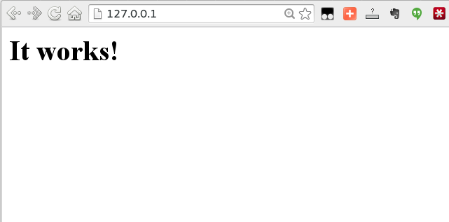
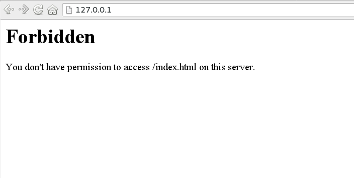

.. _Chapter_My_First_Website:

================
My First Website
================

.. epigraph::

   | Hello, is there anybody in there? Just nod if you can hear me.
   | Is there anyone home?

   -- Pink Floyd, *Comfortably Numb*


.. index:: My first website

.. index:: Getting started


If you're new to running a website, this chapter provides you with some
of the informaiton that you'll need to get started with your first
site. If you're already familiar with running a website, this
chapter can be safely skipped.

I'll cover such things as how to edit a configuration file, how to
upload files to your site, and what other skills you'll need to
learn before you can move on.

Of course, this can't be comprehensive. Web site design is an entire
discipline, and not one that I claim to be an expert on. I'm going
to try to give you a starting place, and point you in the right
direction to learn more.

Also, most of the things in this chapter are not specific to the
Apache HTTP Server, but are things you'll need to know before you make
your first website on any server software.


.. _Recipe_Hello_world_website:

My first "hello world" website
------------------------------

.. index:: Hello world

.. index:: HTML

.. index:: First website

.. index:: My first Hellow World website


.. _Problem_Hello_world_website:

Problem
~~~~~~~


Now that you have te Apache httpd installed, you want to set up
your first simple website.


.. _Solution_Hello_world_website:

Solution
~~~~~~~~


Locate the document directory of your httpd, and create a
file in that directory called **index.html**. Type the following 
HTML markup into that file, and save it:


.. code-block:: text

   <html>
   
   <head>
       <title>It works!</title>
   </head>
   
   <body>
   <h1>It works!</h1>
   </body>
   
   </html>


Now, in your browser, type the url http://127.0.0.1/ and you'll see
the new front page of your server.


.. _It_works:

.It works!




.. _Discussion_Hello_world_website:

Discussion
~~~~~~~~~~


If this is in fact your very first website, there's a lot going on
here that needs explaining. There's also a thing or two that could go
wrong at each step, so if this doesn't work immediately, don't worry,
it could be something that's expected.

Document directory
------------------

.. index:: DocumentRoot

.. index:: Default document directory


In the recipe, I start by saying that you need to locate your
document directory. Depending on how you installed the server, this
could be almost anywhere. This is discussed in greater detail in
:ref:`Recipe_Where_are_my_files`, so you should go take a look at that if
you're unsure what your default document directory is.

If you're trying to set up a website on a server on which someone else has
already modified the configuration, it could be that the location of
the directory has been modified. The location document directory is 
defined by the **DocumentRoot** directive in your server configuration
file, so it can be moved to a different location than what's configured 
by default. For example, in my server configuration file, I have:


.. code-block:: text

   DocumentRoot "/var/www/html"


And, finally, it's possible, if you're trying to set up your first
website on a server that has already been configured to run virtual
hosts - multiple websites, each with its own document directory.

To determine where these document directories are located, use the
``-S`` command line switch to list your server's virtual host
configuration.


.. code-block:: text

   [rbowen@grenache:httpd/conf]$ sudo httpd -S
   VirtualHost configuration:
   *:80                   is a NameVirtualHost
            default server grenache.rcbowen.com (/etc/httpd/conf.d/vhosts/00_grenache.conf:4)
            port 80 namevhost grenache.rcbowen.com (/etc/httpd/conf.d/vhosts/00_grenache.conf:4)
                    alias grenache
            port 80 namevhost www.apacheadmin.com (/etc/httpd/conf.d/vhosts/apacheadmin.com.conf:2)
                    alias apacheadmin.com
            port 80 namevhost tm3.org (/etc/httpd/conf.d/vhosts/tm3.org.conf:1)
                    wild alias *.tm3.org
            port 80 namevhost boxofclue.com (/etc/httpd/conf.d/vhosts/boxofclue.com.conf:1)
                    alias www.boxofclue.com
            port 80 namevhost dandelionforge.com (/etc/httpd/conf.d/vhosts/dandelionforge.com.conf:1)
                    alias www.dandelionforge.com
                    alias cmbowen.com
                    alias www.cmbowen.com
           <... etc. ...>
   ServerRoot: "/etc/httpd"
   Main DocumentRoot: "/var/www/html"
   Main ErrorLog: "/etc/httpd/logs/error_log"
   PidFile: "/run/httpd/httpd.pid"
   User: name="apache" id=48
   Group: name="apache" id=48


This will be discussed again, and in more detail, in 
:ref:`Chapter_Virtual_hosts`, **Virtual Hosts**, but for now, looking
at the output above, you're looking for two main pieces of
information. 

If your content is in a virtual host, you'll find its
name, and the associated configuration file (and line number) in which
it has been defined. You'll need to go look there for the definition
of **DocumentRoot** for that particular virtual host.

Secondly, near the bottom of the output, you'll see the *Main DocumentRoot*, which will be the default place that you'll put your
**index.html** file if your site is not in a virtual host.

index.html
----------

.. index:: index.html

.. index:: DirectoryIndex

.. index:: directives,DirectoryIndex


The default front page of a website is a file named **index.html**. This
is defined in the directive **DirectoryIndex**, which may be defined
globally, or **per**-directory. But it's a pretty safe bet that, unless
someone has modified the configuration, **index.html** will work as a
front page.

.. index:: directives,DocumentRoot

.. index:: DocumentRoot

Once you've located your **DocumentRoot** directory, placing a file with
that name in that directory will cause it to be loaded as the front
page of your website.

File permissions
----------------

.. index:: Commands,chmod

.. index:: File permissions


The most common thing that can go wrong here is file permissions.

If the file permissions on the **index.html** file are not right - **i.e.**,
if the file is not readable by httpd process, you'll
get a **Forbidden** response from the server, instead of seeing the
'It Works' page that you expected.


.. _Forbidden:




   Forbidden


Look back up at the output of the **httpd -S** command, above, and
notice the last two lines of the output:


.. code-block:: text

   User: name="apache" id=48
   Group: name="apache" id=48


These indicate the user permissions with which httpd
is running. This informs your decisions about the file permissions
that need to be applied to the file in order for Apache httpd to be
able to read the file and send it to the client.

In particular, the file needs to be readable by the user **apache**, or
whatever user is listed in that line of the output on your server.

File permissions, on Unix, are set using the ``chmod`` command (That's
CHange MODe, if it helps you remember it), which sets three basic
permissions on any given file: Read, Write, and eXecute.

If you list files on a Unix machine, you'll see something like the
following:


.. code-block:: text

   $ ls -al
   drwxr-xr-x. 15 rbowen rbowen  4096 Jan  1 16:00 .
   drwxr-xr-x. 30 root   root    4096 Jan  1 13:49 ..
   drwxr-xr-x.  8 rbowen rbowen  4096 Oct 29 16:56 .git
   -rw-r--r--.  1 rbowen rbowen   958 Jan  1 16:00 index.html
   -rw-r--r--.  1 rbowen rbowen   163 Sep 12 15:41 test.html


Each line of output gives a number of pieces of information, including
the file ownership (these files are owned by the user **rbowen** and by the
group **rbowen**), the date and time when the file was last modified,
and the file permissions.

That line of letters and dashes at the beginning of of the line shows
the permissions on the file. File permissions are displayed in three
groups of three, with one character on the front showing whether the
file in question is a directory. (The first two entries in the list
start with a **d**, indicating that they're directories.)

The nine characters following that first one show permissions for
three sets of people - the file owner (User), the group (Group), and
everyone else (Other).
In each of those triplets, the file permissions listed are r, w, and
x, which are, as mentioned above, Read, Write, and eXecute.

For example, the file permissions for **index.html**, shown above, are:


+-------+-----+
| User  | rw- |
+-------+-----+
| Group | r-- |
+-------+-----+
| Other | r-- |
+-------+-----+


The only requirement for the index.html file is that it be readable by the
**apache** user. Since the file is owned by **rbowen**, it is sufficient
that there be an **r** in the third group (Other), which there is.


.. warning::

   **DO NOT** make the file writable by the **apache** user, or by the Other
   group, as this will make it possible for an attacker, who gains access
   to your server by some means, to overwrite your server content with
   their own content. This is discussed in more detail in
   :ref:`Recipe_File_permissions`.


To change the permissions on a file, use the **chmod** command, as
follows:


.. code-block:: text

   chmod o+r index.html


You'll need to be either the file owner, or **root**, to run that
command.

The command means "change the mode on the file, and add the r
permission to the o group." That is, allow anyone in the 'Other'
category (which includes the **apache** user) to read the file.

For a full description of the features of the ``chmod`` command, consult
the manual, or look at the Wikipedia article at
http://en.wikipedia.org/wiki/Chmod

See also the ``chown`` command, for changing file ownership.

HTML
----

.. index:: HTML

.. index:: CSS

.. index:: JavaScript


.. admonition:: DRAFT — Review needed

   The following content needs editorial review.
   Check technical accuracy, voice/tone, and fit with surrounding content.

HTML — the HyperText Markup Language — is the language of web pages,
and you need at least a passing familiarity with it if you're going
to run a website. The HTML file presented in the recipe above is the
simplest possible HTML document, with a title and a body, and is
enough to get you started. But if you want to do anything more
complicated than an "It works!" page, you'll need to learn some more.

As a server administrator, you don't need to become an HTML expert,
but you should understand the basics: documents have a ``<head>``
(metadata, title, stylesheet links) and a ``<body>`` (visible
content). Content is structured with elements like ``<h1>`` through
``<h6>`` for headings, ``<p>`` for paragraphs, ``<a>`` for links,
```` for images, and ``<ul>``/``<ol>`` for lists. When
something goes wrong — a broken page, a missing image, a garbled
layout — understanding these elements helps you diagnose whether the
problem is in the HTML or in the server configuration.

The comprehensive guide to HTML may be found at
https://developer.mozilla.org/en-US/docs/Web/HTML — the Mozilla
Developer Network (MDN) reference is thorough, up to date, and free.
The W3Schools tutorial at https://www.w3schools.com/html/ is another
popular starting point.

Be aware, however, that HTML is an evolving standard, with
improvements being added every few
years, so you'll want to be sure to have a recent book.

While you're at it, you'll want to learn two other technologies, CSS -
Cascading Style Sheets - and JavaScript, which will be your constant 
companions as you create web content.

127.0.0.1
---------

.. index:: 127.0.0.1

.. index:: localhost


At this point, you have your content in place, and, assuming that the
server is running (See :ref:`Recipe_Starting_stopping`), you will now be
able to load that content in a web browser. In order to do this, you
need to know the address of your server.

At the moment, your http server doesn't have a name, but it does have
a network address. The address **127.0.0.1**, also known as **localhost**,
or **loopback**, refers to the local machine - the computer that you're currently
using. **127.0.0.1** is network language for "me" - it's the name that
every computer has for itself.


.. tip::

   Every computer that is on a network (or on the Internet) has a network
   address, called an IP address. (IP stands for Internet Protocol.) This
   might be a public address (**i.e.**, one that everyone on the Internet can
   get to), or it might be a private address that is only accessible on
   your priviate (home or office) network.


Opening your web browser and typing that address into the address
bar will cause the computer to ask itself for a web page. The browser
will open a HTTP socket to the local machine, and Apache httpd will be
listening, and will respond by sending the default index page for that
server.

The first part of the URL - the **http:** part - indicates what protocol
will be used for the request. Other things that can go in this part of
the URL include **https:** (See :ref:`Chapter_SSL_and_TLS`, **SSL and TLS**), or other
things like **ftp:** and **mailto:** for other protocols (FTP and Email,
respectively).


.. _See_Also_Hello_world_website:

See Also
~~~~~~~~


* :ref:`Recipe_Where_are_my_files`

* :ref:`Chapter_Virtual_hosts`, **Virtual Hosts**

* http://en.wikipedia.org/wiki/Chmod

* http://en.wikipedia.org/wiki/Chown

* :ref:`Recipe_File_permissions`

* The Mozilla Developer Network HTML reference at
  https://developer.mozilla.org/en-US/docs/Web/HTML

* :ref:`Chapter_SSL_and_TLS`, **SSL and TLS**


.. _Recipe_Editing_config_files:

Editing configuration files.
----------------------------

.. index:: Editing configuration files

.. index:: Editors

.. index:: Vim

.. index:: Emacs

.. index:: VI

.. index:: Nano

.. index:: Pico


.. _Problem_Editing_config_files:

Problem
~~~~~~~


Every change to httpd configuration requires that you
edit a configuration file. How do you do that?


.. _Solution_Editing_config_files:

Solution
~~~~~~~~


Apache httpd is configured **via** text configuration files. So, in order
to modify the configuration, you need to use a text editor.

Fortunately (and unfortunately), there are dozen to choose from.

On Microsoft Windows, you can edit your files using Notepad, or
whatever plain text editor you prefer. Do not use Word, or other
binary format word processor programs, but only something that saves
plain text files by default.

On Unix, there are many editors, and if you ask ten people, you'll get
a dozen recommendations. Favorites include VI (or Vim), Emacs, Nano,
and Pico. For a beginning Unix user, you might try something more
graphically oriented such as Gedit.


.. _Discussion_Editing_config_files:

Discussion
~~~~~~~~~~


Editor choice is a surprisingly controversial topic. People in the
geek world feel very strongly about their choice of editor, and the
convesation often leads to argument. So, I'm not going to recommend
a specific editor. [#vim-joke]_ But here are some of the more popular choices.

.. index:: Windows,Editors

.. index:: Editors,Microsoft Windows

On Windows, Notepad is a common choice for editing configuration
files, because you already have it installed, and it's very simple to
use. If you intend to do more than just edit configuration files -
that is, if you intend to write programming code at some point, you
may want to look at some of the more featureful editors that are
avaible. There are, however, so many of them, that it's difficult to
recommend just a few. 

However, since I am an advocate of free and open source software, I'd
recommend that you look at Emacs
(https://ftp.gnu.org/gnu/emacs/windows/), Winvim
(http://winvim.codeplex.com/), Atom
(https://atom.io/), or Notepad++
(http://notepad-plus-plus.org/),
although there are many, many others.
There's an article (probably out of date by the time you read this) at
http://goo.gl/mYhjBt that may also be worth looking at, too.

.. index:: Editors,Linux

.. index:: Unix,Editors

.. index:: Linux,Editors

On Unix, Emacs and VI (and VI's more modern brother, Vim) are the top
of the pack, and have been for a few decades. Others swear by (or at)
Pico and Nano. These are all console editors, meaning that they are
a textual interface, with no fancy GUI (Graphical User Interface), and
so may be a little hostile to someone coming from a more graphical
computing environment like Windows or macOS.

Most Linuxes come with a graphical editor like Gedit or Kedit, or some
other generic Notepad-like editor, which give a more point-and-click
navigation interface, as well as helpful drop-down menu items to
assist in common tasks.

macOS has a wide variety of featureful editors, including Sublime
(http://www.sublimetext.com/),
BBEdit (http://www.barebones.com/products/bbedit/), and
TextWrangler
(http://www.barebones.com/products/TextWrangler/),
although, of those, only TextWrangler is free. There are also Mac
versions of Emacs and Vim, which are free.

In the end, however, you'll need to find an editor that works for you,
as you will be editing text files a lot in your newly chosen career as
httpd administrator. So, look around, and find
something that you like.

Whichever platform you're using, do not use a word processor, like
Word, or OpenOffice, as these applications typically save files in
binary, or at least non-plain-text, formats.


.. _See_Also_Editing_config_files:

See Also
~~~~~~~~


.. _Recipe_Directive_goes_where:

Placing Directives Properly
---------------------------

.. index:: directives

.. index:: directives,placement

.. index:: Placing directives properly

.. index:: Directive placement

.. index:: Where do I put configuration directives; see directives,placement


.. _Problem_Directive_goes_where:

Problem
~~~~~~~


You know what directives you need, but aren't sure where to put them.


.. _Solution_Directive_goes_where:

Solution
~~~~~~~~


If you wish the scope of the directive to be global (**i.e.**, you
want it to affect all requests to the Web server), then it should be
put in the main body of the configuration file or it should be put in
the section starting with the line **&lt;Directory /&gt;** and ending with **&lt;/Directory&gt;**.

If you wish the directive to affect only a particular directory,
it should be put in a **&lt;Directory&gt;** section that specifies
that directory. Be aware that directives specified in this manner also
affect subdirectories of the stated directory.

Likewise, if you wish the directive to affect a particular
virtual host or a particular set of URLs, then the directive should be
put in a **&lt;VirtualHost&gt;**
section, **&lt;Location&gt;** section, or perhaps a **&lt;Files&gt;** section, referring to the
particular scope in which you want the directive to apply.

In short, the answer to "Where should I put it?" is to find the scope
where you want it to be in effect, and put it there.


.. _Discussion_Directive_goes_where:

Discussion
~~~~~~~~~~


This question is most often asked when someone believes that they
know what configuration directives they should be using, but they're
not having the expected result. Thus, the specific answer may vary
from one situation to another.

The situation is further complicated by the fact that the
configuration file is frequently split over several files, which are
loaded **via** **Include** directives, and
the (usually) mistaken impression that it will make a difference
whether a directive is put in one file or another.

Knowing exactly where to put a particular directive comes from
understanding how httpd deals with sections (such as 
**&lt;Directory&gt;** and **&lt;Location&gt;**). There is seldom one magic
place that a directive must be placed to make it work. Rather, you
need to think about how the configuration file is parsed, and which
portion of it will be in effect during any specific request.

There are two main situations in which a directive, when added
to your configuration file, will not have the desired effect. These
are when a directive is overridden by a directive appearing in the
same scope but later in the configuration, and when there is a
directive in a more specific scope.

For the first of these two situations, it is important to
understand that the httpd configuration file is parsed from top to
bottom. Files that use **Include** are
considered to appear in their entirety in the location where the
**Include** directive appears. Thus, if
you have the same directive appearing twice but with different values,
the last one appearing will be the one that is actually in
effect.

In the other situation, it's important to understand that, while
directives in one directory apply to subdirectories, a **&lt;Directory&gt;** section referring to a
more specific or "deeper" directory will have precedence over sections
referring to "shallower" directories. For example, consider the
following configuration:

.. index:: containers,<Directory>

.. index:: directives,<Directory>

.. index:: directives,Options


.. code-block:: text

   <Directory /www/docs>
       Options ExecCGI
   </Directory>
   
   <Directory /www/docs/mod>
       Options Includes
   </Directory>


Files accessed from the directory **``/www/docs/mod/misc/``** will 
have **Options** **Includes** in effect but will not have
**Options ExecCGI** in effect, because
the more specific directory section is the configuration that
applies.

More discussion of how configuration sections are merged is available
in the document at
http://httpd.apache.org/docs/sections.html

Other potentially confusing scenarios include the case where a
configuration has been placed in the global server configuration
scope, but is not inherited by a virtual host. 

The most common of
these is Rewrite directives, which are not, by default, applied to
virtual hosts when they are defined in global (**i.e.**, outside of the
virtual host container) scope. This behavior may be modified by the
**RewriteOptions** directive. This directive is discussed in more detail
in :ref:`Recipe_RewriteOptions`.

Finally, you must consider **.htaccess** files as well, which can override
settings in the main server configuration file and cause situations
that are confusing and difficult to track. These are discussed in
detail in :ref:`Chapter_htaccess`, **.htaccess Files**.


.. _See_Also_Directive_goes_where:

See Also
~~~~~~~~


* :ref:`Recipe_RewriteOptions`

* :ref:`Chapter_htaccess`, **.htaccess files**

* http://httpd.apache.org/docs/sections.html


.. _Recipe_Which_config_file:

Which of these configuration files should I use?
------------------------------------------------

.. index:: Which configuration file?

.. index:: Configuration files


.. _Problem_Which_config_file:

Problem
~~~~~~~


This question is closely related to the above recipe -
:ref:`Recipe_Directive_goes_where` - but is a little different. Your
Apache httpd installation has more than a dozen files in the
configuration directory, and you're not sure which ones you're
supposed to be using.


.. _Solution_Which_config_file:

Solution
~~~~~~~~


Your Apache httpd configuration file is split into several smaller
files for convenience, not because it matters which file you put
directives into. Placing directives into a particular file aids in
keeping your configuration organized, but doesn't have a direct effect
on how a particular configuration directive is applied.


.. _Discussion_Which_config_file:

Discussion
~~~~~~~~~~


Since the first versions of Apache httpd, the server configuration
file was split into several files, in order to provide a logical
organization of directives.

Historically, the server configuration was split into three fixed
files — **httpd.conf**, **access.conf**, and **srm.conf** — and each
directive had to go in its designated file. That restriction has long
since been removed, and configuration files are now divided into
smaller files purely for convenience and organization.

.. index:: Include

The **Include** directive is used to load a configuration file, or
files, allowing you to split your configuration into as many files as
you like. 


.. code-block:: text

   # Load the mod_info configuration
   Include conf/extra/httpd-info.conf
   
   # Load all virtual hosts
   Include conf/vhosts/*.conf


Thus, some people will have a configuration file for each
virtual host, or perhaps a file for directives related to a particular
module.

The source distribution of httpd has an ``extra`` directory under the
``conf`` directory, containing several topic-specific configuration
files, which are then loaded into the main configuration with
**Include** directives. These extra files are ones that many server
admins will never need to touch, but when you're looking for a
particular directive, the names of the files will give you a hint
where you might find the directives you're looking for.

To add to the confusion, each third party distribution of **httpd**
tends to have its own arrangement of configuration files, which made
sense to the person or people who put together that particular
packaging. 

.. index:: a2enmod

.. index:: mods-available

.. index:: mods-enabled

For example the Debian/Ubuntu distribution of httpd
**httpd** puts configuration for each module into its own file in the
**mods-available** directory, which is then symlinked into the
**mods-enabled** when that module is enabled using the **a2enmod** tool
that Debian ships with the httpd package. A similar arrangement is
provided for virtual hosts.

These divisions are for your convenience, and placement does not
affect the meaning of a directive. That is, it's not required that a
particular directive be placed into one particular file.

.. index:: containers,<Location>

.. index:: directives,<Location>

.. index:: containers,<Directory>

.. index:: directives,<Directory>

Instead, directives need to be placed in the right scope, or
container. For example, a directive placed within a particular
**<Location>** block will apply to requests within that URL scope,
and a directive placed within a particular **<Directory>** block will
apply to requests that target that particular directory.

Because there are several third-party distributions of httpd,
and each one makes their own decisions about
configuration file layout, these decisions have been documented in the
Apahche HTTP server wiki, at
http://wiki.apache.org/httpd/DistrosDefaultLayout where
they can be updated as those layouts shift over time.


.. _See_Also_Which_config_file:

See Also
~~~~~~~~


http://wiki.apache.org/httpd/DistrosDefaultLayout


.. _Recipe_syntax:

When should I quote directive arguments?
----------------------------------------

.. index:: Quoting arguments

.. index:: When should I quite directive arguments


.. _Problem_syntax:

Problem
~~~~~~~


Sometimes configuration file arguments are quotes, and other times
they aren't. What's the best practice?


.. _Solution_syntax:

Solution
~~~~~~~~


Quote any arguments that contain spaces. Use a line continuation
backslash if you want a directive to span multiple lines. Beyond that,
it's up to your personal preference.


.. _Discussion_syntax:

Discussion
~~~~~~~~~~


Any argument to a httpd configuration directive can be placed in
quotes if you want, but it is seldom required. The one time that it is
required is when an argument contains a space. This is because spaces
are the divider between arguments, and so a space in an argument is
seen as the end of one argument and the start of another.

Consider, for example:


.. code-block:: text

   DocumentRoot C:/program files/apache2/html


Apache httpd sees this as two separate arguments provides to the
**DocumentRoot** directive, and fails with the error message


.. code-block:: text

   AH00526: Syntax error on line 124 of C:/apache2/conf/httpd.conf
   DocumentRoot takes one argument, Root directory of the document tree


This is because the space after **program** is seen as a separator
between arguments.

Fix this by putting the entire argument in quotes:


.. code-block:: text

   DocumentRoot "C:/program files/apache2/html"


You can, if you wish, always enclose arguments in quotes, but it's not
required except in the case of spaces in arguments.

Finally, as mentioned in the recipe, you can also indicate that a
directive continues on the next line by including a line continuation
character - the backslash - in the line. This is almost never actually
useful except when you are formatting examples for books and articles.


.. code-block:: text

   AddDescription "The planet Jupiter and its moons" \
       juputer.gif 


.. _See_Also_syntax:

See Also
~~~~~~~~


.. refcosplay

.. _Recipe_config-file-variables:

Using variables in configuration files
--------------------------------------

.. index:: Configuration files,variables

.. index:: Variables,Configuration files

.. index:: Using variables in configuration files


.. _Problem_config-file-variables:

Problem
~~~~~~~


You want to define a variable once and then use it several times in
your configuration file.


.. _Solution_config-file-variables:

Solution
~~~~~~~~


You can set and use a variable using the ``Define`` directive:
.. index:: directives,Define

.. index:: directives,DocumentRoot

.. index:: DocumentRoot

.. index:: containers,<Directory>

.. index:: directives,<Directory>

.. index:: directives,Require

.. index:: directives,AllowOverride


.. code-block:: text

   Define DOCROOT "/home/rbowen/devel/httpd-trunk"
   
   DocumentRoot "${DOCROOT}/"
   
   <Directory "${DOCROOT}/">
       Require all granted
       AllowOverride none
   </Directory>


Discussion
~~~~~~~~~~


The **Define** directive allows you to set a variable in a configuration
file, and then refer to that variable elsewhere. This can prevent
errors in typing, as well as ensuring that an update in one place
immediately effects all of the other places where it is used.

In the example shown above, the document root directory is configured
in a single place, and then used in two places, ensuring that you
don't forget to update one when you update the other.


.. _See_Also_config-file-variables:

See Also
~~~~~~~~


* :ref:`Chapter_per_request`, **Programmable Configuration**


.. _Recipe_Options:

Enabling server functionality with Options
------------------------------------------

.. index:: Options

.. index:: directives,Options

.. index:: Enabling server functionality with Options


.. _Problem_Options:

Problem
~~~~~~~


You wish to enable, or disable, categories of server functionality.


.. _Solution_Options:

Solution
~~~~~~~~


The ``Options`` directive enables, or disables, major categories of
server functionality, either globally, or for particular portions of
your site.

You can specify exactly what options you want enabled by declaring a
list of them:


.. code-block:: text

   Options Indexes Multiviews


You can add or subtract from an existing set of configurated options
using the ``+`` or ``-`` syntax:


.. code-block:: text

   Options +ExecCGI -Indexes


You can enable all available options (with the exception of
``MultiViews``) using the ``All`` keyword:


.. code-block:: text

   Options All


Or you can disable all of them using the ``None`` keyword:


.. code-block:: text

   Options None


.. _Discussion_Options:

Discussion
~~~~~~~~~~


Each of the possible values of ``Options`` enables (or disables) major
categories of functionality of httpd. These can be
set globally, **per** directory, **per** virtual host, or in ``.htaccess``
files.

Possible values for the ``Options`` directive are:


+------------------------------+-----------------------------------------------------------------+
| **``All``**                  | All options except for MultiViews. This is the default setting. |
+------------------------------+-----------------------------------------------------------------+
| **``None``**                 | Disable all categories of options                               |
+------------------------------+-----------------------------------------------------------------+
| **``ExecCGI``**              | Execution of CGI scripts using mod_cgi is permitted.            |
+------------------------------+-----------------------------------------------------------------+
| **``FollowSymLinks``**       | The server will follow symbolic links in this directory.        |
+------------------------------+-----------------------------------------------------------------+
| **``SymLinksIfOwnerMatch``** |                                                                 |
+------------------------------+-----------------------------------------------------------------+
| **``Includes``**             | Server-side includes provided by _mod_include_ are permitted.   |
+------------------------------+-----------------------------------------------------------------+
| **``IncludesNOEXEC``**       | Server-side includes are permitted, but ``#exec`` is disabled.  |
+------------------------------+-----------------------------------------------------------------+
| **``Indexes``**              |                                                                 |
+------------------------------+-----------------------------------------------------------------+
| **``MultiViews``**           |                                                                 |
+------------------------------+-----------------------------------------------------------------+


You can specify a list of enabled options in two ways. 

If you specify a list of options, it will clear all existing options,
and impose just the ones you have set:


.. code-block:: text

   Options Includes Indexes


The above example would result in all options being turned off, and
just ``Includes`` and ``Indexes`` being enabled.

Or, you can indicate what you want to add to, or remove from, the
existing set of options:


.. code-block:: text

   Options +ExecCGI -Indexes


This example, in conjunction with the earlier example, would result in
``Includes`` and ``ExecCGI`` being enabled, while ``Indexes`` was disabled.


.. warning::

   Don't mix the declarative syntax and the +/- syntax, as this will
   result in unexpected outcomes.


.. _See_Also_Options:

See Also
~~~~~~~~


* :ref:`Recipe_AllowOverride-options`

* http://httpd.apache.org/docs/mod/core.html#options


.. _Recipe_dns:

Pointing a name at your server's address
----------------------------------------

.. index:: DNS

.. index:: Name server

.. index:: Pointing a name at your server's address


.. _Problem_dns:

Problem
~~~~~~~


You've got a server running, and would now like to point a name, such
as **www.example.com**, at your server's address.


.. _Solution_dns:

Solution
~~~~~~~~


Register a domain name with a registrar, and set up a DNS record
pointing to your server address.


.. _Discussion_dns:

Discussion
~~~~~~~~~~


DNS - the Domain Name System - is a basic service of the Internet,
whereby names, like **www.apache.org**, are mapped to network addresses,
like **104.130.219.184**, so that humans don't have to remember
numerical IP addresses.

When you run a website, you want a name, rather than an address, so
that people can remember how to get to your site.

Registrars are organizations responsible for maintaining the databases
of these name-to-address mappings, as well as the ownership of these
names. There are many such registrars. A complete list is maintained
by ICANN - the Internet Corporation for Assigned Names and Numbers -
at
https://www.icann.org/registrar-reports/accredited-list.html or you
can find a short list of the most popular ones by searching for
'register domain name' on your favorite search engine.

Registering a domain name, like 'boxofclue.com', is cheap and easy.
Once you have it registered, most registrars also provide name
resolution services - that is, resolving a name like
'www.boxofclue.com' to the network address of your server. Exactly how
this works will vary from one registrar to another, and you'll need to
consult with whichever registrar you choose for details.

Your ISP - your Internet Service Provider - can tell you the IP
address of your server, so that you know what to put in the hostname
record. 

Or, if you're running a server on your home internet
connection, you can determine your IP address by visiting a website
such as http://www.whatismyip.com/ which tells you what address you
are visiting from.

If you have a server at a public cloud provider, such as Amazon
Web Services, or Rackspace, you can determine your IP address by
typing, at the command line:


.. code-block:: text

   ifconfig -a


This will return a lot of information about your network connections,
including the IP address of your network interface.


.. code-block:: text

   eth0: flags=4163<UP,BROADCAST,RUNNING,MULTICAST>  mtu 1500
      inet 146.78.185.89  netmask 255.255.255.0  broadcast 146.78.185.255


In this case, the IP address of the server is 166.78.185.89, so you'd
want to have your hostname resolve to that address in order to serve a
website from that server.


.. _See_Also_dns:

See Also
~~~~~~~~


.. _Recipe_hosting:

Finding website hosting
-----------------------

.. index:: Hosting

.. index:: VPS

.. index:: Web hosting

.. index:: Finding website hosting


.. _Problem_hosting:

Problem
~~~~~~~


You want to run httpd somewhere, but you don't have either a
server class machine to run it on, or an Internet connection capable
of supporting a busy website. Where should you put your site?


.. _Solution_hosting:

Solution
~~~~~~~~


Many server hosting companies are available where you can host a web
server, or any other Internet service, for a monthly fee. Some of
these give you a dedicated server on which you can run any service you
wish. Others give you a shared Web host, where you can only run a
Website and no other services.

Searching on your favorite Web search engine for 'web hosting' or 'vps
hosting' will find many many options.


.. _Discussion_hosting:

Discussion
~~~~~~~~~~


There are a large number of organizations that provide Web hosting
services, and it would be impossible to enumerate them here. As
mentioned above, a web search for 'web hosting' or 'vps hosting' will
find many of them.

VPS stands for Virtual Private Server, and refers generally to a
service where you can rent a virtual server which you can do with as
you please. This is one of the most common ways that you might acquire
Web space.

A VPS requires that you act as your own server administrator, managing
the operating system as well as the web server, and so is the route
you want to take if you know something about server administration,
usually on Linux, and want to control everything. Reputable VPS
hosting providers include such vendors as Rackspace.com and DigitalOcean.Com.

On the other hand, if you just want Web space where you can put Web
content, a shared Web space host may be the way to go. Such vendors
are too numerous to name, but popular ones include Dreamhost.com and
1and1.com.

Finally, if you're really only interested in putting content on a
Website that is powered by an existing application which someone else
manages entirely, you may be interested in an 'application as a service'
solution, such as Wordpress.com or Blogger.com, where you create an
account and create content, and someone else manages everything else
beneath that level.

For the purposes of this book, and hosting your own httpd,
a VPS makes the most sense, since you'll need to be able to
configure and restart your own server, which isn't possible when
you're simply renting Web space.


.. _See_Also_hosting:

See Also
~~~~~~~~


* http://rackspace.com/
* http://digitalocean.com.com/
* http://dreamhost.com/
* http://1and1.com/
* http://wordpress.com/
* http://blogger.com/


.. _Recipe_rcp:

Copying files to a remote server
--------------------------------

.. index:: SCP

.. index:: SSH

.. index:: FTP

.. index:: SFTP

.. index:: File transfer

.. index:: Upload files

.. index:: Copying files to a remote server


.. _Problem_rcp:

Problem
~~~~~~~


You've acquired a web host, and need to copy your Web content from
your local computer to the remote server.


.. _Solution_rcp:

Solution
~~~~~~~~


There are a variety of ways to copy files across the internet. Common
protocols include SCP (Secure Copy), SFTP (Secure File Transfer
Protocol), and FTP (File Transfer Protocol), in decreasing order of
security (and, thus, desirability). What's available to you will
depend on the exact nature of your Web hosting provider.

Depending on what operating system you're running on your local
computer, different remote copy solutions will be available to you.
For Microsoft Windows, I recommend WinSCP
(http://winscp.net/). For macOS, I recommend CyberDuck
(https://cyberduck.io/). For Linux, I recommend **scp**,
which should be available to you by default.


.. _Discussion_rcp:

Discussion
~~~~~~~~~~


SCP - Secure Copy - allows you to transfer files securely from one
computer to another across the Internet, and is the preferred way to
copy files up to your web host. There are still a few Web hosting
providers that don't support SCP, but not very many.

FTP, File Transfer Protocol, once fairly universal, is falling out of
favor because it is insecure, and makes it easy for someone to
intercept your transfer and possibly intercept your server
credentials. Avoid it if at all possible.

SFTP, Secure FTP, is a midway point, and is recommended if SCP isn't
available.

In the same family of protocols is SSH - Secure Shell - which many
hosting providers make available as a means to establish a direct
remote connection to the server, so that you can run commands directly
on the server. This will probably be available to you if you opt for a
VPS as your hosting platform. Using SSH, you can use the remote system
as though it were your local computer, and edit your web content
directly on the server.


.. _See_Also_rcp:

See Also
~~~~~~~~


* http://en.wikipedia.org/wiki/Secure_Shell
* http://en.wikipedia.org/wiki/File_Transfer_Protocol
* https://cyberduck.io/
* http://winscp.net/


.. _Recipe_sitetesting:

Testing your site
-----------------

.. index:: Testing

.. index:: Site testing


.. _Problem_sitetesting:

Problem
~~~~~~~


You've got your server running, and you want to test it to be sure
it's working.


.. _Solution_sitetesting:

Solution
~~~~~~~~


Usually, you can test your server by just firing up a browser and
typing in your site address. Third-party solutions can give you a
deeper analysis of how your site is performing, and there are even
sites that will monitor your site day and night, and notify you when
it goes down.


.. _Discussion_sitetesting:

Discussion
~~~~~~~~~~


The easiest solution is to point your browser at your server and see
what happens. Hopefully you know the name or address of your server
(see :ref:`Recipe_dns` above). Put that into your browser's address bar
preceeded by a **http://**. For example, if your hostname is
'boxofclue.com', type 'http://boxofclue.com/' into your browser
address bar. This should load your site's front page.

On the other hand, if you only know an IP address, you can use that
instead of the hostname.

There are also services that allow you to test your site from various
places around the world, so that you can ensure that your site works
everywhere. A site like http://websitetest.com/ tests your site using
a variety of locations and browsers, so that you can know what your
site looks like, and how it performs, from the perspective of people
around the world.

Finally, if you want to monitor your website and ensure that it stays
up, a service like http://pingmybox.com/ will look at your website
periodically and notify you if it stops responding.


.. _See_Also_sitetesting:

See Also
~~~~~~~~


* http://websitetest.com/

* http://pingmybox.com/

* :ref:`Recipe_dns`

* :ref:`Chapter_Performance_and_testing`, **Performance and Testing**


.. _Recipe_favicon:

Setting a Default 'favicon'
---------------------------

.. index:: favicon.ico

.. index:: Default site icon

.. index:: Setting a default favicon


.. _Problem_favicon:

Problem
~~~~~~~


You want to define a default favorite icon, or "favicon" for
your server, to be used for any site that doesn't define one,
but allow individual sites or users to override it.


.. _Solution_favicon:

Solution
~~~~~~~~


Put your default **favicon.ico** file into the **/icons/** subdirectory under your **ServerRoot**, and add the following lines to
your server configuration file in the scope where you want it to take
effect (such as inside a particular <VirtualHost> container or outside all
of them):


.. code-block:: text

   AddType image/x-icon .ico
   <Files favicon.ico>
       ErrorDocument 404 /icons/favicon.ico
   </Files>


.. _Discussion_favicon:

Discussion
~~~~~~~~~~


**favicon.ico** files allow Web
sites to provide a small (16 × 16 pixels) image to clients for use in
labeling pages; for instance, the Mozilla browser will show the
favicon in the location bar and in any page tabs. These files are
typically located in the site's **DocumentRoot** or in the same directory
as the pages that reference them.

What the lines in the solution do is trap any references to
**favicon.ico** files that don't
exist and supply a default instead. An **ErrorDocument** is used instead of a **RewriteRule** because you
want the default to be supplied **only** if the file
isn't found where expected. A rewrite, unless carefully crafted, would
force the specified file to be used regardless of whether a more
appropriate one existed.

See the ``See Also`` section below for links to sites that are helpful
in generating your own custom ``favicon.ico`` files.


.. _See_Also_favicon:

See Also
~~~~~~~~


* http://www.favicon-generator.org/

* http://www.favicon.cc/


.. _Recipe_Design:

Web site design
---------------

.. index:: Web site design

.. index:: Design


.. _Problem_Design:

Problem
~~~~~~~


You want your website to look prettier


.. _Solution_Design:

Solution
~~~~~~~~


This is firmly outside of the scope of this book. Consult one of the
many website design books on the market, or, better yet, hire a
professional.


.. _Discussion_Design:

Discussion
~~~~~~~~~~


Web site design is an art, and not one that I, the author of this
book, have mastered. Fortunately, there are many practitioners of this
art who you can contact to help you with your website. There are also
many, many web site design books available. 

Don't neglect designing for mobile clients, as that is a large and
growing percentage of your audience.

A good place to start on your quest to be a web designer might be
*Learning Web Design* by Jennifer Niederst Robbins
(https://www.learningwebdesign.com/). The Mozilla Developer Network
also has an excellent free tutorial series, "Learn web development,"
at https://developer.mozilla.org/en-US/docs/Learn that covers HTML,
CSS, and JavaScript from the ground up. Both are practical,
beginner-friendly, and regularly updated.

There are also numerous talented web designers that you can hire to
help with your web site, either in your local phone book or online.


.. _See_Also_Design:

See Also
~~~~~~~~


.. admonition:: DRAFT — Review needed

   The following content needs editorial review.
   Check technical accuracy, voice/tone, and fit with surrounding content.

* *Learning Web Design* by Jennifer Niederst Robbins —
  https://www.learningwebdesign.com/

* MDN "Learn web development" —
  https://developer.mozilla.org/en-US/docs/Learn

Summary
-------


While most of this book is specifically about configuring the httpd
HTTP Server, there are a number of areas of knowledge that are assumed
in much of the discussion to come. I hope that this chapter points
you in the right direction to acquire these skills.

Searching for 'my first website' on your favorite web search site will
lead you to a number of helpful sites that will walk you through these
topics, and many others that you may encounter during the process of
putting up your first site.


.. rubric:: Footnotes

.. [#vim-joke] For the record, the right answer is Vim.
