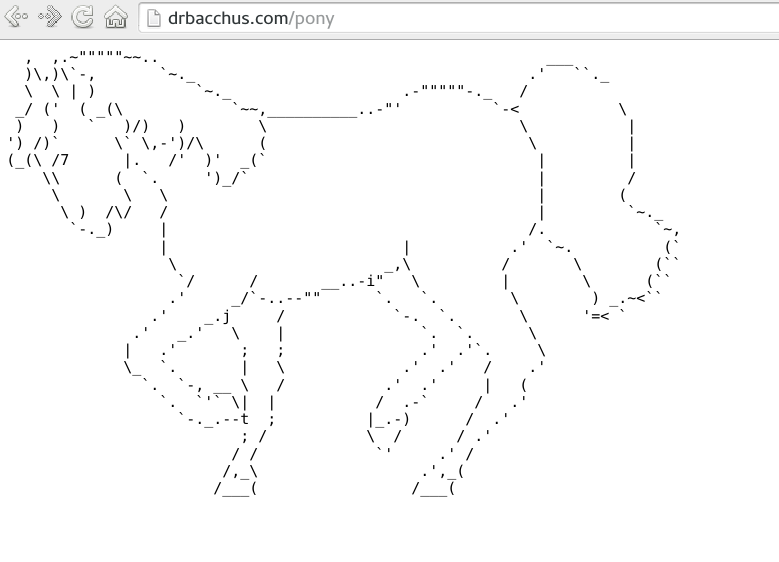
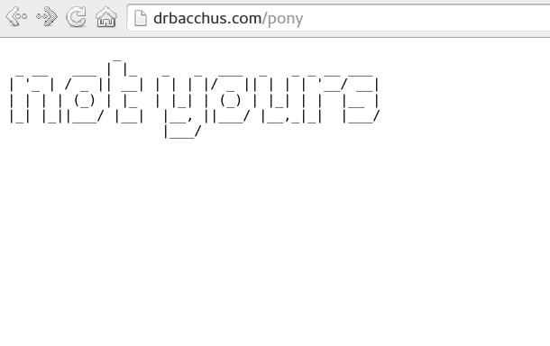

.. _Chapter_Common_modules:

=====================
Adding Common Modules
=====================

.. index:: Common modules

.. index:: Modules,common

.. index:: Adding common modules

A critical detail of the Apache http server is that it is modular.
There's a small core, and everything beyond the absolute basics is
implemented in modules.

The module API makes it fairly easy for anyone to create their own
modules to perform whatever task, large or small. As a result, a large
number of third-party modules have sprung up. By "third-party", we
mean modules that are maintained and distributed separately from the
main web server project. This is due to a variety of factors. Not
everything is of interest to enough people to necessitate being part
of the main project. Some modules are licensed incompatibly to the
Apache license. Some modules are for use only within a particular site
or company.

When a module gains sufficient popular following, sometimes the httpd
project will go encourage a module author to bring their module to the
main project. Or, alternatively, the author may approach the httpd
project and offer their module as a code donation, so that a larger
community will be working on it. Thus, modules like mod_ssl, mod_lua,
mod_macro, and others, have over the years become part of the main
server project.

Other modules, such as mod_perl, mod_security, or PHP, have a
sufficient community around them that they exist as vibrant
independent projects.

In this chapter, we show how to install and configure several
third-party modules, ranging from the trivial (mod_pony) to the more
useful. We'll show how to install them **via** packages, and from source.

This chapter does not cover writing your own modules. We feel that
this is beyond the scope of this book. Instead we recommend Nick Kew's
book, The Apache Modules book.
http://www.amazon.com/The-Apache-Modules-Book-Application/dp/0132409674

We also recommend the online developer resource,
http://httpd.apache.org/dev/ , and the API guide,
http://ci.apache.org/projects/httpd/trunk/doxygen/

.. _Recipe_Finding_Modules:

Finding Modules
---------------

.. index:: Modules,finding

.. index:: Finding modules

.. index:: modules.apache.org

.. _Problem_Finding_Modules:

Problem
~~~~~~~

I'd like to see what third-party modules are available.

.. _Solution_Finding_Modules:

Solution
~~~~~~~~

While there's no comprehensive list, a large number of third-party
modules are available on http://modules.apache.org/

.. _Discussion_Finding_Modules:

Discussion
~~~~~~~~~~

modules.apache.org is a site hosted by the Apache httpd project, which
encourages third-party module developers to list their modules, along
with some basic meta data, so that you, the web server admin, can find
these modules.

There are, of course, may other modules out there that haven't (yet?)
been listed on this site, because the author doesn't know about it, or
doesn't want to list their module for whatever reason. But it's the
best available list.

On this site, you can search by keyword or topic, and then go to
the module's site to download it. modules.apache.org does not host the
module downloads.

You can also post comments about a module, which may be a good way to
see what others might have thought of the module.

And, if you're a module author yourself, you can add your own module
ot the site.

.. _See_Also_Finding_Modules:

See Also
~~~~~~~~

http://modules.apache.org/

.. _Recipe_apxs:

Installing a module with apxs
-----------------------------

.. index:: apxs

.. index:: Installing modules with apxs

.. index:: Modules,installing with apxs

.. _Problem_apxs:

Problem
~~~~~~~

You have downloaded a third-party module that isn't listed in
this chapter, and you want to install it.

.. _Solution_apxs:

Solution
~~~~~~~~

Move to the directory where the module's source file was
unpacked, and then:

.. code-block:: text

   apxs -cia module.c

.. _Discussion_apxs:

Discussion
~~~~~~~~~~

Since the introduction of Apache httpd 2.0, installing modules has
been pretty standard, and for most modules, the proces should be
fairly easy.

``apxs`` is a tool that comes with the web server which facilitates
building, installing and enabling a module.

If you installed httpd **via** a package, you will likely have to install
a second package to get the developer tools, such as ``apxs``.

On Debian (or Ubuntu, and related distributions), install the
``apache2-dev`` package:

.. code-block:: text

   apt-get install apache2-dev

On CentOS, Fedora, and related distributions, install the
``httpd-devel`` package:

.. code-block:: text

   yum install httpd-devel

The ``-cia`` option to ``apxs`` is a shortcut for the options ``-c -i -a``,
and means compile, install, and activate, respectively.

Compile builds the C source code into a ``.so`` file. Install copies
that file into the location where your server has module files.
Activate modifies your server configuration file to add ``LoadModule``
directive so that the module will be loaded on server restart.

This requires that your server is build with ``mod_so`` enabled, to
permit dynamic module loading.

.. _See_Also_apxs:

See Also
~~~~~~~~

* The **apxs** manpage, typically **ServerRoot/man/man8/apxs.8** or type
  ``man apxs`` at the command line.

* apxs documentation, at
  http://httpd.apache.org/docs/programs/apxs.html

.. _Recipe_Installing_PHP:

Running PHP Programs
--------------------

.. index:: PHP

.. index:: PHP,Installing

.. index:: Running PHP programs

.. _Problem_Installing_PHP:

Problem
~~~~~~~

You want to use the PHP language on your Apache http server.

.. _Solution_Installing_PHP:

Solution
~~~~~~~~

There are a few different ways to install PHP on your Apache server,
depending on how you installed Apache httpd itself, and your needs and
preferences.

Look in :ref:`Chapter_Dynamic_content`, **Dynamic Content**, for discussion of the various ways
to install and enable PHP on your Apache http server.

.. _Discussion_Installing_PHP:

Discussion
~~~~~~~~~~

We've devoted an entire chapter to the various ways of producing
dynamic content on Apache httpd, and PHP is a very important topic in
that discussion.

.. _See_Also_Installing_PHP:

See Also
~~~~~~~~

* :ref:`Recipe_enabling_mod_php`

* :ref:`Recipe_php-fpm`

.. _Recipe_modules_apache_org:

modules.apache.org
------------------

.. index:: modules.apache.org

.. index:: Modules,third party

.. index:: Third party modules

.. _Problem_modules_apache_org:

Problem
~~~~~~~

You're looking for a listing of Apache httpd modules for various
purposes.

.. _Solution_modules_apache_org:

Solution
~~~~~~~~

Use http://modules.apache.org/ to find a wide variety of httpd modules
for many purposes.

.. _Discussion_modules_apache_org:

Discussion
~~~~~~~~~~

http://modules.apache.org/ is a site that allows authors of Apache
httpd modules to list their modules, and users to post reviews and
comments about these modules.

The modules listed on this site are not endorsed by the official
Apache httpd project, but the service is provided by the project in
order to encourage third-party module developers, and make it easier
for end-users to find modules to serve their needs.

Modules can be listed by popularity and freshness, and you can also
search for modules based on what functionality you're looking for.

And if you're a module author, you can list your own module, and
increase its exposure to the audience of Apache httpd users.

.. _See_Also_modules_apache_org:

See Also
~~~~~~~~

.. _Recipe_mod_pony:

Installing and configuring mod_pony
-----------------------------------

.. index:: mod_pony

.. index:: Modules,mod_pony

.. index:: Pony

.. index:: Example module

.. index:: Modules,example

.. index:: Installing and configuring mod_pony

.. _Problem_mod_pony:

Problem
~~~~~~~

You've found mod_pony on modules.apache.org and you want to install it
and try it out.

.. _Solution_mod_pony:

Solution
~~~~~~~~

Download mod_pony.c from the module repository at
http://svn.rcbowen.com/svn/public/mod_pony/

Install and enable it using apxs, as described above:

.. code-block:: text

   apxs -cia mod_pony.c

Configure the pony handler as described in the documentation:

.. code-block:: text

   <Location /pony>
     SetHandler pony
   </Location>

To verify that it works, load the address
http://your.server/pony in your browser to invoke the
``pony`` handler.

.. _Discussion_mod_pony:

Discussion
~~~~~~~~~~

mod_pony is a joke module that does nothing more than randomly display
either an ascii-art pony, or the words 'not yours'.

It is also a useful example of how to write a content module, so it's
a good place to start if you're interested in writing your own httpd
module.

It is used as an example in this chapter simply because it provides
the simplest possible example of how to install and configure a
third-party module on your Apache httpd server.

.. _See_Also_mod_pony:

See Also
~~~~~~~~

* mod_example and mod_example_hooks

* http://svn.rcbowen.com/svn/public/mod_pony/

.. _Recipe_mod_security:

mod_security
------------

.. index:: mod_security

.. index:: Modules,mod_security

.. index:: Security,mod_security

.. _Problem_mod_security:

Problem
~~~~~~~

You'd like to use mod_security to block unsavory requests to your web
server.

.. _Solution_mod_security:

Solution
~~~~~~~~

Obtain and install mod_security from http://modsecurity.org/
and install it using apxs, or install it **via** your operating system's
package manager.

To install **via** packages on Ubuntu or Debian:

.. code-block:: text

   $ sudo apt-get install libapache2-mod-security
   $ sudo a2enmod mod-security
   $ sudo /etc/init.d/apache2 force-reload

To install **via** packages on CentOS or Fedora:

.. code-block:: text

   $ sudo yum install mod_security
   $ sudo /etc/init.d/httpd restart

To install on Microsoft Windows, obtain the installer from
http://modsecurity.org/download.html

To install using the source code, download the source tarball from
http://www.modsecurity.org/download.html and unpack it. Then:

.. code-block:: text

   $ $cd ModSecurity
   $ ./autogen.sh
   $ ./configure --with-apxs=/path/to/httpd/bin/apxs
   $ make
   $ sudo make install
   $ /usr/local/modsecurity/lib/mod_security2.so /usr/local/apache/modules/

Load ``mod_security`` into your server by adding the following line to
your httpd configuration file:

.. code-block:: text

   LoadModule security2_module modules/mod_security2.so

.. _Discussion_mod_security:

Discussion
~~~~~~~~~~

Building ``mod_security`` from source is slightly more complicated than
building simpler modules, like, say, ``mod_pony``, as there are various
library dependencies that ``mod_security`` needs to resolve in the build
process. In particular, you need to ensure that you have the following
libraries installed:

* libapr
* libapr-util
* libpcre
* libxml2
* liblua
* libcurl

These will almost certainly be installed if you have Apache httpd
installed, so there's not usually anything to worry about here.

.. index:: mod_uniqueid

.. index:: Modules,mod_uniqueid

You will also need to have ``mod_uniqueid`` installed to use many of the
features of ``mod_security``.

In the recipe above, you'll need to provide your correct file paths
for ``apxs`` and your modules directory in the appropriate places. That
is:

.. code-block:: text

   ./configure --with-apxs=/path/to/httpd/bin/apxs

In that command, replace ``/path/to/httpd/bin/apxs`` with the actual
path to your ``apxs`` utility, which you can usually obtain by typing
``which apxs``.

And in the last line of the recipe:

.. code-block:: text

   $ /usr/local/modsecurity/lib/mod_security2.so /usr/local/apache/modules/

Ensure that this is actually the location where your server stores
modules files, or replace it with the correct path.

Finally, there is an excellent book available by the creator of
``mod_security`` - mod_security Handbook, by Ivan Ristić, from Feisty
Duck publishing. You can find more information about this book at
https://www.feistyduck.com/books/modsecurity-handbook/

.. _See_Also_mod_security:

See Also
~~~~~~~~

* Ivan Ristić's book -
  https://www.feistyduck.com/books/modsecurity-handbook/

* The mod_security website, at http://modsecurity.org/

* The mod_security reference manual, at
  https://github.com/SpiderLabs/ModSecurity/wiki/Reference-Manual

.. _Recipe_mod_security_rules:

mod_security rules
------------------

.. index:: mod_security,rules

.. index:: Securing your server with mod_security

.. _Problem_mod_security_rules:

Problem
~~~~~~~

Now that you have ``mod_security`` installed, how do I use it?

.. _Solution_mod_security_rules:

Solution
~~~~~~~~

There are a number of recipes about using ``mod_security`` to protect
your web server in :ref:`Chapter_Security`, **Security**.

.. _Discussion_mod_security_rules:

Discussion
~~~~~~~~~~

This chapter is primarily devoted to installing and enabling
third-party modules. Because ``mod_security`` is a web application
firewall, primarily focused on web application security, we've put the
relevant recipes in the Security chapter.

.. _See_Also_mod_security_rules:

See Also
~~~~~~~~

* :ref:`Chapter_Security`, **Security**

.. _Recipe_module_broken:

Why Won't This Module Work?
---------------------------

.. index:: Why won't this module work

.. index:: Troublshooting,third-party modules

.. _Problem_module_broken:

Problem
~~~~~~~

You are trying to install a third-party module, but the Apache
Web server refuses to recognize it.

.. _Solution_module_broken:

Solution
~~~~~~~~

Consult the sources for the module, or its documentation, or ask
the author, in order to determine which version of Apache the package
supports.

.. _Discussion_module_broken:

Discussion
~~~~~~~~~~

As significant changes are made to the Apache Web server,
sometimes compatibility suffers as the API is changed. Although
efforts are made to keep this sort of thing to a minimum, sometimes it
is unavoidable.

To keep an incompatible module from being loaded and crashing
the Web server when used, both modules and the server have a built-in
'magic' number that is recorded when they're built, and that relates
to the version of the API. When the server tries to load a module DSO,
it compares the module's magic number with the server's own, and if
they aren't compatible, the server refuses to load it.

The development team tries to keep the magic number
compatibility within major version numbers, but not across them. That
is, a module built for Apache 2.2 **should** work
with almost any 2.2 version of the server built after the module was,
but it definitely won't work with a 2.0 server. Contrariwise, a 2.0
module won't work with a 1.3 server under any circumstances.

.. _See_Also_module_broken:

See Also
~~~~~~~~

* The Apache Modules Registry at http://modules.apache.org

.. _Recipe_Enabling_modules_debian:

Enabling modules on Ubuntu and Debian
-------------------------------------

.. index:: Ubuntu,Enabling and disabling modules

.. index:: Enabling and disabling modules on Debian and Ubuntu

.. index:: Debian,Enabling and disabling modules

.. _Problem_Enabling_modules_debian:

Problem
~~~~~~~

Debian, and related distributions such as Ubuntu, provide their own
tools for enabling and disabling modules.

.. _Solution_Enabling_modules_debian:

Solution
~~~~~~~~

Use the **a2enmod** and **a2dismod** tools to enable, and disable,
available modules, respectively.

.. code-block:: text

   a2enmod rewrite
   a2dismod mime_magic

.. _Discussion_Enabling_modules_debian:

Discussion
~~~~~~~~~~

Debian, and related distributions like Ubuntu, use a directory
structure built around its site- and server-management tools. In the
case of modules, there are two directories, and two command line
tools.

In the directory **/etc/apache2/mods-available/**, you will find
configuration files for the various
modules which have been installed with the server, and which may or
may not be enabled.

In the directory **/etc/apache2/mods-enabled/**, you will find symbolic
links (symlinks) to files in that other directory.

Two command line tools are provided to manage these symlinks.
**a2enmod** (Apache 2 Enable Module) creates the symlink, and **a2dismod**
(Apache 2 Disable Module) removes that symlink.

In this way, you can easily enable and disable various modules at will
without having to edit configuration files.

.. note::

   You will still need to restart your Apache httpd server in order for
   these configuration changes to take effect.

.. _See_Also_Enabling_modules_debian:

See Also
~~~~~~~~

* :ref:`Recipe_Debian_Vhosts`

* ``man a2enmod`` (Type this at the command line for the ``a2enmod`` user
  manual.

* ``man a2dismod`` (Type this at the command line for the ``a2dismod`` user
  manual.

Summary
-------

Apache httpd is modular - the core is as small as possible, and all
interesting functionality is in optional modules. this means that
httpd can be as simple, or as featureful, as you want it to be, by
enabling and disabling various modules for the functionality you want,
or don't want.

Everything else in this book is implemented by some module or other,
which you'll need to have enabled to use the functionalty discussed.

