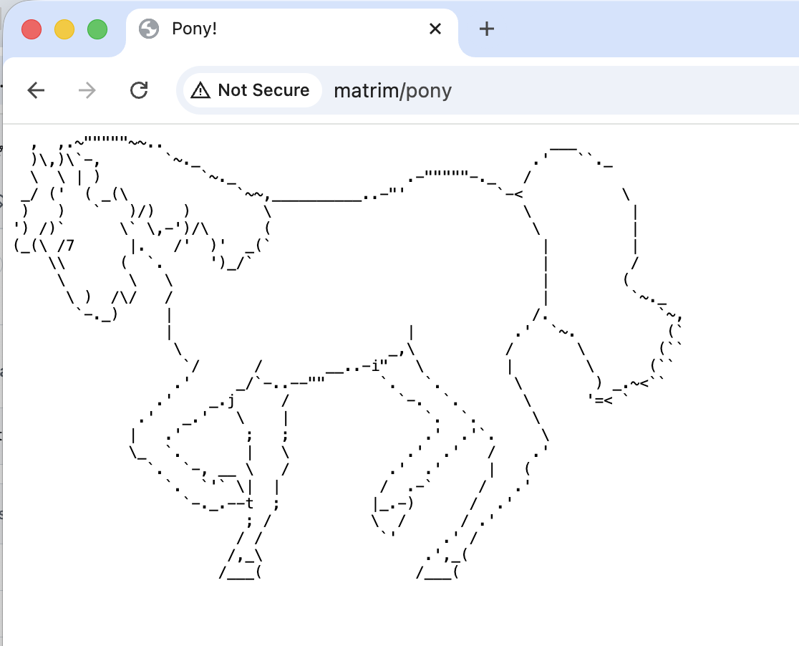
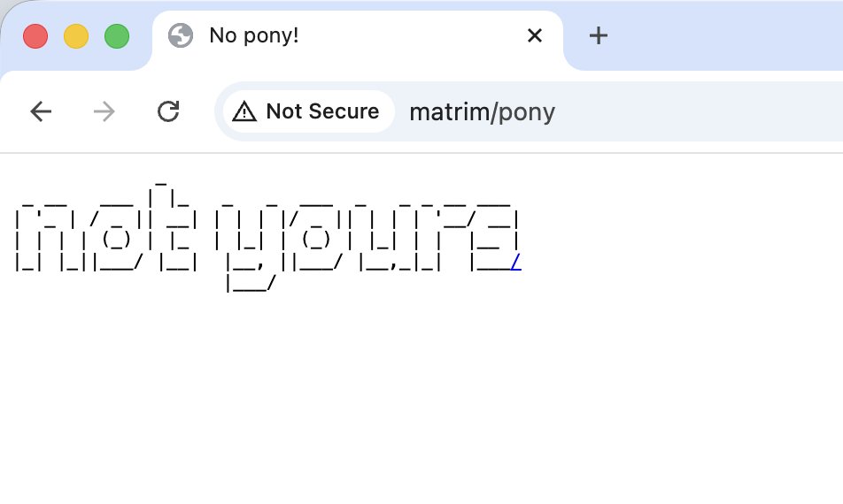

.. raw:: latex

   \part{Core Configuration}

.. _Chapter_Common_modules:

=====================
Adding common modules
=====================

.. epigraph::

   "When I get a little money I buy books; and if any is left
   I buy food and clothes."

   -- Desiderius Erasmus

.. index:: Common modules

.. index:: Modules,common

.. index:: Adding common modules

A critical detail of the Apache HTTP Server is that it is modular.
There's a small core, and everything beyond the absolute basics is
implemented in modules.

The module API makes it fairly easy for anyone to create their own
modules to perform whatever task, large or small. As a result, a large
number of third-party modules have sprung up. By "third-party", I
mean modules that are maintained and distributed separately from the
main web server project. This is due to a variety of factors. Not
everything is of interest to enough people to necessitate being part
of the main project. Some modules are licensed incompatibly to the
Apache license. Some modules are for use only within a particular site
or company.

When a module gains sufficient popular following, sometimes the httpd
project will go encourage a module author to bring their module to the
main project. Or, alternatively, the author may approach the httpd
project and offer their module as a code donation, so that a larger
community will be working on it. Thus, modules like mod_ssl, mod_lua,
mod_macro, and others, have over the years become part of the main
server project.

Other modules, such as mod_perl, mod_security, or PHP, have a
sufficient community around them that they exist as vibrant
independent projects.

In this chapter, I show how to install and configure several
third-party modules, ranging from the trivial (mod_pony) to the more
useful. I'll show how to install them via packages, and from source.

This chapter does not cover writing your own modules. I feel that
this is beyond the scope of this book. If you are interested in module
development, start with the developer documentation at
https://httpd.apache.org/docs/current/developer/ and the API reference
at https://ci.apache.org/projects/httpd/trunk/doxygen/ (generated from
the httpd trunk source).

.. _Recipe_Finding_Modules:

Finding modules
---------------

.. index:: Modules,finding

.. index:: Finding modules

.. index:: Finding modules on GitHub

.. _Problem_Finding_Modules:

Problem
~~~~~~~

I'd like to see what third-party modules are available.

.. _Solution_Finding_Modules:

Solution
~~~~~~~~

There is no single comprehensive registry of third-party httpd modules.
The best approach is to search GitHub:

* https://github.com/search?q=apache+httpd+module&type=repositories
* Look for repositories tagged with the ``apache-httpd-module`` or
  ``httpd-module`` topics.

Your operating system's package manager is also a good starting point.
On Debian/Ubuntu, try ``apt search libapache2-mod-``. On
Fedora/RHEL/AlmaLinux, try ``dnf search mod_``.

.. _Discussion_Finding_Modules:

Discussion
~~~~~~~~~~

For many years, the Apache httpd project maintained a module registry at
modules.apache.org, where third-party authors could list their modules
and users could post reviews. That site has been retired, and there is
no direct replacement.

In practice, GitHub has become the de facto home for third-party httpd
modules. Most active module projects are hosted there, and GitHub's
search and topic system makes them reasonably easy to find. When
searching, try terms like "apache httpd module" followed by the
functionality you're looking for — for example, "apache httpd module
rate limiting" or "apache httpd module markdown".

For Perl-based modules (especially those related to mod_perl), CPAN
(https://metacpan.org/) remains a useful source.

Your Linux distribution's package manager is often the easiest path,
since packaged modules will be compiled against the right version of
httpd and can be installed with a single command. The downside is that
distribution repositories tend to carry only the most popular modules,
and the versions may lag behind upstream.

When evaluating a third-party module — particularly one found on
GitHub — look for:

* **Recent commits** — is the module actively maintained?
* **Compatibility** — does it mention support for httpd 2.4?
* **License** — is it Apache-2.0 or compatible?
* **Issues and pull requests** — is anyone using it and reporting
  problems?
* **Documentation** — does it explain installation and configuration?

A module with no commits in several years may still work, but you
should be cautious about relying on it in production.

.. _See_Also_Finding_Modules:

See Also
~~~~~~~~

* https://github.com/search?q=apache+httpd+module&type=repositories

* https://httpd.apache.org/docs/current/mod/ — the list of modules
  bundled with httpd itself

.. _Recipe_apxs:

Installing a module with apxs
-----------------------------

.. index:: apxs

.. index:: Installing modules with apxs

.. index:: Modules,installing with apxs

.. _Problem_apxs:

Problem
~~~~~~~

You have downloaded a third-party module that isn't listed in
this chapter, and you want to install it.

.. _Solution_apxs:

Solution
~~~~~~~~

Move to the directory where the module's source file was
unpacked, and then:

.. code-block:: text

   sudo apxs -cia module.c

The install step copies files into the server's modules directory, so
you will need root privileges (via ``sudo``) to run this command.

.. _Discussion_apxs:

Discussion
~~~~~~~~~~

Installing modules has
been pretty standard for a long time, and for most modules, the process should be
fairly easy.

``apxs`` is a tool that comes with the web server which facilitates
building, installing and enabling a module.

If you installed httpd via a package, you will likely have to install
a second package to get the developer tools, such as ``apxs``.

On Debian (or Ubuntu, and related distributions), install the
``apache2-dev`` package:

.. code-block:: text

   apt-get install apache2-dev

On RPM-based distributions (Fedora, RHEL, AlmaLinux, Rocky Linux), install the
``httpd-devel`` package:

.. code-block:: text

   dnf install httpd-devel

The ``-cia`` option to ``apxs`` is a shortcut for the options ``-c -i -a``,
and means compile, install, and activate, respectively.

Compile builds the C source code into a ``.so`` file. Install copies
that file into the location where your server has module files.
Activate modifies your server configuration file to add ``LoadModule``
directive so that the module will be loaded on server restart.

This requires that your server is built with ``mod_so`` enabled, to
permit dynamic module loading.

.. _See_Also_apxs:

See Also
~~~~~~~~

* The **apxs** manpage, typically **ServerRoot/man/man8/apxs.8** or type
  ``man apxs`` at the command line.

* apxs documentation, at
  https://httpd.apache.org/docs/current/programs/apxs.html

.. _Recipe_Installing_PHP:

Running PHP programs
--------------------

.. index:: PHP

.. index:: PHP,Installing

.. index:: Running PHP programs

.. _Problem_Installing_PHP:

Problem
~~~~~~~

You want to use the PHP language on your httpd.

.. _Solution_Installing_PHP:

Solution
~~~~~~~~

There are a few different ways to install PHP on your httpd,
depending on how you installed Apache httpd itself, and your needs and
preferences.

Look in :ref:`Chapter_Dynamic_content` for discussion of the various ways
to install and enable PHP on your httpd.

.. _Discussion_Installing_PHP:

Discussion
~~~~~~~~~~

I've devoted an entire chapter to the various ways of producing
dynamic content on Apache httpd, and PHP is a very important topic in
that discussion.

.. _See_Also_Installing_PHP:

See Also
~~~~~~~~

* :ref:`Recipe_enabling_mod_php`

* :ref:`Recipe_php-fpm`

.. _Recipe_mod_pony:

Installing and configuring mod_pony
-----------------------------------

.. index:: mod_pony

.. index:: Modules,mod_pony

.. index:: Pony

.. index:: Example module

.. index:: Modules,example

.. index:: Installing and configuring mod_pony

.. _Problem_mod_pony:

Problem
~~~~~~~

You've found mod_pony on GitHub and you want to install it
and try it out.

.. _Solution_mod_pony:

Solution
~~~~~~~~

Download mod_pony.c from the module repository at
https://github.com/rbowen/mod_pony

Install and enable it using apxs, as described above:

.. code-block:: text

   apxs -cia mod_pony.c

Configure the pony handler as described in the documentation:

.. code-block:: text

   <Location /pony>
     SetHandler pony
   </Location>

To verify that it works, load the address
http://your.server/pony in your browser to invoke the
``pony`` handler.

.. _Discussion_mod_pony:

Discussion
~~~~~~~~~~

mod_pony is a joke module that does nothing more than randomly display
either an ascii-art pony, or the words 'not yours'.

It is also a useful example of how to write a content module, so it's
a good place to start if you're interested in writing your own httpd
module.

It is used as an example in this chapter simply because it provides
the simplest possible example of how to install and configure a
third-party module on your Apache httpd server.

.. _See_Also_mod_pony:

See Also
~~~~~~~~

* ``mod_example_hooks`` —
  https://httpd.apache.org/docs/current/mod/mod_example_hooks.html
  — a sample module in the httpd source tree, useful as a template for
  writing your own modules)

* https://github.com/rbowen/mod_pony

.. _Recipe_mod_security:

mod_security
------------

.. index:: mod_security

.. index:: Modules,mod_security

.. index:: Security,mod_security

.. _Problem_mod_security:

Problem
~~~~~~~

You'd like to use ModSecurity as a web application firewall (WAF) to
block common attacks against your web server.

.. _Solution_mod_security:

Solution
~~~~~~~~

Install ModSecurity via your operating system's package manager, then
enable it and configure it with the OWASP Core Rule Set (CRS).

To install via packages on Ubuntu or Debian:

.. code-block:: text

   sudo apt install libapache2-mod-security2
   sudo a2enmod security2
   sudo systemctl restart apache2

To install via packages on Fedora or RHEL:

.. code-block:: text

   sudo dnf install mod_security
   sudo systemctl restart httpd

Next, enable the recommended configuration:

.. code-block:: text

   sudo cp /etc/modsecurity/modsecurity.conf-recommended \
       /etc/modsecurity/modsecurity.conf

Edit ``/etc/modsecurity/modsecurity.conf`` and change:

.. code-block:: text

   SecRuleEngine DetectionOnly

to:

.. code-block:: text

   SecRuleEngine On

.. _Discussion_mod_security:

Discussion
~~~~~~~~~~

ModSecurity is an open-source web application firewall (WAF) that
inspects HTTP traffic in real time and blocks common attack patterns
such as SQL injection, cross-site scripting (XSS), and other OWASP
Top 10 threats.

The project has been under the stewardship of the OWASP Foundation
since January 2024 (previously maintained by Trustwave/SpiderLabs).
The source code is at
https://github.com/owasp-modsecurity/ModSecurity

.. index:: mod_uniqueid

.. index:: Modules,mod_uniqueid

.. index:: OWASP Core Rule Set

.. index:: CRS

You will need to have ``mod_unique_id`` enabled for ModSecurity to
function. On Debian/Ubuntu: ``sudo a2enmod unique_id``.

By itself, ModSecurity is just an engine — it doesn't know what to
block until you give it rules. The standard rule set is the **OWASP
Core Rule Set (CRS)**, which provides protection against the most
common web attacks out of the box.

To install the CRS on Debian/Ubuntu:

.. code-block:: text

   sudo apt install modsecurity-crs

On RHEL/Fedora, the CRS is typically included with the
``mod_security_crs`` package:

.. code-block:: text

   sudo dnf install mod_security_crs

The default CRS installation starts in "detection only" mode, which
logs potential attacks without blocking them. This is a sensible
starting point — run in detection mode for a while, review the logs
for false positives, then switch to enforcement by setting
``SecRuleEngine On`` as shown in the Solution above.

For more detailed recipes on tuning ModSecurity rules and handling
false positives, see :ref:`Chapter_Security`.

.. _See_Also_mod_security:

See Also
~~~~~~~~

* OWASP ModSecurity project —
  https://github.com/owasp-modsecurity/ModSecurity

* OWASP Core Rule Set (CRS) —
  https://coreruleset.org/

* ModSecurity Reference Manual —
  https://github.com/owasp-modsecurity/ModSecurity/wiki/Reference-Manual

.. _Recipe_mod_security_rules:

mod_security rules
------------------

.. index:: mod_security,rules

.. index:: Securing your server with mod_security

.. _Problem_mod_security_rules:

Problem
~~~~~~~

Now that you have ``mod_security`` installed, how do you use it?

.. _Solution_mod_security_rules:

Solution
~~~~~~~~

There are a number of recipes about using ``mod_security`` to protect
your web server in :ref:`Chapter_Security`.

.. _Discussion_mod_security_rules:

Discussion
~~~~~~~~~~

This chapter is primarily devoted to installing and enabling
third-party modules. Because ``mod_security`` is a web application
firewall, primarily focused on web application security, I've put the
relevant recipes in the Security chapter.

.. _See_Also_mod_security_rules:

See Also
~~~~~~~~

* :ref:`Chapter_Security`

.. _Recipe_module_broken:

Why won't this module work?
---------------------------

.. index:: Why won't this module work

.. index:: Troubleshooting,third-party modules

.. _Problem_module_broken:

Problem
~~~~~~~

You are trying to install a third-party module, but httpd
refuses to recognize it.

.. _Solution_module_broken:

Solution
~~~~~~~~

Consult the sources for the module, or its documentation, or ask
the author, in order to determine which version of httpd the package
supports.

.. _Discussion_module_broken:

Discussion
~~~~~~~~~~

As significant changes are made to httpd,
sometimes compatibility suffers as the API is changed. Although
efforts are made to keep this sort of thing to a minimum, sometimes it
is unavoidable.

To keep an incompatible module from being loaded and crashing
the web server when used, both modules and the server have a built-in
'magic' number that is recorded when they're built, and that relates
to the version of the API. When the server tries to load a module DSO,
it compares the module's magic number with the server's own, and if
they aren't compatible, the server refuses to load it.

The development team tries to keep the magic number
compatibility within major version numbers, but not across them. That
is, a module built for httpd 2.4 **should** work
with almost any 2.4 version of the server built after the module was,
but it won't work across major versions.

.. _See_Also_module_broken:

See Also
~~~~~~~~

* :ref:`Recipe_Finding_Modules`

.. _Recipe_Enabling_modules_debian:

Enabling modules on Ubuntu and Debian
-------------------------------------

.. index:: Ubuntu,Enabling and disabling modules

.. index:: Enabling and disabling modules on Debian and Ubuntu

.. index:: Debian,Enabling and disabling modules

.. _Problem_Enabling_modules_debian:

Problem
~~~~~~~

Debian, and related distributions such as Ubuntu, provide their own
tools for enabling and disabling modules.

.. _Solution_Enabling_modules_debian:

Solution
~~~~~~~~

Use the **a2enmod** and **a2dismod** tools to enable, and disable,
available modules, respectively.

.. code-block:: text

   a2enmod rewrite
   a2dismod mime_magic

.. _Discussion_Enabling_modules_debian:

Discussion
~~~~~~~~~~

Debian, and related distributions like Ubuntu, use a directory
structure built around its site- and server-management tools. In the
case of modules, there are two directories, and two command line
tools.

In the directory **/etc/apache2/mods-available/**, you will find
configuration files for the various
modules which have been installed with the server, and which may or
may not be enabled.

In the directory **/etc/apache2/mods-enabled/**, you will find symbolic
links (symlinks) to files in that other directory.

Two command line tools are provided to manage these symlinks.
**a2enmod** (Apache 2 Enable Module) creates the symlink, and **a2dismod**
(Apache 2 Disable Module) removes that symlink.

In this way, you can easily enable and disable various modules at will
without having to edit configuration files.

.. note::

   You will still need to restart your Apache httpd server in order for
   these configuration changes to take effect.

.. _See_Also_Enabling_modules_debian:

See Also
~~~~~~~~

* :ref:`Recipe_Debian_Vhosts`

* ``man a2enmod`` (Type this at the command line for the ``a2enmod``
  user manual.)

* ``man a2dismod`` (Type this at the command line for the ``a2dismod``
  user manual.)

Summary
-------

Apache httpd is modular - the core is as small as possible, and all
interesting functionality is in optional modules. This means that
httpd can be as simple, or as featureful, as you want it to be, by
enabling and disabling various modules for the functionality you want,
or don't want.

Everything else in this book is implemented by some module or other,
which you'll need to have enabled to use the functionality discussed.

