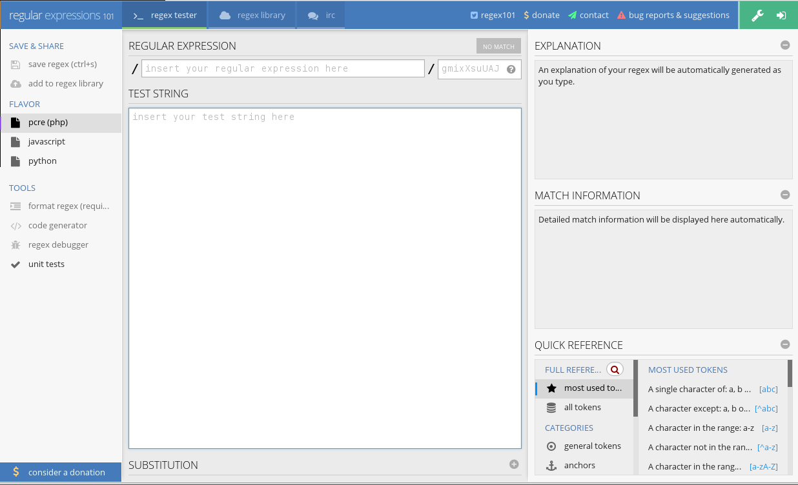

.. raw:: latex

   \part{Power User}

.. _Chapter_regex:

===================================
Introduction to regular expressions
===================================

.. epigraph::

   | Is this the real life? Is this just fantasy?
   | Caught in a landslide, no escape from reality.

   -- Queen, *Bohemian Rhapsody*

.. index:: Regular expressions

.. index:: Regex

In several of the coming chapters, as well as a few of the earlier
ones, I've used a syntax called Regular Expressions to match patterns
in URLs. I'm going to take a short aside now to cover Regular
Expression syntax a little more thoroughly.

Throughout this chapter, and the rest of the book, regular
expressions will also be refered to as 'regex' (pronounced 'rej-eks').
You'll also occasionally see them refered to as 'regexp' or 'regexps',
and sometimes as simply 'RE'. In
some older reference materials, you may see 'regexen' used as 
the plural of 'regex'.

.. index:: Mastering Regular Expressions

.. index:: Jeffrey Friedl

Please note that this isn't a comprehensive treatment. For that, you
should get Jeffrey Friedl's excellent book Mastering Regular
Expressions, which is by far the best resource on the topic. You can
also see his website at http://regex.info/

However, for the purposes of this book, I'm going to provide a brief
introduction to, and basic syntax for, the regular expressions that
you are likely to encounter in working with the Apache HTTP Server.

.. tip::

   This section appears before the ``mod_rewrite`` chapter to ensure
   that you have a grounding in regular expressions before you dive
   into the content where they are used extensively.

Apache httpd uses the PCRE (Perl Compatible Regular Expression)
library, which is what is used by most modern tools which have a
regular expression capability. Thus, the syntax that you learn here
will map to most other places you may encouter regular expressions,
with a few small differences.

What are regular expressions?
-----------------------------

.. index:: Regular expressions,definition

Regular expressions, or regex, are a symbolic language for
representing patterns in text. For example, if you wanted to locate
all occurances of numbers in a document, you might use the regular
expression syntax for number (``\d``) to locate any numbers (digits) in
that larger blob of text.

In a moment, I'll present a basic regex vocabulary, but it won't be
comprehensive - just sufficient for our use in Apache httpd
configuration directives. A full regular expression vocabulary can
describe almost any pattern that might appear text.

In the context of the Apache HTTP Server, you're mostly going to be
using regular expressions to match URLs. In other contexts, they can
be used to match any characters, including non-latin characters. So,
for the purposes of this book, you're actually dealing with a
simplified sub-set of the complete power of regular expressions.

Basic regex vocabulary
----------------------

.. index:: Regular expressions,vocabulary

To get started in writing your own regular expressions, you'll
need to know a few basic pieces of vocabulary, such as shown in Tables
:ref:`A_basic_regex_vocabulary` and
:ref:`Predefined_regular_expression_character_classes`.
These constitute the bare minimum
that you need to know. Although this will hardly qualify you as an
expert, it will enable you to solve many of the regex scenarios you
will find yourself faced with.

.. _A_basic_regex_vocabulary:

A basic regex vocabulary
----------------------------

+-----------+--------------------------------------------------+
| Character | Meaning                                          |
+-----------+--------------------------------------------------+
| . | Matches any character. This is the wildcard      |
+-----------+--------------------------------------------------+
| +         | Matches one or more of the previous character. |
+-----------+--------------------------------------------------+
| *         | Matches zero or more of the previous character. |
+-----------+--------------------------------------------------+
| ?         | Makes the previous character optional. For       |
+-----------+--------------------------------------------------+
| ^         | Indicates that the following characters must     |
+-----------+--------------------------------------------------+
| $         | Indicates that the characters to be matched must |
+-----------+--------------------------------------------------+
| \         | Escapes the following character, meaning that it |
+-----------+--------------------------------------------------+
| [ ]       | Character class. Match one of the things         |
+-----------+--------------------------------------------------+
| ( )       | Groups a set of characters together. This allows |
+-----------+--------------------------------------------------+

.. _backreferences:

Grouping, capturing, and backreferences
---------------------------------------

.. index:: Backreferences

Using parentheses in a regex causes the contents of the parentheses to
be treated as a single unit. You can think of it as turning several
atoms into a molecule.

For example, the regex ``1(abc)+2`` would match a string ``1abc2``, and
also ``1abcabc2``, since the ``+`` applies to the entire molecule "abc".

However, using parentheses has a side-effect, that the thing which was
matches is captured and put into a variable, which you can use later.
This is called a backreference, because it references back to the 
thing that matches.

Consider, for example, a regular expression ``A(\d+)B``. (``\d``
matches a digit, that is, a number from 0-9. See :ref:`charclass`.) 
If this regex
is applied to a string "A123B", then the ``\d+`` part would match ``123``.
As a result of this match, a new variable would be created, called
``$1``, containing the value ``123``. This is what is called a
backreference.

Later on, you would then be able to use the variable ``$1`` in a
replacement. You'll see extensive examples of this in later chapters,
but here's one to give you an idea:

.. code-block:: text

   RewriteRule ^/product/(\d+) /prod_lookup.php?ID=$1 [PT]

Without diving into all the details, what you need to observe here is
that a product ID appearing in a URL (like
http://wwww.mystore.com/product/435632) will be mapped to a product
lookup script, and the number that was seen in the URL will be passed
to that script in a query string (in this case,
``/prod_lookup.php?ID=435632``)

The second set of parentheses in a regex are assiged to $2, the next
to $3, and so on, so that you can capture multiple parts of the
pattern.

Later on, when I introduce the ``RewriteCond`` directive, you'll learn
that backreferences in ``RewriteCond`` are called %1, %2, and so on
instead.

.. _charclass:

Character Classes
-----------------

.. index:: Character classes

As shown in the table above - :ref:`A_basic_regex_vocabulary`,
a character class defines a set of characters. Thus, ``[abc]`` matches
one of ``a``, ``b``, or ``c``, and ``c[aou]t`` will match 
``cat``, ``cot``, or ``cut``.
                
In addition to character
classes that you form yourself, there are a number of special
predefined character classes to represent commonly used groups
of characters. See the below table 
:ref:`Predefined_regular_expression_character_classes`
for a list of these predefined character classes.

.. _Predefined_regular_expression_character_classes:

Predefined regular expression character classes
---------------------------------------------------

+-----------------+-------------------------------------------------+
| Character class | Meaning                                         |
+-----------------+-------------------------------------------------+
| \d              | Any decimal digit ("0" through                  |
+-----------------+-------------------------------------------------+
| \D              | Any character that is **not** a                 |
+-----------------+-------------------------------------------------+
| \s              | Any whitespace character except VT (vertical    |
+-----------------+-------------------------------------------------+
| \S              | Any nonwhitespace character (that is, anything  |
+-----------------+-------------------------------------------------+
| \w              | Any 'word' character; that is, an underscore or |
+-----------------+-------------------------------------------------+
| \W              | Any nonword character. |
+-----------------+-------------------------------------------------+
| [:alnum:]       | Any alphanumeric character. |
+-----------------+-------------------------------------------------+
| [:alpha:]       | Any alphabetical character. |
+-----------------+-------------------------------------------------+
| [:blank:]       | A space or horizontal tab. |
+-----------------+-------------------------------------------------+
| [:cntrl:]       | A control character. |
+-----------------+-------------------------------------------------+
| [:digit:]       | A decimal digit. |
+-----------------+-------------------------------------------------+
| [:graph:]       | A nonspace, noncontrol character. |
+-----------------+-------------------------------------------------+
| [:lower:]       | A lowercase letter. |
+-----------------+-------------------------------------------------+
| [:print:]       | Same as graph, but also space and               |
+-----------------+-------------------------------------------------+
| [:punct:]       | A punctuation character. |
+-----------------+-------------------------------------------------+
| [:space:]       | Any whitespace character, including newline and |
+-----------------+-------------------------------------------------+
| [:upper:]       | An uppercase letter. |
+-----------------+-------------------------------------------------+
| [:xdigit:]      | A valid hexadecimal digit. |
+-----------------+-------------------------------------------------+

The POSIX classes (the ones using ``[: :]``) are shorthand names for multiple
matching characters, and the ``[:``
and ``:]`` are part of their syntax.
As classes, they can only be used within a class expression (**i.e.**,
between ``[`` and ``]``), which can make things look a little
weird and confusing. For instance, to match any single hexadecimal
digit, you'd use:

.. code-block:: text

To match more than one, you'd use:

.. code-block:: text

   [[:xdigit:]]+

To match any hexadecimal digit **or** whitespace character:

.. code-block:: text

   [[:xdigit:][:space:]]

Or maybe:

.. code-block:: text

   [[:xdigit:]\s]

To match any character **except** a hexadecimal digit, use:

.. code-block:: text

   [^[:xdigit:]]

.. _regex_directives:

What directives use regular expressions?
----------------------------------------

.. index:: directives,regular expressions

.. index:: Regular expressions,directives

.. index:: What directives use regular expressions

Three main categories of httpd directives use regular expressions.

Any directive with a name containing the word
**Match**, such as ``FilesMatch``, or ``RedirectMatch``, can be assumed
to use regular expressions in its arguments. 

``SomethingMatch`` directives each implement the same
functionality as their counterpart without the **Match**. For example,
the **RedirectMatch** directive does essentially the
same thing as the **Redirect** directive, except that the first
argument, rather than being a literal string, is a regular 
expression, which will be compared to the incoming request URL.

And directives supplied by the module ``mod_rewrite`` use regular
expressions to accomplish their work.

For more about ``mod_rewrite``, see :ref:`Chapter_mod_rewrite`, *URL
Rewriting with mod_rewrite*.

Finally, the general purpose expression parser can use regular
expressions in its expressions. The expression parser is discussed in
more detail in :ref:`Chapter_per_request`, **Programmable Configuration**.

Common regex pitfalls
---------------------

.. index:: Regex,pitfalls

A common pitfall when constructing regular expression patterns is
overlooking that ``**`` matches **zero* or more occurrences. This
means that a pattern of ``ab*c``, intended to match things like ``abbc``
and ``abbbbc``, will **also** match ``ac``. It also means, as mentioned
above, that the pattern ``.*`` will match any string, including an empty
string.

Often, you actually want to use a ``+`` (meaning **one** or more 
occurrences) rather than a ``*`` (meaning **zero** or more occurrences).

Another fact often forgotten is that pattern characters that
match a variable number of occurrences (``+``, ``*``, and ``?``)
apply to the single pattern
expression they immediately follow. And unless you've grouped
several together with parentheses, that usually means a single
character. 

Thus, ``abc+`` will match ``abc`` and ``abcccc``, *
not* ``abcabcabc``. To match the latter, group
the characters like this: ``(abc)+``

Where else will you encounter regular expressions?
--------------------------------------------------

Once you have mastered regular expressions, you'll find that them are
useful in many different contexts. Numerous unix command line
utilities, and almost every programming language you'll ever
encounter, will use regular expressions in some way.

Useful command line tools that use regex include ``grep``, ``sed``, and
many others. A detailed treatment of these tools is well outside of the
scope of this book, but I'll give a quick example of each.

The ``grep`` tool looks for strings in files. This is a place where
regular expressions could be very useful. For example, to find the
comments in a file of C source code:

.. code-block:: text

   grep -e '^[/ ]\*' mod_rewrite.c

In this case, the command looks for lines that start with either "/\*\*" or " \*\*" in
the source code for ``mod_rewrite``.

See ``http://www.gnu.org/software/grep/manual/grep.html`` for more
detail on using ``grep``.

The ``sed`` tool is used to replace occurrences of of strings in a file
with something else. This is a very powerful tool for file
manipulation, and can be used to globally change a bunch of files.

For example, you could use ``sed`` to replace ``arial`` with ``garamond`` in
a CSS file to change the font used on your website:

.. code-block:: text

   sed -i .bak 's/arial/garamond/' style.css

In this example, the original file is backed up to a file named
``style.css.bak`` in case you made a mistake.

See ``https://www.gnu.org/software/sed/manual/sed.txt`` for more detail
on using ``sed``.

Many other command line tools use regular expressions, including
``awk``, ``ack``, and more. You'll encounter them all the time if you're a
Unix or Linux user.

Most programming languages have the ability to use regular
expressions.

Perl is the best example of this, with regular
expressions being a central part of how Perl does everything. The Perl
regex documentation - ``http://perldoc.perl.org/perlre.html`` - is often
cited as the best reference for learning regex, and the standard regex
library used in many implementations is called PCRE - Perl Compatible
Regular Expressions.

But you can use regex in almost every language, with different
languages putting more emphasis on them than others. So, once you
learn this set of tools, you'll find that they're useful for the rest
of your computer career.

Regex test tools
----------------

.. index:: Regular expressions,test tools

You will often find yourself with the need to craft a particular
regular expression, and the need to test your ideas before putting
them to use. There are many tools available for this purpose online.
Here I mention just a few
of them, but you can easily find others using your favorite search
engine.

Be aware that some of them are geared to a particular purpose, such as
regular expressions for use in Javascript, Perl, or RewriteRules, and
that the syntax will vary slightly from one implementation to another.

Regex101 - https://regex101.com/ - is an online tool that supports a
few different regex flavors, including the PCRE flavor that you'll
need to work with httpd.

.. _Regex1001:

   Regex 101

In the form on this page, you will type your test regex in the top
field, and the URL that you're trying to match in the text box, and it
will show you whether the string matched, and, if it did, which
portion of it matches. It will also show you the values of any
backreferences that are captured by the pattern.

Similar tools include Regex Pal -  http://www.regexpal.com/ -
RegExr - http://regexr.com/ - and many others.

While there were, at one time, many installable regex tester tools,
for Mac, Windows, and Linux, most of these are no longer maintained,
as the online tools have become more and more sophisticated over the
years, and so the desktop tools have fallen out of use.

Some tools such as Regex Widget -
http://www.apple.com/downloads/dashboard/developer/regexwidget.html -
and RegExr Desktop - http://regexr.com/desktop/ - are still actively
maintained, and may be worth trying if you need to test regexes
somewhere that you don't have a browser.

.. _glob_matching:

Other pattern matching in Apache httpd
--------------------------------------

.. index:: Pattern matching

Finally, there are other places in Apache httpd configuration where a
simpler form of pattern matching is used called ``globbing``. This is
typically used to find file names that follow certain simple patterns.
This syntax is used by directives that refer directly to file and
directory names, but don't have ``Match`` as part of their name. For
example, the ``Directory`` directive can use globbing to match directory
names.

.. code-block:: text

   <Directory /var/www/*/images>

The syntax that can be used in file globs is:

.. _File_globbing_syntax:

**File globbing syntax**

+-----------+-------------------------------------------------------------+
| Character | Meaning                                                     |
+-----------+-------------------------------------------------------------+
| *         | Matches any string appearing between slashes - that is, one |
+-----------+-------------------------------------------------------------+
| ?         | Matches any single character                                |
+-----------+-------------------------------------------------------------+
| [abc]     | A character class - matches one character in the brackets   |
+-----------+-------------------------------------------------------------+
| [0-9]     | Matches anything in a range of characters, such as 0-9 or   |
+-----------+-------------------------------------------------------------+

Other directives that allow the use of globs include ``UserDir``,
``Files``, and ``Include``.

For more information
--------------------

This chapter only scratches the surface when it comes to regular
expressions. I will leave you with a few places that you should look
if you want to become a regex wizard.

As already mentioned, the best reference on this topic is Jeffrey
Friedl's excellent book "Mastering Regular Expressions." It is an
enormous book, and packed with deep technical details. It should be on
your shelf.

Perhaps the best online reference on regular expressions is the PerlRe
documentation. This is available on your computer if you have Perl
installed, by typing ``perldoc perlre``, or online at
``http://perldoc.perl.org/perlre.html``

In the following chapter, :ref:`Chapter_mod_rewrite`, *URL Rewriting with
mod_rewrite*, I'll introduce
``mod_rewrite``, which will be the primary place you'll encounter
regular expressions in httpd. Hopefully I've given
you sufficient background to tackle this topic, and I'll frequently
point you back to this chapter during the course of that one.

