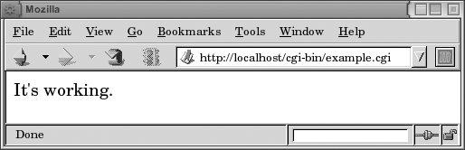
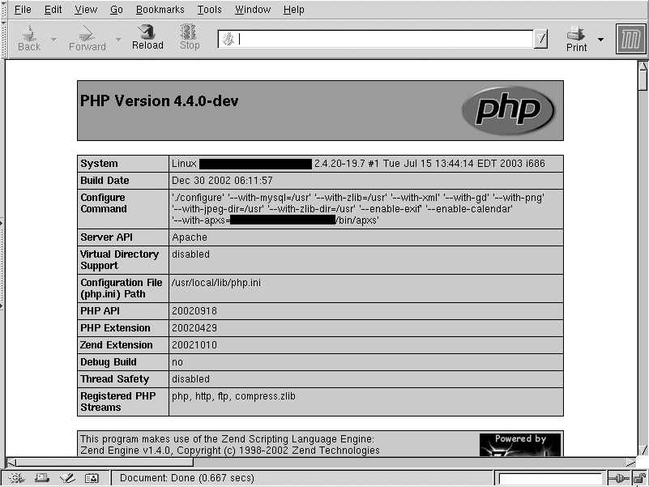

.. _Chapter_Dynamic_content:

===============
Dynamic Content
===============

.. index:: Dynamic content

.. index:: CGI

.. index:: PHP

.. index:: Running scripts


Very few Web sites can survive without some mechanism for providing
dynamic content—content that is generated in response to the needs of
the user. The recipes in this chapter guide you through enabling
various mechanisms to produce this dynamic content and help you
troubleshoot possible problems that may occur.

CGI programs are one of the simplest ways to provide dynamic content
for your Web site. They tend to be easy to write because you can write
them in any language. Thus, you don't have to learn a new language to
write CGI programs. Examples in this chapter will be given in a
variety of languages, but it's not necessary that you know these
languages in order to see how to configure Apache for their execution.

Although CGI is no longer the preferred mechanism for generating
dynamic content, it is the simplest, and understanding how CGI works
is a great help in understanding how the more complex dynamic content
providers work.

Other dynamic content providers, such as PHP and ``mod_perl``, also
enjoy a great deal of popularity, because they provide many of the
same functions as CGI programs but typically execute faster.


.. _Recipe_ScriptAlias:

Enabling a CGI directory
~~~~~~~~~~~~~~~~~~~~~~~~


.. _Problem_ScriptAlias:

Problem
~~~~~~~


You want to designate a directory that contains only CGI scripts.


.. _Solution_ScriptAlias:

Solution
~~~~~~~~


Add the following to your **httpd.conf** file:


.. code-block:: text

   ScriptAlias /cgi-bin/ /www/cgi-bin/


.. _Discussion_ScriptAlias:

Discussion
~~~~~~~~~~


A CGI directory will usually be designated and enabled in your default
configuration file when you install Apache. However, if you want to
add additional directories where CGI programs are located, the
**ScriptAlias** directive does this for you. You may have as many
**ScriptAlias**'ed directories as you want.

The one line previously introduced is equivalent to these directive
lines:


.. code-block:: text

   Alias /cgi-bin/ /www/cgi-bin/
   
   <Location /cgi-bin/>
       Options ExecCGI
       SetHandler cgi-script
   </Location>


.. _apacheckbk-CHP-8-NOTE-106:


.. warning::

   Note that URLs that map to the directory in question **via** some other
   mechanism or URL path, such as another **Alias** or a **RewriteRule**,
   will not benefit from the **ScriptAlias** setting, as this mapping is by
   URL (``&lt;Location&gt;``), not by directory. As a result, accessing
   the scripts in this directory through some other URL path may result
   in their code being displayed rather than the script being executed.


You also may need to add a **&lt;Directory&gt;** block to permit access
to the directory in question, as a **cgi-bin** directory is usually
outside of the document directory tree. It is also recommended that
you deny the use of **.htaccess** files in **cgi-bin** directories:


.. code-block:: text

   <Directory /www/cgi-bin>
       Order allow,deny
       Allow from all
       AllowOverride None
   </Directory>


.. tip::

   See also :ref:`Using_Windows_File_Extensionsto_Launch_CGI_Programs_id141031`
   for a discussion of using Windows file extensions to launch CGI
   programs.


.. _See_Also_ScriptAlias:

See Also
~~~~~~~~


* :ref:`Recipe_ScriptAliasMatch`

* :ref:`Enabling_CGI_Scripts_in_Non-ScriptAliased_Directories_id140724`

* http://httpd.apache.org/docs/2.0/mod/mod_alias.html


.. _Enabling_CGI_Scripts_in_Non-ScriptAliased_Directories_id140724:

Enabling CGI Scripts in Non-ScriptAliased Directories
~~~~~~~~~~~~~~~~~~~~~~~~~~~~~~~~~~~~~~~~~~~~~~~~~~~~~


.. _Problem_id140738:

Problem
~~~~~~~


You want to put a CGI program in a directory that contains
non-CGI documents.


.. _Solution_id140804:

Solution
~~~~~~~~


Use **AddHandler** to map the CGI handler to the particular files that
you want executed:

.. index:: containers,<Directory>

.. index:: Directives,Options

.. index:: Directives,AddHandler


.. code-block:: text

   <Directory "/foo">
       Options +ExecCGI
       AddHandler cgi-script .cgi .py .pl
   </Directory>


.. _Discussion_id140835:

Discussion
~~~~~~~~~~

.. index:: Directives,ScriptAlias


Enabling CGI execution **via** the **ScriptAlias** directive is preferred
for a number of reasons over permitting CGI execution in arbitrary
document directories. The primary reason is security auditing. It is
much easier to audit your CGI programs if you know where they are, and
storing them in a single directory ensures that.

However, there are cases in which it is desirable to have access to
CGI functionality in other locations. For example, you may want to
keep several files together in one directory—some of them static
documents, and some of them scripts—because they are part of a single
application.

Using the **AddHandler** directive maps certain file extensions to the
**cgi-script** handler so they can be executed as CGI programs. In the
case of the aforementioned example, programs with a **.cgi**, **.py**, or
**.pl** file extension will be treated as CGI programs, whereas all
other documents in the directory will be served up with their usual
MIME type.

Note that the **\+ExecCGI** argument is provided to the **Options**
directive, rather than the **ExecCGI** argument—that is, with the
``+`` sign rather than without. Using the ``+`` sign adds this
option to any others already in place, whereas using the option
without the ``+`` sign will replace the existing list of
options. You should use the argument without the ``+`` sign if you
intend to have only CGI programs in the directory, and with the
``+`` sign if you intend to also serve non-CGI documents out of the
same directory.


.. _See_Also_id141000:

See Also
~~~~~~~~


* :ref:`Recipe_ScriptAlias`


.. _I_sect18_d1e13831:

Specifying a Default Document in a CGI Directory


Problem
~~~~~~~


You want to allow a default file to be served when a CGI
directory is requested.


Solution
~~~~~~~~

.. index:: Directives,ScriptAlias

.. index:: Directives,Alias

.. index:: Directives,Options

.. index:: Directives,SetHandler

.. index:: Directives,DirectoryIndex

.. index:: containers,<Directory>

.. index:: Directives,Order

.. index:: Directives,Allow

.. index:: Directives,AllowOverride


Rather than using **ScriptAlias** to enable a CGI directory, use the
following:


.. code-block:: text

   Alias /cgi-bin /www/cgi-bin
   <Directory /www/cgi-bin>
       Options ExecCGI
       SetHandler cgi-script
       DirectoryIndex index.pl
   
       Order allow,deny
       Allow from all
       AllowOverride none
   </Directory>


Discussion
~~~~~~~~~~


Using **ScriptAlias** explicitly forbids the use of **DirectoryIndex** to
provide a default document for a directory. Because of this, if you
attempt to get a default document from a **ScriptAlias**'ed directory,
you'll see the following error message in your error log file:
"``attempt to invoke directory as script``".

And, in their browsers, users will see the message: ``Forbidden. You
don't have permission to access /cgi-bin/ on this server.``

So, in order to get a default document, you must avoid **ScriptAlias**
and use the alternate method of creating a CGI-enabled directory, as
discussed in
:ref:`Enabling_CGI_Scripts_in_Non-ScriptAliased_Directories_id140724`.

Once you have created a CGI directory without using **ScriptAlias**, you
may use a **DirectoryIndex** directive to display a default document
when the directory is requested.

.. index:: Directives,RedirectMatch

.. index:: Directives,RewriteEngine

.. index:: Directives,RewriteBase

.. index:: Directives,RewriteRule


An alternate method is possible if you wish, for some reason, to use
**ScriptAlias** rather than this technique. You may use either a
**RedirectMatch** directive, or a **RewriteRule** directive, to redirect
the request for the CGI directory to the filename desired:


.. code-block:: text

   ScriptAlias /cgi-bin /www/cgi-bin
   RedirectMatch "^/cgi-bin/?$" "http://server.example.com/cgi-bin/index.pl"


Or:


.. code-block:: text

   ScriptAlias /cgi-bin /www/cgi-bin
   RewriteEngine On
   RewriteRule "^/cgi-bin/?$" "/cgi-bin/index.pl" [PT]


The two examples above should go in your main server configuration
file. Ordinarily, **.htaccess** files are not enabled in **ScriptAlias**
directories.  However, if you do have **.htaccess** files enabled in
your **ScriptAlias** directory, and wish to use the **RewriteRule**
technique in one, remember that the directory path is stripped from
the requested URI before the **RewriteRule** is applied, so your rule
set should look more like:


.. code-block:: text

   RewriteEngine On
   RewriteBase /cgi-bin/
   RewriteRule "^$" "index.pl" [R]


See Also
~~~~~~~~


* :ref:`Enabling_CGI_Scripts_in_Non-ScriptAliased_Directories_id140724`


.. _Using_Windows_File_Extensionsto_Launch_CGI_Programs_id141031:

Using Windows File Extensions to Launch CGI Programs
~~~~~~~~~~~~~~~~~~~~~~~~~~~~~~~~~~~~~~~~~~~~~~~~~~~~


.. _Problem_id141045:

Problem
~~~~~~~


You want to have CGI programs on Windows executed by the program
associated with the file extension. For example, you want **.pl**
scripts to be executed by **perl.exe** without having to change the
scripts' **``#!``** line to point at the right location of **perl.exe**.


.. _Solution_id141107:

Solution
~~~~~~~~


Add the following line to your **httpd.conf** file:

.. index:: Directives,ScriptInterpreterSource


.. code-block:: text

   ScriptInterpreterSource registry


.. _Discussion_id141135:

Discussion
~~~~~~~~~~


Because Apache has its roots in the Unixish world, there are a number
of things that are done the Unixish way, even on Microsoft
Windows. CGI execution is one of these things, but the
**ScriptInterpreterSource** directive allows you to have Apache behave
more in the way to which Windows users are accustomed.

Usually, on Windows, a file type is indicated by the file
extension. For example, a file named **example.pl** is associated with
the Perl executable; when a user clicks on this file in the file
explorer, Perl is invoked to execute this script. This association is
created when you install a particular program, such as Perl or MS
Word, and the association is stored in the Windows registry.

On Unixish systems, by contrast, most scripts contain the location of
their interpreter in the first line of the file, which starts with the
characters ``#!``. This line is often called the **shebang** line (short
for sharp bang, which are the shorthand names for the two characters).

For example, a Perl program might start with the line:


.. code-block:: text

   #!/usr/bin/perl


The shell running the script looks in this first line and uses the
program at the indicated path to interpret and execute the script.  In
this way, files with arbitrary file extensions (or no extension at
all) may be invoked with any interpreter desired. In the case of Perl,
for example, one might have several versions of Perl installed, and
the particular version desired may be invoked by using the appropriate
``#!`` line.

However, you may be accustomed to Windows' usual way of executing a
program based on the file extension, and this Unixism can be somewhat
nonintuitive. Thus, in the early days of Apache on Windows, the
**ScriptInterpreterSource** directive was added to make Apache behave
the way that Windows users expected.

**ScriptInterpreterSource** may have one of three values. When set to
the default value, **script**, Apache will look in the script itself for
the location of the interpreter that it is to use.

When it is set to **registry**, it will look in the Windows registry for
the mapping that is associated with the file's extension and use this
to execute the script.

Setting the value to **registry-strict** will have the same effect as
**registry** except that only the subkey ``Shell\ExecCGI\Command`` will be
searched. This requires that the setting be manually configured, and
prevents unintentional command execution.

This feature can be very useful for users who are running multiple
servers, some on Unixish operating systems and others on Windows, but
who want the same CGI programs to run both places.  Because Perl, for
example, is unlikely to be located at **/usr/bin/perl** on your Windows
machine, using the **ScriptInterpreterSource** directive allows you to
run the script unedited on Windows, simply by virtue of it having a
**.pl** file extension.


.. _See_Also_id141322:

See Also
~~~~~~~~


* :ref:`Enabling_CGI_Scripts_in_Non-ScriptAliased_Directories_id140724`

* :ref:`Using_Extensions_to_Identify_CGI_Scripts_id141365`

* http://httpd.apache.org/docs/2.2/mod/core.html#ScriptInterpreterSource


.. _Using_Extensions_to_Identify_CGI_Scripts_id141365:

Using Extensions to Identify CGI Scripts
~~~~~~~~~~~~~~~~~~~~~~~~~~~~~~~~~~~~~~~~


.. _Problem_id141379:

Problem
~~~~~~~


You want Apache to know that all files with a particular extension
should be treated as CGI scripts.


.. _Solution_id141427:

Solution
~~~~~~~~


Add the following to your **httpd.conf** file in a scope covering the
areas where it should apply, or in an **.htaccess** file for the
appropriate directory:


.. code-block:: text

   AddHandler cgi-script .cgi


.. _Discussion_id141464:

Discussion
~~~~~~~~~~


The **AddHandler** directive shown in this solution tells Apache that
any files that have a **.cgi** extension should be treated as CGI
scripts, and it should try to execute them rather than treat them as
content to be sent.

The directive only affects files with that extension in the same scope
as the directive itself. You may replace the common **.cgi** extension
with another, or even with a list of space-separated extensions.

Note the use of the term **extension** rather than **suffix**; a file
named **foo.cgi.en** is treated as a CGI script unless a handler with
the **.en** extension overrides it.

An alternate way of accomplishing this will cause files with a
particular extension to be execute as CGI programs regardless of where
they appear in the file system:

.. index:: containers,<FilesMatch>

.. index:: Directives,Options

.. index:: Directives,SetHandler


.. code-block:: text

   <FilesMatch \.cgi(\.|$)>
       Options +ExecCGI
       SetHandler cgi-script
   </FilesMatch>


The **FilesMatch** directive allows directives to be applied to any file
that matches a particular pattern. In this case, a file with a file
extension of **.cgi**. As mentioned above, a file may have several file
extensions. Thus, rather than using a pattern of **\.cgi$**, which would
require that the filename ended with **.cgi**, we use **\.cgi(\.|$)**. The
**``(\.|$)``** regular expression syntax requires that **.cgi** be
followed either by another **.**, or the end of the string.


.. _See_Also_id141551:

See Also
~~~~~~~~


* :ref:`Enabling_CGI_Scripts_in_Non-ScriptAliased_Directories_id140724`


.. _Testing_That_CGI_Is_Set_Up_Correctly_id141582:

Testing that CGI Is Set Up Correctly


.. _Problem_id141596:

Problem
~~~~~~~


You want to test that you have CGI enabled correctly.  Alternatively,
you are receiving an error message when you try to run your CGI script
and you want to ensure the problem doesn't lie in the Web server
before you try to find a problem in the script.


.. _Solution_id141636:

Solution
~~~~~~~~


.. code-block:: text

   #! /usr/bin/perl
   print "Content-type: text/plain\n\n";
   print "It's working.\n";


And then, if things are still not working, look in the error log.


.. _Discussion_id141661:

Discussion
~~~~~~~~~~


Because Perl is likely to be installed on any Unixish system, this CGI
program should be a pretty safe way to test that CGI is configured
correctly. In the event that you do not have Perl installed, an
equivalent shell program may be substituted:


.. code-block:: text

   #! /bin/sh
   echo Content-type: text/plain
   echo
   echo It\'s working.


And if you are running Apache on Windows, so that neither of the above
options works for you, you could also try this with a batch file:


.. code-block:: text

   echo off
   echo Content-type: text/plain
   echo.
   echo It's working.


Make sure that you copy the program code exactly, with all the right
punctuation, slashes, and so on, so that you don't introduce
additional complexity by having to troubleshoot the program itself.

In either case, once the program is working, you should see something
like the screen capture shown in :ref:`Your_CGI_program_worked_id141721`.


.. _Your_CGI_program_worked_id141721:




   Your CGI program worked


The idea here is to start with the simplest possible CGI program to
ensure that problems are not caused by other complexities in your
code. We want to ensure that CGI is configured properly, not to verify
the correctness of a particular CGI program.

There are a variety of reasons why a particular CGI program might not
work. In very general terms, it can be in one of three categories:
misconfiguration of the Web server; an error in the program itself; or
incorrect permissions on the files and directories in question.

Fortunately, when something goes wrong with one of your CGI programs,
an entry is made in your error log. Knowing where your error log is
located is a prerequisite to solving any problem you have with your
Apache server. The error messages that go to the browser, while
vaguely useful, tend to be catch-all messages and usually don't
contain any information specific to your actual problem.

Ideally, if you have followed the recipes earlier in this chapter, you
will not be having configuration problems with your CGI program, which
leaves the other two categories of problems.

If your problem is one of permissions, you will see an entry in your
logfile that looks something like the following:


.. code-block:: text

   [Sun Dec  1 20:31:16 2002] [error] (13)Permission denied: exec of /usr/local/apache/
        cgi-bin/example1.cgi failed


The solution to this problem is to make sure that the script itself is
executable:


.. code-block:: text

   % sudo chmod a+x /usr/local/apache/cgi-bin/example1.cgi


If the problem is an error in the program itself, then there are an
infinite number of possible solutions, as there are an infinite number
of ways to make any given program fail. If the example program above
works correctly, you can be fairly assured that the problem is with
your program, rather than with some other environmental condition.

The error message ``Premature end of script headers``, which you will
see frequently in your career, means very little by itself. You should
always look for other error messages that augment this message. Any
error in a CGI program will tend to cause the program to emit warnings
and error message prior to the correctly formed HTTP headers, which
will result in the server perceiving malformed headers, resulting in
this message. The **suexec** wrapper also can confuse matters if it's
being used.

One particularly common error message, which can be rather hard to
track down if you don't know what you're looking for, is the
following:


.. code-block:: text

   [Sat Jul 19 21:39:47 2003] [error] (2)No such file or directory:
        exec of /usr/local/apache/cgi-bin/example.cgi failed


This error message almost always means one of two things: an incorrect
path or a corrupted file.

In many cases, particularly if you have acquired the script from
someone else, the ``#!`` line of the script may point to the wrong
location (such as **#!/usr/local/bin/perl**, when perl is instead
located at **/usr/bin/perl**). This can be confirmed by using the
``which`` command and comparing its output to the ``#!`` line. For
example, to find the correct location for Perl, you would type:


.. code-block:: text

   % which perl


The other scenario is that the file has been corrupted somehow so that
the ``#!`` line is illegible.  The most common cause of this second
condition is when a script file is transferred from a Windows machine
to a Unixish machine, **via** FTP, in binary mode rather than ASCII
mode. This results in a file with the wrong type of end-of-line
characters, so that Apache is unable to correctly read the location of
the script interpreter.

.. note:: Not Apache the web server — the system!

To fix this, you should run the following one-liner from the command
line:


.. code-block:: text

   % perl -pi.bak -le 's/\r$//;' example.cgi


This will remove all of the Windows-style end-of-line characters, and
your file will be executable. It also creates a backup copy of the
file, with a **.bak** file extension, in case, for some reason, the
changes that you make to the file cause any problems.


.. _See_Also_id141977:


See Also
~~~~~~~~


* :ref:`Debugging_Premature_End_of_Script_Headers_id159096`

* :ref:`Chapter_Troubleshooting_and_error_handling`, *Troubleshooting and
  error Handling*


.. _Reading_Form_Parameters_id142026:

Reading Form Parameters


.. _Problem_id142039:

Problem
~~~~~~~


You want your CGI program to read values from Web forms for use in
your program.


.. _Solution_id142076:

Solution
~~~~~~~~


First, look at an example in Perl, which uses the popular **CGI.pm**
module:


.. code-block:: text

   #!/usr/bin/perl
   use CGI;
   use strict;
   use warnings;
   
   my $form = CGI->new;
   
   # Load the various form parameters
   my $name = $form->param('name') || '-';
   
   # Multi-value select lists will return a list
   my @foods = $form->param('favorite_foods');
   
   # Output useful stuff
   print "Content-type: text/html\n\n";
   print 'Name: ' . $name . "<br />\n";
   print "Favorite foods: <ul>\n";
   foreach my $food (@foods) {
       print " <li>$food</li>\n";
   }
   print "</ul>\n";


Next, look at a program in C, which does pretty much the same thing,
and uses the **cgic** C library:


.. code-block:: text

   #include "cgic.h"
   /* Boutell.com's cgic library */
   
   int cgiMain() {
       char name[100];
   
       /* Send content type */
       cgiHeaderContentType("text/html");
   
       /* Load a particular variable */
       cgiFormStringNoNewlines("name", name, 100);
       fprintf(cgiOut, "Name: ");
       cgiHtmlEscape(name);
       fprintf(cgiOut, "\n");
   
       return 0;
   }


For this example, you also will need a **Makefile**, which looks
something like this:


.. code-block:: makefile

   CFLAGS=-g -Wall
   CC=gcc
   AR=ar
   LIBS=-L./ -lcgic
   
   libcgic.a: cgic.o cgic.h
   TABrm -f libcgic.a
   TAB$(AR) rc libcgic.a cgic.o
   
   example.cgi: example.o libcgic.a
   TABgcc example.o -o example.cgi $(LIBS)


.. _Discussion_id142147:

Discussion
~~~~~~~~~~


The exact solution to this will vary from one programming language to
another, and so examples are given here in two languages.  Note that
each of these examples uses an external library to do the actual
parsing of the form content. This is important, because it is easy to
parse forms incorrectly. By using one of these libraries, you ensure
that all of the form-encoded characters are correctly converted to
usable values, and then there's the simple matter of code readability
and simplicity. It's almost always better to utilize an existing
library than to reimplement functionality yourself.

The Perl example uses Lincoln Stein's **CGI.pm** module, which is a
standard part of the Perl distribution and will be installed if you
have Perl installed. The library is loaded using the **use** keyword and
is used **via** the object-oriented (OO) interface.

The **param** method returns the value of a given form field. When
called with no arguments, **params()** returns a list of the form field
names. When called with the name of a multivalue select form field, it
will return a list of the selected values. This is illustrated in the
example for a field named ``favorite_foods``.

The example in C uses the **cgic** C library, which is available from
http://boutell.com. You will need to acquire this library
and install it in order to compile the aforementioned code. The
**Makefile** provided is to assist in building the source code into a
binary file that you can run. Type **make example.cgi** to start the
compile. Note that if you are doing this on Windows, you will probably
want to replace **.cgi** with **.exe** in the example **Makefile**.

In either case, an HTML form pointed at this CGI program, containing a
form field named ``name``, will result in the value typed in that field
being displayed in the browser. The necessary HTML to test these
programs is as follows:


.. code-block:: text

   <html>
    <head>
      <title>Example CGI</title>
    </head>
    <body>
   
      <h3>Form:</h3>
   
      <form action="/cgi-bin/example.cgi" method="post">
      Name: <input name="name">
      <br />
      <input type="submit">
      </form>
   
    </body>
   </html>


The examples given in this recipe each use CGI libraries, or modules,
for the actual functionality of parsing the HTML form
contents. Although many CGI tutorials on the Web show you how to do
the form parsing yourself, we don't recommend it. One of the great
virtues of a programmer is laziness, and using modules, rather than
reinventing the wheel, is one of the most important manifestations of
laziness. And it makes good sense, too, because these modules tend to
get it right. It's very easy to parse form contents incorrectly,
winding up with data that have been translated from the form encoding
incompletely or just plain wrongly. These modules have been developed
over a number of years, extensively tested, and are much more likely
to correctly handle the various cases that you have not thought about.

Additionally, modules handle file uploads, multiple select lists,
reading and setting cookies, returning correctly formatted error
messages to the browser, and a variety of other functions that you
might overlook if you were to attempt to do this yourself.
Furthermore, in the spirit of good programming technique, reusing
existing code saves you time and tends to prevent errors.


.. _See_Also_id142370:

See Also
~~~~~~~~


* http://search.cpan.org/author/LDS/CGI.pm/CGI.pm

* http://www.boutell.com/cgic


.. _Recipe_CGI_Action:

Invoking a CGI Program for Certain Content Types
~~~~~~~~~~~~~~~~~~~~~~~~~~~~~~~~~~~~~~~~~~~~~~~~


.. _Problem_CGI_Action:

Problem
~~~~~~~


You want to invoke a CGI program to act as a sort of content filter
for certain document types. For example, a photographer may wish to
create a custom handler to add a watermark to photographs served from
his Web site.


.. _Solution_CGI_Action:

Solution
~~~~~~~~


Use the **Action** directive to create a custom handler, which will be
implemented by a CGI program.  Then use the **AddHandler** directive to
associate a particular file extension with this handler:


.. code-block:: text

   Action watermark /cgi-bin/watermark.cgi
   AddHandler watermark .gif .jpg


Or if you really want to the server to select your handler based on
the type of data rather than the name of the file, you can use:


.. code-block:: text

   Action image/gif /cgi-bin/watermark.cgi
   Action image/jpeg /cgi-bin/watermark.cgi


.. _Discussion_CGI_Action:

Discussion
~~~~~~~~~~


This recipe creates a watermark handler that is called whenever a
**.gif** or **.jpg** file is requested.

A CGI program, **watermark.cgi**, takes the image file as input and
attaches the watermark image on top of the photograph. The path to the
image file that was originally requested in the URL is available in
the ``PATH_TRANSLATED`` pass:
[<!--PLEASE INDEX-->]
environment
variable, and the program needs to load that file, make the necessary
modifications, and send the resulting content to the client, along
with the appropriate HTTP headers.

Note that there is no way to circumvent this measure, as the CGI
program will be called for any **.gif** or **.jpg** file that is requested
from within the scope to which these directives apply.

This same technique may be used to attach a header or footer to HTML
pages in an automatic way, without having to add any kind of SSI
directive to the files. This can be extremely inefficient, as it
requires that a CGI program be launched, which can be a very slow
process. It is, however, connstructive to see how it is done. What
follows is a very simple implementation of such a footer script:


.. code-block:: text

   #! /usr/bin/perl
   
   print "Content-type: text/html\n\n";
   
   my $file = $ENV{PATH_TRANSLATED};
   
   open FILE, "$file";
   print while <FILE>;
   close FILE;
   print qq~
   
   <p>
   FOOTER GOES HERE
   </p>
   ~;


An equivalent PHP script might look something like this:


.. code-block:: text

   #! /usr/bin/php
   $fh = fopen($_SERVER['PATH_TRANSLATED'], 'r');
   fpassthru($fh);
   print "\n\n<p>\n"
       . "FOOTER GOES HERE\n"
       . "</p>\n";
   return;


The requested file, located at ``PATH_TRANSLATED``, pass:
[<!--PLEASE INDEX-->]
is read in and printed out, unmodified. Then, at the end of it, a few
additional lines of footer are output. A similar technique might be
used to filter the contents of the page itself. With Apache 2.0, this
may be better accomplished with ``mod_ext_filter``.

This script is intended to illustrate the technique, **not** to be used
to add footer text to Web pages!  It doesn't do any of the checking
that would be necessary for such a task ("Is this an HTML file?," "Is
it safe to add HTML after all of the content?," and so on).


.. _See_Also_CGI_Action:

See Also
~~~~~~~~


* :ref:`Including_a_Standard_Header_id143444`


* :ref:`Filtering_Proxied_Content_id148839`


.. _Getting_SSIs_to_Work_id142764:

Getting SSIs to Work
~~~~~~~~~~~~~~~~~~~~


.. _Problem_id142777:

Problem
~~~~~~~


You want to enable Server-Side Includes (SSIs) to make your HTML
documents more dynamic.


.. _Solution_id142834:

Solution
~~~~~~~~


There are at least two different ways of doing this.

Specify which files are to be parsed by using a filename extension
such as **.shtml**. For Apache 1.3, add the following directives to your
**httpd.conf** in the appropriate scope:


.. code-block:: text

   <Directory /www/html/example>
       Options +Includes
       AddHandler server-parsed .shtml
       AddType "text/html; charset=ISO-8859-1" .shtml
   </Directory>


Or, for Apache 2.0 and later:


.. code-block:: text

   <Directory /www/html/example>
       Options +Includes
       AddType text/html .shtml
       AddFilter INCLUDES .shtml
   </Directory>


The second method is to add the **XBitHack** directive to the
appropriate scope in your **httpd.conf** file and allow the file
permissions to indicate which files are to be parsed for SSI
directives:


.. code-block:: text

   XBitHack On


.. _Discussion_id142928:

Discussion
~~~~~~~~~~


SSIs provide a way to add dynamic content to an HTML page **via** a
variety of simple tags. This functionality is implemented by the
``mod_include`` module, which is documented at
http://httpd.apache.org/docs/mod/mod_include.html.  There
is also a how-to-style document available at
http://httpd.apache.org/docs/howto/ssi.html.

The first solution provided here tells Apache to parse all **.shtml**
files for SSI directives.  So, to test that the solution has been
effective, create a file called **something.shtml**, and put the
following line in it:


.. code-block:: text

   File last modified at '<!--#echo var="LAST_MODIFIED" -->'.


.. _apacheckbk-CHP-8-NOTE-109:


.. tip::

   Note the space between the last argument and the closing
   "``--&gt;``". This space is surprisingly important; many SSI failures
   can be traced to its omission.


Accessing this document **via** your server should result in the page
displaying the date and time when you modified (or created) the file.

If you wish to enable SSIs, but do not wish to permit execution of CGI
scripts, or other commands using the **#exec** or the **#include virtual**
SSI directives, substitute **IncludesNoExec** for **Includes** in the
**Options** directive in the solution.

Some Webmasters like to enable SSI parsing for all HTML content on
their sites by specifying **.html** instead of **.shtml** in the
**AddType**, **AddHandler**, and **AddFilter** directives.

If for some reason you do not wish to rename documents to **.shtml**
files, merely because you want to add dynamic content to those files,
**XBitHack** gives you a way around this. Of course, you could enable
SSI parsing for all **.html** files, but this would probably result in a
lot of files being parsed for no reason, which can cause a performance
hit.

The **XBitHack** directive tells Apache to parse files for SSI
directives if they have the execute bit set on them. So, when you have
this directive set to **On** for a particular directory or virtual host,
you merely need to set the execute bit on those files that contain SSI
directives. This way, you can add SSI directives to existing documents
without changing their names, which could potentially break links from
other pages, sites, or search engines.

The simplest way of setting (or clearing) the execute permission bit
of a file is:


.. code-block:: text

   % sudo chmod a+x foo.html  # turns it on
   % sudo chmod a-x foo.html  # turns it off


The **XBitHack** method only works on those platforms that support the
concept of execute access to files; this includes Unixish systems but
does **not** include Windows.


.. _See_Also_id143223:

See Also
~~~~~~~~


* :ref:`Including_the_Output_of_a_CGI_Program_id143785`

* :ref:`Including_a_Standard_Header_id143444`


.. _Displaying_Last_Modified_Date_id143266:

Displaying Last Modified Date


.. _Problem_id143280:

Problem
~~~~~~~


You want your Web page to indicate when it was last modified but not
have to change the date every time.


.. _Solution_id143311:

Solution
~~~~~~~~


Use SSI processing by putting a line in the HTML file for which you
want the information displayed:


.. code-block:: text

   <!--#config timefmt="%B %e, %Y" -->
   This document was last modified on <!--#echo var="LAST_MODIFIED" -->


.. _Discussion_id143338:

Discussion
~~~~~~~~~~


The **config** SSI directive allows you to configure a few settings
governing SSI output formats.  In this case, we're using it to
configure the format in which date/time information is displayed. The
default format for date output is ``04-Dec-2037 19:58:15 EST``, which is
not the most user-friendly style. The recipe provided changes this to
the slightly more readable format ``December 4, 2002``. If you want
another output format, the **timefmt** attribute can take any argument
accepted by the C strftime(3) function.


.. _See_Also_id143401:

See Also
~~~~~~~~


* :ref:`Getting_SSIs_to_Work_id142764`

* The **strftime(3)** documentation


.. _Including_a_Standard_Header_id143444:

Including a Standard Header
~~~~~~~~~~~~~~~~~~~~~~~~~~~


.. _Problem_id143458:

Problem
~~~~~~~


You want to include a header (or footer) in each of your HTML
documents.


.. _Solution_id143515:

Solution
~~~~~~~~


Use SSI by inserting a line in all your parsed files:


.. code-block:: text

   <!--#include virtual="/include/headers.html" -->


.. _Discussion_id143540:

Discussion
~~~~~~~~~~


By using the SSI **include** directive, you can have a single header
file that can be used throughout your Web site. When your header needs
to be modified, you can make this change in one place and have it go
into effect immediately across your whole site.

The argument to the **virtual** attribute is a local URI and subject to
all normal **Alias**, **ScriptAlias**, **RewriteRule**, and other commands,
which means that:


.. code-block:: text

   <!--#include virtual="/index.html" -->


will include the file from your **DocumentRoot**, and:


.. code-block:: text

   <!--#include virtual="/cgi-bin/foo" -->


will include the **output** from the **foo** script in your server's
**ScriptAlias** directory.

If the argument doesn't begin with a ``/`` character, it's treated as
being relative to the location of the document using the **#include**
directive.


.. _apacheckbk-CHP-8-NOTE-111:


.. tip::

   Be aware that URIs passed to **#include** **virtual** may **not** begin with
   **../**, nor may they refer to full URLs such as
   **http://example.com/foo.html**. Documents included using relative
   syntax (**i.e.**, those not beginning with **/**) may only be in the
   same location as the including file, or in some sublocation underneath
   it. Server processing of the URI may result in the actual included
   document being located somewhere else, but the restrictions on the
   **#include** **virtual** SSI command syntax permit only same-location or
   descendent-location URIs.


.. _See_Also_id143743:

See Also
~~~~~~~~


* :ref:`Recipe_CGI_Action`

* :ref:`Getting_SSIs_to_Work_id142764`


.. _Including_the_Output_of_a_CGI_Program_id143785:

Including the Output of a CGI Program
~~~~~~~~~~~~~~~~~~~~~~~~~~~~~~~~~~~~~


.. _Problem_id143800:

Problem
~~~~~~~


You want to have the output of a CGI program appear within the body of
an existing HTML document.


.. _Solution_id143848:

Solution
~~~~~~~~


Use server-side includes by adding a line such as the following to the
document (which must be enabled for SSI parsing):


.. code-block:: text

   <!--#include virtual="/cgi-bin/content.cgi" -->


.. _Discussion_id143874:

Discussion
~~~~~~~~~~


The SSI **#include** directive, in addition to being able to include a
plain file, can also include other dynamic content, such as CGI
programs, other SSI documents, or content generated by any other
method.

The **#exec** SSI directive may also be used to produce this effect, but
for a variety of historical and security-related reasons, its use is
deprecated. The **#include** directive is the preferred way to produce
this effect.


.. _See_Also_id144009:

See Also
~~~~~~~~


* :ref:`Getting_SSIs_to_Work_id142764`


.. _Running_CGI_Scripts_as_a_Different_User_with_suexec_id144040:

Running CGI Scripts as a Different User with suexec


.. _Problem_id144055:

Problem
~~~~~~~


You want to have CGI programs executed by some user other than
``nobody`` (or whatever user the Apache server runs as). For example,
you may have a database that is not accessible to anyone except a
particular user, so the server needs to temporarily assume that user's
identity to access it.


.. _Solution_id144106:

Solution
~~~~~~~~


When building Apache, enable **suexec** by passing the ``--enable-suexec``
argument to **configure**.

Then, in a virtual host section, specify which user and group you'd
like to use to run CGI programs:


.. code-block:: text

   User rbowen
   Group users


Also, **suexec** will be invoked for any CGI programs run out of
username-type URLs for the affected virtual host.


.. _Discussion_id144157:

Discussion
~~~~~~~~~~


The **suexec** wrapper is a suid (runs as the user ID of the user that
owns the file) program that allows you to run CGI programs as any user
you specify, rather than as the ``nobody`` user that Apache runs
as. **suexec** is a standard part of Apache but is not enabled by
default.


.. _apacheckbk-CHP-8-NOTE-113:


.. tip::

   The **suexec** concept does not fit well into the Windows environment,
   and so **suexec** is not available under Windows.


When **suexec** is installed, there are two different ways that it can
be invoked, as shown in the Solution.

A **User** and **Group** directive may be specified in a **VirtualHost**
container, and all CGI programs executed within the context of that
virtual host are executed as that user and group. Note that this only
applies to CGI programs.  Normal documents and other types of dynamic
content are still accessed as the user and group specified in the
**User** and **Group** directives in the main server configuration, not
those in the virtual host, and need to be readable by that user and
group.  Second, any CGI program run out of a **UserDir** directory is
run with the permissions of the owner of that directory. That is, if a
CGI program is accessed **via** the URL
http://example.com/~rbowen/cgi-bin/test.cgi, then that
program will be executed, **via** **suexec**, with a userid of
**``rbowen``**, and a groupid of **``rbowen``**'s primary group.


.. _apacheckbk-CHP-8-NOTE-114:


.. note::

   If **UserDir** points to a nonstandard location, you must tell **suexec**
   about this when you build it. In a default configuration, **suexec** is
   invoked when CGI programs are invoked in a directory such as **/home/**
   ``username````/public_html/`` for some ``username``. If,
   however, you move the **UserDir** directory somewhere else, such as, for
   example, **/home/** ``username/www/``, then you could configure
   **suexec** to be invoked in that directory instead, using the following
   argument when you build Apache 1.3:

   ++++++++++++++++++++++++++++++++++++++
   <pre id="I_programlisting8_d1e15048" data-type="programlisting">--suexec-userdir=<em><code>www</code></em></pre>
   ++++++++++++++++++++++++++++++++++++++

   And, for Apache 2.0, you would specify the following:


   ++++++++++++++++++++++++++++++++++++++
   <pre id="I_programlisting8_d1e15054" data-type="programlisting">--with-suexec-userdir=<em><code>www</code></em></pre>
   ++++++++++++++++++++++++++++++++++++++


Running CGI programs **via** **suexec** eliminates some of the security
concerns surrounding CGI programs. By default, CGI programs run with
the permissions of the user and group specified in the **User** and
**Group** directives, meaning that they have rather limited ability to
do any damage. However, it also means that CGI programs on one part of
your Web server run with all the same permissions as those on another
part of your server, and any files that are created or modified by one
will be modifiable by another.

By running a CGI program under **suexec**, you allow each user to
exercise a little more control over her own file permissions, and in
the event that a malicious CGI program is written, it can only damage
the files owned by the user in question, rather than having free rein
over the entire Web server.

PHP scripts that are run as CGI programs, rather than under the
``mod_php`` handler, may be run as **suexec** processes in the same
way as any other CGI program.

If **suexec** encounters a problem, it reacts in as paranoid a way as
possible—which means it won't serve the document. The end user will
see an error page, but the only explanation of what **really** went
wrong will be found in the server's error log. The messages are pretty
self-explanatory. Almost all **suexec** problems are caused by files
having the wrong permission or ownership; the entry in **suexec**'s
log should make clear which.


.. _See_Also_id144468:

See Also
~~~~~~~~


.. todo:: Update docs URLs for current versions.


* User directive at http://httpd.apache.org/docs/mod/core.html#user or
  http://httpd.apache.org/docs-2.0/mod/mpm_common.html#user

* Group directive at http://httpd.apache.org/docs/mod/core.html#group or
  http://httpd.apache.org/docs-2.0/mod/mpm_common.html#group


* The **suexec** documentation at
  http://httpd.apache.org/docs/programs/suexec.html
  or
  http://httpd.apache.org/docs-2.0/programs/suexec.html


.. _Installing_a_mod_perl_Handler_from_CPAN_id144561:

Installing a mod_perl Handler from CPAN


.. _Problem_id144575:

Problem
~~~~~~~


You want to install one of the many ``mod_perl`` handler modules
available on CPAN.  For example, you want to install the
**Apache::Perldoc** module, which generates HTML documentation for any
Perl module that you happen to have installed.


.. _Solution_id144645:

Solution
~~~~~~~~


Assuming you already have ``mod_perl`` installed, you'll just need
to install the module from CPAN, and then add a few lines to your
Apache configuration file.

To install the module, run the following command from the shell as
root:


.. code-block:: text

   % sudo perl -MCPAN -e 'install Apache::Perldoc'


Then, in your Apache configuration file, add:


.. code-block:: text

   <Location /perldoc>
       SetHandler perl-script
       PerlHandler Apache::Perldoc
   </Location>


After restarting Apache, you can access the handler by going to a URL
such as http://example.com/perldoc/Apache/Perldoc.


.. _Discussion_id144704:


Discussion
~~~~~~~~~~


The CPAN shell, which is installed when Perl is installed, gives you
an easy way to install Perl modules from CPAN. pass:
[<!--PLEASE INDEX 'CPAN'-->]
CPAN, if you're not familiar with it, is the Comprehensive Perl
Archive Network, at http://cpan.org, a comprehensive
archive of Perl stuff, including Perl modules for every purpose you
can imagine and several you can't. This includes a substantial number
of ``mod_perl`` handlers.

The module specified in this recipe is a very simple one that gives
you HTML documentation for any Perl module you have installed,
accessible **via** your Apache server. Other ones provide photo albums,
weblog handlers, and DNS zone management, among other things.

The first time you run the CPAN shell, you will need to answer a
series of questions about your configuration, what CPAN server you
want to get modules from, where it should find your FTP clients, and
so on. This only happens once, and for every use after that it just
works.

The specific way that you need to configure Apache to use your
newly-installed module will vary from one module to another, but many
of them will look like the example given. The **SetHandler perl-script**
directive tells Apache that the content will be handled by
``mod_perl``, whereas the **PerlHandler** directive specifies what
Perl module contains the actual handler code.


.. _See_Also_id144827:

See Also
~~~~~~~~


* http://cpan.org

* http://search.cpan.org/author/RBOW/Apache-Perldoc

* http://apachegallery.dk

* http://dnszone.org


.. _Writing_a_mod_perl_Handler_id144894:

Writing a mod_perl Handler


.. _Problem_id144908:

Problem
~~~~~~~


You want to write your own ``mod_perl`` handler.


.. _Solution_id144949:

Solution
~~~~~~~~


Here's a simple handler:


.. code-block:: text

   package Apache::Cookbook::Example;
   
   sub handler {
       my $r = shift;
       $r->send_http_header('text/plain');
       $r->print('Hello, World.');
   }
   
   1;


Place this code in a file called **Example.pm**, in a directory
**Apache/Cookbook/**, somewhere that Perl knows to look for it.


.. _Discussion_id145014:

Discussion
~~~~~~~~~~


The example handler given is fairly trivial and does not do anything
useful. More useful examples may be obtained from the ``mod_perl``
Web site (http://perl.apache.org) and from Geoffrey Young's
(et al.) excellent book) ``mod_perl Developer's Cookbook``
(Sams). Also, although it is somewhat dated, the "Eagle book"
(**Writing Apache Modules with Perl and C**) by Lincoln Stein and Doug
MacEachern (O'Reilly) is an excellent introduction to ``mod_perl``
and the Apache API.

The real question here, however, is how and where you should install
the file that you've created. There are two answers to this question,
and which one you choose will be largely personal preference.

When Perl looks for a module, it looks through the list called **@INC**
for directories where that module might be. You can either put your
module in one of those directories, or you can add a directory to the
list.

To find out where Perl is looking, you can examine the values stored
in **@INC** with the following:


.. code-block:: text

   perl -le 'print join "\n", @INC;'


This will give you a listing that will look something like:


.. code-block:: text

   /usr/local/lib/perl5/5.8.0/i686-linux
   /usr/local/lib/perl5/5.8.0
   /usr/local/lib/perl5/site_perl/5.8.0/i686-linux
   /usr/local/lib/perl5/site_perl/5.8.0
   /usr/local/lib/perl5/site_perl
   .


This will of course vary from one system to another, from one version
of Perl to another, but will bear some resemblance to that listing.

To install a module called **Apache::Cookbook::Example**, you might put
the file **Example.pm** at this location:
``/usr/local/lib/perl5/site_perl/5.8.0/Apache/Cookbook/Example.pm``.

Alternately, you can tell Perl to look in some other directory by
adding a value to the **@INC** list. The best way to do this is to add
the following to your **startup.pl** file:


.. code-block:: text

   use lib '/home/rbowen/perl_libs/';


**startup.pl** should then be loaded by Apache at startup, using the
following directive in the Apache server configuration file:


.. code-block:: text

   PerlRequire /path/to/startup.pl


This tells Perl to also look in that directory for Perl modules.  This
time, if your module is called **Apache::Cookbook::Example**, you would
now place it at the location
``/home/rbowen/perl_libs/Apache/Cookbook/Example.pm``.


.. _See_Also_id145172:

See Also
~~~~~~~~


* ``mod_perl Developer's Cookbook`` by
  Geoffrey Young et al., which can be accessed at http://modperlcookbook.org


.. _Recipe_enabling_mod_php:

Enabling PHP Script Handling with mod_php
~~~~~~~~~~~~~~~~~~~~~~~~~~~~~~~~~~~~~~~~~


.. _Problem_enabling_mod_php:

Problem
~~~~~~~


You want to enable PHP scripts on your server.


.. _Solution_enabling_mod_php:

Solution
~~~~~~~~


If you have ``mod_php`` installed, use **AddHandler** to map **.php**
and **.phtml** files to the PHP handler:


.. code-block:: text

   AddHandler application/x-httpd-php .phtml .php


.. _Discussion_enabling_mod_php:

Discussion
~~~~~~~~~~


This recipe maps all files with **.phtml** or **.php** to the PHP
handler. You must ensure that the ``mod_php`` module is installed
and loaded.


.. tip::

   You may find some disagreement as to whether one should use
   **AddHandler** or **AddType** to enable the module, but the **AddHandler**
   directive is the correct one.


.. _See_Also_enabling_mod_php:

See Also
~~~~~~~~


* Installation instructions on the ``mod_php`` Web site at
  http://www.php.net/manual/en/install.apache.php for
  Apache 1.3, or go to
  http://www.php.net/manual/en/install.apache2.php for
  Apache 2.0.


.. _Verifying_PHP_Installation_id145392:

Verifying PHP Installation


.. _Problem_id145406:

Problem
~~~~~~~


You want to verify that you have PHP correctly installed and
configured.


.. _Solution_id145440:

Solution
~~~~~~~~


Put the following in your test PHP file:


.. code-block:: text

   <?php phpinfo(); ?>


.. _Discussion_id145464:

Discussion
~~~~~~~~~~


Place that text in a file called **something.php** in a directory where
you believe you have enabled PHP script execution. Accessing that file
should give you a list of all configured PHP system variables. The
first screen of the output should look something like
:ref:`Sample_phpinfo__output_id145499`.


.. _Sample_phpinfo__output_id145499:




   Sample phpinfo( ) output


.. _See_Also_id145551:

See Also
~~~~~~~~


* :ref:`Recipe_enabling_mod_php`


.. _Recipe_php-fpm:

Running PHP under PHP-FPM
~~~~~~~~~~~~~~~~~~~~~~~~~


.. _Problem_php-fpm:

Problem
~~~~~~~


.. _Solution_php-fpm:

Solution
~~~~~~~~


.. _Discussion_php-fpm:

Discussion
~~~~~~~~~~


.. _See_Also_php-fpm:

See Also
~~~~~~~~


.. _ACB-CH-08-SECT-ssi-cgi:

Parsing CGI Output for Server Side Includes
~~~~~~~~~~~~~~~~~~~~~~~~~~~~~~~~~~~~~~~~~~~


Problem
~~~~~~~


You want to include SSI directives in the output from a CGI script and
have them processed correctly.


Solution
~~~~~~~~


// TODO: Update for the modern era.


.. note::

   This is fully supported only in Apache **httpd** version 2.0 and later.


Put the following into a scope that includes the CGI scripts for which
you want the output parsed. Change the ``.cgi`` suffix to whatever your
scripts use:


.. code-block:: text

   Options +Includes
   AddOutputFilter INCLUDES .cgi


Discussion
~~~~~~~~~~


Place this text in the server-wide configuration files or in a
**.htaccess** file in the same directory as the scripts. This will cause
the server to collect the output from the scripts and examine it for
SSI directives before sending it to the client.


See Also
~~~~~~~~


* :ref:`ACB-CH-08-SECT-ssi-scriptalias`


.. _ACB-CH-08-SECT-ssi-scriptalias:

Parsing ScriptAlias Script Output for Server-Side Includes
~~~~~~~~~~~~~~~~~~~~~~~~~~~~~~~~~~~~~~~~~~~~~~~~~~~~~~~~~~


Problem
~~~~~~~


You want to include SSI directives in the output from one or more of
the scripts in your **ScriptAlias** directory and have them processed
correctly.


Solution
~~~~~~~~


.. note::

   This is fully supported only in Apache **httpd** version 2.0 and later.


Put the following into the **&lt;Directory&gt;** container for your
**ScriptAlias** directory:


.. code-block:: text

   Options +Includes
   SetOutputFilter INCLUDES


Discussion
~~~~~~~~~~


The above directive will instruct the server to filter all output from
scripts in the **ScriptAlias** directory for SSI directives before
sending it to the client.


See Also
~~~~~~~~


* :ref:`ACB-CH-08-SECT-ssi-cgi`


.. _I_sect18_d1e15579:

Getting mod_perl to Handle All Perl Scripts


Problem
~~~~~~~


You want all **.pl** files to always be executed by ``mod_perl``.


Solution
~~~~~~~~


Place this line near the top of your **httpd.conf** file, after the
module declaration and activation sections:


.. code-block:: text

   PerlModule Apache::Registry


Place this code in the section of your **httpd.conf** file which
includes the scope where you want this behavior to occur (such as
within a **&lt;Directory&gt;** container:


.. code-block:: text

   <FilesMatch \.pl$>
       SetHandler perl-script
       PerlHandler Apache::Registry
   </FilesMatch>


Be sure that you have the Apache module ``mod_perl`` installed and
activated.


Discussion
~~~~~~~~~~


The **PerlModule** directive ensures that the necessary bits from
``mod_perl`` are available. The **&lt;FilesMatch&gt;_ applies to
every file ending in ``.pl`` and instructs the server to treat it as a
script to be handled as CGI scripts by the **Apache::Registry** package.

More information can be found at the ``mod_perl`` Web site
(http://perl.apache.org).

These directives will result in **all** ``.pl`` files being treated as CGI
scripts, whether they are or not. If the server tries to execute a
non-CGI script using this method, the end-user will get an error page
and an entry will be made in the server's error log. The most common
error logged refers to "``Premature end of script headers``," which is
a pretty sure indicator of either a broken CGI script or a completely
non-CGI script being treated like one.


See Also
~~~~~~~~


* The mod_perl Web site at http://perl.apache.org

* ``mod_perl Developer's Cookbook``, by
   Geoffrey Young et al., which can be accessed at http://modperlcookbook.org/


.. _ACB-CH-08-SECT-pythonenable:

Enabling Python Script Handling


Problem
~~~~~~~


You want to enable Python scripts on your server.


Solution
~~~~~~~~


If you have ``mod_python`` installed, use the following directives
to instruct the server to call it when a Python script is referenced:


.. code-block:: text

   AddHandler mod_python .py
   PythonHandler mod_python.publisher
   PythonDebug On


Discussion
~~~~~~~~~~


This recipe maps all files with **.py** to the Python script
handler. Whenever a request resolves to a file with a **.py** suffix in
the scope of those directives, the server will treat it as a Python
script and execute it. You must ensure that the ``mod_python``
module is installed.


See Also
~~~~~~~~


* :ref:`Recipe_enabling_mod_php`


* Installation instructions on the ``mod_python`` Web site at
  http://modpython.org/doc_html


TODO


.. todo:: Expression parser syntax in mod_include


Summary


.. todo:: 

