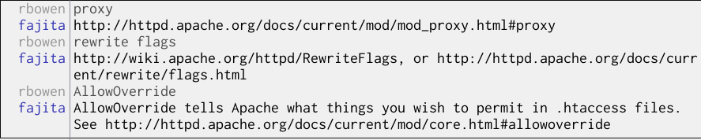
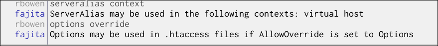
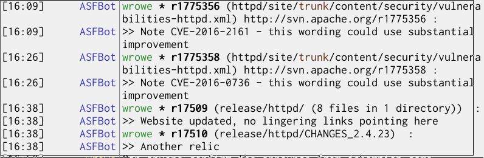

.. _Chapter_Contributing_to_apache:

======================================
Contributing to the Apache HTTP Server
======================================

.. epigraph::

   Come together, right now, over me.

   -- The Beatles, *Come Together*

.. index:: Contributing

.. index:: Open Source

.. index:: F/LOSS

.. index:: The Apache Way

.. index:: Apache Software Foundation

The Apache httpd is open source (sometimes called **F/LOSS**:
**Free/Libre Open Source Software**). That means there's no **you** and
**us**. It's **all** just us. The software is developed by us, for us, and
you're welcome to become one of us and participate in that process.

If you've never worked on an open source project, navigating your way
around can be a little confusing. In this chapter, I'll try to give
you the lay of the land, and show you all of the places where you can
join in the fun.

.. _Recipe_Foundation:

How the Apache Software Foundation works
----------------------------------------

.. _Problem_Foundation:

Problem
~~~~~~~

You're a little confused as to how httpd, the web server, relates to
httpd, the Apache Software Foundation.

.. _Solution_Foundation:

Solution
~~~~~~~~

The Apache Software Foundation - http://apache.org/ - is a
non-profit organization that exists to facilitate the creation of free
software for the public good.

httpd is one project out of the many that make their
home at the Apache Software Foundation, and happens to be the one
that started it all.

.. _Discussion_Foundation:

Discussion
~~~~~~~~~~

Yes, I cheated. This isn't actually a recipe. But it fits well in
this chapter to talk briefly about the larger organization that houses
the httpd project.

The Apache Software Foundation - the ASF - was founded in 1999 to
provide a legal umbrella under which the httpd project, and others,
could exist. This provides a means for them to accept financial
donations, as well as to provide legal protection to the developers
working on these projects.

There are hundreds of projects that call the ASF home.
These projects span all areas of technology, from server-based
projects like httpd, Apache Traffic Server, and Apache Hadoop, to
desktop projects like Apache Open Office, to mobile application
development projects like Apache Cordova. You can see all of these
projects, organized by technology, programming language, size, or age, at
http://projects.apache.org/

There are 61 projects that are in the Incubator. 
The Incubator is a place where projects learn
how to operate in the Apache Software Foundation. When they're ready,
they graduate to become top-level Apache projects. These projects may
be seen at http://incubator.apache.org/

Finally, there are also some projects - 41 of them at the time of this 
writing - which have retired for one reason or another, and reside in 
the Attic.  This isn't a shameful thing - some projects are simply no longer
relevant in today's technology, while others have achieved feature
completeness, and so the development community around the project has
moved on to other things. The Attic exists to permanently archive the
code and other artifacts around a project, for the benefit of the
people that still use the software. It also provides a means for
osmeone to restart the project, should that ever become desirable in
the future. The Attic is at http://attic.apache.org/

On the legal side, The Apache Software Foundation is a non-profit
organization - a 501c3 - which has a mission of creating software for
the public good. That means that everything that we produce is free to
download, free to use, and free to modify for your own purposes. It's
all released under the Apache License, which is
recognized by the OSI - the Open Source Initative - as an accepted
open source license. This license makes it easy for other
organizations, including for-profit companies, to build on top of our
code for other purposes.

The Foundation provides infrastructure resources for projects to use
in their development process, including, but not necessarily limited
to, code repositories, and hosting for websites, mailing lists, and
other necessary components for building an online community.

httpd is just one of these projects. It's the one that
started it all, but is now one of many, and is far from the largest or
most active.

.. _See_Also_Foundation:

See Also
~~~~~~~~

* Apache.org - http://apache.org/

* About the Apache Software Foundation - http://apache.org/foundation/

* The Apache license - http://apache.org/licenses/

* Apache Projects - http://projects.apache.org/

* The Apache Incubator - http://incubator.apache.org/

* The Apache Attic - http://attic.apache.org/

* OSI - http://opensource.org/

.. _Recipe_Mailing_lists:

The Mailing Lists
-----------------

.. index:: Mailing lists

.. index:: Mailing lists,users list

.. index:: Mailing lists,dev list

.. index:: Mailing lists,bugs list

.. index:: Mailing lists,docs list

.. index:: Mailing lists,commits list

.. index:: Users mailing list

.. index:: Dev mailing list

.. index:: Bugs mailing list

.. index:: Docs mailing list

.. index:: Commits mailing list

.. index:: Discussion,mailing lists

.. index:: Support,mailing lists

.. _Problem_Mailing_lists:

Problem
~~~~~~~

What mailing lists should I be subscribed to if I'm interested in Apache httpd?

.. _Solution_Mailing_lists:

Solution
~~~~~~~~

There are several mailing lists that you might want to be subscribed to
if you're interested in httpd.

The users mailing list - users@httpd.apache.org - is where users of
the software can ask questions, get support, report problems, and talk
about upcoming events where other httpd enthusiasts might be present.
To subscribe to the list, send an empty email message to
users-subscribe@httpd.apache.org and then follow the instructions in
the confirmation message that you should receive almost immediately.
Or, if you prefer a more web-based interface to the list, you can read
past archives, and participate in converstaions, in the forum/archive
interface at
https://lists.apache.org/list.html?users@httpd.apache.org.

Traffic on the users list is light - roughly 3 or 4 messages per day.
You can see detailed statistics on the list at
https://lists.apache.org/trends.html?users@httpd.apache.org.

If you're interested in upcoming developments in the project, or if
you want to participate in development yourself, you need to be on the
developer mailing list - dev@httpd.apache.org. The process for
subscribing is the same - send a message to
dev-subscribe@httpd.apache.org  The arcive/forum interface is at 
https://lists.apache.org/list.html?dev@httpd.apache.org.

Traffic on the developer list is somewhat higher than the users list,
at about 5 to 10 messages a day. Traffic levels vary greatly,
depending on who is actively working on features, and how close we are
to a release.  Messages tend to be of a much more
technical nature, and tend to require some understanding of the code,
and of the C programming language.

If you're going to be involved in development, you might also want to
be on the commits mailing list - cvs@httpd.apache.org. This is where
notifications are sent every time the project source code is modified.
Discussion of these changes are then sent back to the developer
mailing list.

The name of the mailing list - ``cvs`` - is the name of the version
control system that the project originally used. The project has
since moved from CVS to Subversion to Git, but the name of the list has
remained the same.

To subscribe to the list, send a message to
cvs-subscribe@httpd.apache.org. The list archive and forum interface
is at
https://lists.apache.org/list.html?cvs@httpd.apache.org

Traffic on this list is in the 8 to 12 messages a day range, but this
also varies greatly from one month to another.

The bugs mailing list - bugs@httpd.apache.org - is where you can keep
up to date on everything that happens in the bug tracker. When new
bug tickets are opened, when there's any changes or discussion on a ticket,
and when a ticket is closed, the notification is sent to this list. To
subscribe, send a message to bug-subscribe@httpd.apache.org  The
archive and forum interface is at
https://lists.apache.org/list.html?bugs@httpd.apache.org

This list is fairly low traffic, with around 3 messages per day.

Finally, if you are interested in the documentation side of the
project, the docs team has a separate list - docs@httpd.apache.org.
You can subscribe by sending a message to
docs-subscribe@httpd.apache.org. The list archive and forum interface
is at https://lists.apache.org/list.html?docs@httpd.apache.org.

The docs list is for discussion of updates to the documentation,
translations of the documentation, and related efforts such as
supporting the IRC channel, other mailing lists, and third-party
support forums such as Stack Overflow.

There are several other mailing lists for various other purposes. The
full list of these mailing lists may be seen at
http://httpd.apache.org/lists.html. But the ones listed
above are the most important ones if you want to jump right in and get
involved in the community.

.. _See_Also_Mailing_lists:

See Also
~~~~~~~~

* :ref:`Recipe_Documentation`

* :ref:`Recipe_Patch`

* :ref:`Recipe_IRC`

* Apache httpd mailing lists - http://httpd.apache.org/lists.html

* Apache mailing list archives - http://lists.apache.org/

.. _Recipe_IRC:

Apache httpd on IRC
-------------------

.. index:: IRC

.. index:: Discussion,IRC

.. index:: Chat

.. index:: Support,IRC

.. _Problem_IRC:

Problem
~~~~~~~

You want an answer to a question faster than a mailing list is
providing, and are looking for a real-time discussion channel.

.. _Solution_IRC:

Solution
~~~~~~~~

IRC - Internet Relay Chat - is a way to have real-time discssion with
experts who can help you answer your questions.

In the case of Apache httpd, the channel you want is ``#httpd`` on the
Libera Chat IRC network. With your favorite IRC client, connect to
``irc.libera.chat`` and join ``#httpd``.

Or, if you're not yet familiar with IRC, you can join in a browser by
going to https://web.libera.chat/#httpd

.. _Discussion_IRC:

Discussion
~~~~~~~~~~

One of the best ways to get help when you're experiencing problems
with httpd - or, really, with any softare - is to ask
on IRC. IRC is a real-time chat server, with participants from all
over the world. In the free software world, this often means that
you're discussing problems with the very people that created the
softare that you're using.

In the case of Apache httpd, the ``#httpd`` channel on the Libera Chat IRC
network usually contains several of the httpd developers, and several
members of the documentation team. This makes it probably the best
place in the world to ask your httpd questions,
particularly if you're in a hurry.

And here's another pro tip. One participant of the channel who is
always there is fajita. She's the channel bot, and she knows almost as
much as anyone else on channel. You can ask her about almost any topic
relating to Apache httpd, including any configuration directive, most
common error messages, and topics such as ``rewrite flags`` and `reverse
proxy`. She'll provide brief explanations, and links to more detailed
howto documents.

.. _asking_fajita:

   Asking fajita

She can also tell you details about specific configuration options. To
ask where a particular directive may be used, as for the directive's
context. For example, say ``ServerAlias context``. And to ask about
using a particular directive in a ``.htaccess`` file, ask her for the
``override`` information for that directive. For example, say `Options
override`.

.. _asking_fajita_2:

   Asking fajita for directive details

If you need to provide extended details about your particular problem,
use one of the pastebin websites to paste configuration sections,
error messages, or code examples. Useful pastebin websites include
http://apaste.info/ and http://hastebin.com/.

.. _See_Also_IRC:

See Also
~~~~~~~~

* Libera Chat webchat - https://web.libera.chat/

* ``#httpd`` on Libera Chat - https://web.libera.chat/#httpd

* Pastebin sites - http://apaste.info/ or
  http://hastebin.com/

.. _Recipe_httpd-dev-irc:

IRC for httpd developers
------------------------

.. index:: IRC,for developers

.. index:: Developers,IRC

.. _Problem_httpd-dev-irc:

Problem
~~~~~~~

You're looking for a more technical IRC channel, for
development-related discussion.

.. _Solution_httpd-dev-irc:

Solution
~~~~~~~~

While the ``#httpd`` channel is great for user support - help with
configuring and running your httpd - if you're looking
for something a little deeper, the ``#httpd-dev`` channel may be what
you need.

.. _Discussion_httpd-dev-irc:

Discussion
~~~~~~~~~~

As discussed in :ref:`Recipe_IRC`, the ``#httpd`` is perfect for questions
about configuring your httpd.

``#httpd-dev``, on the other hand, is for discussion of the development
of the server itself. It's also the appropriate place to discuss bugs
that you believe you have found in the server code, and questions you have
on httpd modules that you are writing yourself.

The channel bot, named ``ASFBot``, announces every time that a change is
made to the code repository. This is a great way for server developers
to stay notified of changes, and catch unexpected commits.

.. _ASFBot:

.ASFBot announces a code change on #httpd-dev

And, finally, there's also a certain amount of social interaction on
``#httpd-dev`` between the various people that are working on the code.
This makes it a good place to hang out to get to know the other
people on the project.

.. _See_Also_httpd-dev-irc:

See Also
~~~~~~~~

* :ref:`Recipe_IRC`

* https://web.libera.chat/#httpd

.. _Recipe_social-media:

Apache httpd on Social Media
----------------------------

.. index:: Social media

.. index:: Twitter

.. index:: Google+

.. index:: Facebook

.. _Problem_social-media:

Problem
~~~~~~~

You'd like to keep up with Apache httpd news on social media.

.. _Solution_social-media:

Solution
~~~~~~~~

httpd community has a few different places on social
media.

The official Twitter account for the project is ``@apache_httpd``. This
is a good place to find out about new releases, upcoming conferences,
or interesting features that are in development.

Apache httpd has a Google Plus group at
https://s.apache.org/httpd-gplus  This is primarily a
support forum, with people posting a variety of questions.

Apache httpd does not have any official presence
on Facebook, although there are a few regional groups and unofficial
discussion groups.

.. _See_Also_social-media:

See Also
~~~~~~~~

* http://twitter.com/apache_httpd

* https://s.apache.org/httpd-gplus

.. _Recipe_Patch:

Your first patch
----------------

.. index:: Patch

.. index:: Your first patch

.. index:: Making a code change

.. index:: git

.. _Problem_Patch:

Problem
~~~~~~~

You want to contribute a change to the Apache httpd source code.

.. _Solution_Patch:

Solution
~~~~~~~~

Making your first patch to any free software project can be a
difficult process, as each project is slightly different. Here's the
process with httpd:

1. Clone the source code repository:

.. code-block:: text

   git clone https://github.com/apache/httpd.git httpd-trunk

2. Edit the source code file with your favorite editor.

3. Test your change!

4. Create a patch using ``git diff``.

.. code-block:: text

   git diff > my_patch.diff

5. Send the patch as an attachment to the ``dev@httpd.apache.org``
   mailing list with explanation of what your change is for. Put
   ``[PATCH]`` in the subject line.

.. _Discussion_Patch:

Discussion
~~~~~~~~~~

The source code of httpd is maintained in Git,
hosted on GitHub at https://github.com/apache/httpd.
Git is a distributed version control
system which allows everyone to edit the same code base at the same
time, resolve conflicts, and contribute to a single central shared
repository.

If you do not already have ``git`` installed on your
development machine, you will need to obtain it and install it first.
See https://git-scm.com/downloads for installation instructions
for a wide variety of platforms.

The ``checkout`` command obtains a local copy of the source code, called
your working copy, where you can make changes and test those changes
before committing them back to the central shared repository.

If you have direct write access to the source repository - called
"commit rights", you will use the same checkout address, but with
``https`` rather than ``http``, as your checkins will be authenticated against
the httpd committer list.

The command to check out working copy of the code is, as shown in the
recipe above:

.. code-block:: text

   git clone https://github.com/apache/httpd.git httpd-trunk

The second argument to the command created a directory called, in this
case, ``httpd-trunk``, and puts the code in that directory. If you omit
that argument, the code is put in a directory named after the
repository directory, which, in this case, would simply be ``trunk``.

Note also that I've given you the repository address of the ``trunk``
version of the code. ``trunk`` is the development repository - the
bleeding edge, you might say. If you want, instead, to send a patch to
one of the already released branches, such as ``2.4``, you'd
need to alter the checkout URL accordingly. For example, to check out
the ``2.4`` branch, you'd use the following command:

.. code-block:: text

   git clone https://github.com/apache/httpd.git httpd-2.4
   cd httpd-2.4
   git checkout 2.4.x

If you already have a checkout of the code, and come back to it at a
later location, you need to update the checkout, to ensure that you
have the latest version of all files. To do this, use the following
command from within the working copy:

.. code-block:: text

   git pull

Note that ``update`` only updates the directory that you're currently
in, and subdirectories. Thus, to ensure that you update the entire
working copy, ensure that you're in the top-level directory of the
checkout.

Once you have the latest version of the repository, make the edits to
the file or files which you want to change. Since all of the source is
in text files, you can edit them using whatever editor you prefer.

Please test your changes. Compile the server (See
:ref:`Recipe_Build_from_source`) and make sure that it starts up and
runs. Make sure that you exercise the functionality that you have
modified, but also any related functionality that may be affected by
the change. 

The httpd project also has a testing subproject, along with a number
of testing tools, which you may find documented at
http://httpd.apache.org/test/  For changes of any
significant size, you may wish to test your changes using these tools,
as well as exercising the code in a more manual manner.

See also :ref:`Chapter_Performance_and_testing`, *Performance
and Testing*, for more discussion of testing your server.

Once you are sure that your changes work to your satisfaction, and
don't break anything else, you need to send those changes to the
community for consideration. The ``git diff`` command shows just the
changes that you made, so that reviewers can examine these changes
very quickly, without having to read through the entire file looking
to see what changed.

The output of the ``diff`` command shows what lines were added (indicated by 
a ``+`` sign), removed (indicated by a ``-`` sign), 
and changed (indicated by showing the old line removed and the new line added),
in an easily human-readable format. It also makes it very
easy to apply those changes to someone else's working copy, so that
they can test your changes themselves.

The output also shows what version you started from, so that a review
can quickly determine whether you are in fact working from a recent
version.

The change is shown in context, with a few lines either side of
each change. This helps make the change more human-readable, and help
the reviewer to find the location of the change in the source code
file more easily.

An example ``diff`` output is shown below for a very small change to the
source code of ``mod_rewrite``. [#example-svn-diff]_

.. code-block:: text

   Index: mod_rewrite.c
   ===================================================================
   --- mod_rewrite.c	(revision 1775984)
   +++ mod_rewrite.c	(working copy)
   @@ -4582,7 +4582,7 @@
         *  else return immediately!
         */
        if (!dconf || dconf->state == ENGINE_DISABLED) {
   -        return DECLINED;
   +        return DISINCLINED;
        }
    
        /*

The command shown in the recipe captures the output of the ``diff``
command into a file which can then be sent to the community mailing
list. 

Attach that file to an email message, and send it to the
``dev@httpd.apache.org`` mailing list, using a subject line that starts
with ``[PATCH]``, and a description of what you propose to change, and
why.

You can see an example of one such email at
https://s.apache.org/example-httpd-patch, proposing a
change to ``mod_http2``.

You should be subscribed to the mailing list, so that you can see, and
respond to, any comments or questions that reviewers have regarding
your patch. Failure to respond to those comments will likely result in
the patch being abandoned. Note that you may need to be active in
promoting your change, particular if it's something that other
developers don't care about a great deal. This will help ensure that
it doesn't get ignored or forgotten.

If your patch is accepted, someone will commit the change, and you
will be given credit for the change in the commit message. If you
continue submitting high-quality patches over a period of time, you'll
eventually be given rights to make these changes directly yourself
without having to mail in the patch file.

.. index:: Commit policies,RTC (Review Then Commit)

.. index:: Commit policies,CTR (Commit Then Review)

.. index:: RTC; see Commit policies

.. index:: Review Then Commit; see Commit policies

.. index:: CTR; see Commit policies

.. index:: Commit Then Review; see Commit policies

However, the source code
changes are managed under a process called **Commit Then Review** (CTR)
for trunk, and **Review Then Commit** (RTC) for release branches. This
ensures that changes don't get into the code without being widely
reviewed. This prevents anything slipping in without sufficient
oversight. So even if you have direct commit rights, the review
process is still in place to ensure code quality.

You can view the change history of every file in the project in
``viewvc``, which is a web utility for seeing what changed, when, by
whom, and why. You can see ``viewvc`` for httpd trunk at
https://github.com/apache/httpd

Actually teaching you to hack on the httpd source code is beyond
the scope of this book. See the developer documentation, at 
http://www.apache.org/dev/, for more details. I also
recommend the excellent book by Nick Kew, 'The Apache Modules Book.'
While this book is somewhat dated, it is still the best book on the
market on the topic.

.. _See_Also_Patch:

See Also
~~~~~~~~

* Developer documentation: http://www.apache.org/dev/

* Git repository: https://github.com/apache/httpd

* Git installation instructions: https://git-scm.com/downloads

* :ref:`Recipe_Mailing_lists`

* viewvc interface for viewing source code history: https://github.com/apache/httpd

* The Apache Modules Book:
  https://www.amazon.com/Apache-Modules-Book-Application-Development/dp/0132409674

.. _Recipe_What_to_work_on:

What to work on
---------------

.. index:: Open tickets

.. index:: Suggested tickets

.. _Problem_What_to_work_on:

Problem
~~~~~~~

You'd like to work on the Apache httpd project, but you're looking for
a good place to start.

.. _Solution_What_to_work_on:

Solution
~~~~~~~~

Consult the ticket tracker for open tickets:
https://s.apache.org/httpd-open-bugs

.. _Discussion_What_to_work_on:

Discussion
~~~~~~~~~~

.. _See_Also_What_to_work_on:

See Also
~~~~~~~~

.. _Recipe_Documentation:

Contributing to the Documentation
---------------------------------

.. index:: Documentation,contributing

.. index:: Contributing,documentation

.. _Problem_Documentation:

Problem
~~~~~~~

You'd like to help improve the documentation.

.. _Solution_Documentation:

Solution
~~~~~~~~

The documentation of the server is run as a subproject of the main
httpd project. We are always looking for new
contributors. There's numerous ways that you can help improve the
documentation, and thus make the product better for the whole world.

Start by getting on the mailing list - ``docs@httpd.apache.org``.

Next, read the documentation project documentation at
http://httpd.apache.org/docs-project/

And jump on the ``#httpd`` IRC channel to introduce yourself. There's
always a few of the docs project people hanging out there who can
point you in the right direction.

.. _Discussion_Documentation:

Discussion
~~~~~~~~~~

The best software in the world doesn't do a bit of good if nobody can
use it. This is why I think the documentation is so important. And
because writing documentation requires such a different set of skills
from writing code, the documentation project is managed as a
subproject of the main httpd project, with different
rules about reviews, commits, and granting committer rights.

The first thing you need to do if you want to participate in the
documentation project is to get on the mailing list -
``docs@httpd.apache.org``. To subscribe, send a blank email message to
``docs-subscribe@httpd.apache.org``. You can read the archives of the
list, and get some idea as to the content of discussion, at
https://lists.apache.org/list.html?docs@httpd.apache.org
The list tends to be very low traffic - typically less than one
message a day.

If you're looking for something specific to work on, there's several
good places to start.

You can look at the bug tickets that have already been opened against
documentation issues. This list is at
http://s.apache.org/httpd-doc-bugs  You will need to
create an account in order to leave comments about these issues, and
to open new tickets, or close existing ones.

You will notice as you look at the documentation that at the bottom of
each page there's a place for people to leave comments. Some of these
are questions. Other are suggestions for improvement of the docs. This
is a great place to find places in the documentation that can use
improvement.

And you can often find places that need improvement by just reading
through the docs. Much of what is there has been written by people
that have been using Apache httpd for years, or even decades, and much
that seems obvious to us, isn't that obvious to beginners. Having a
new eye on the docs can be incredibly helpful in identifying sections
that make incorrect assumptions about what you already know.

Once you know what you want to work on, you'll need to get a checkout
of the source, and write a patch. This process is somewhat involved,
and is discussed in a separate recipe, :ref:`Recipe_Patch`.

The documentation source files are in a format called DocBook. This is
a markup language that was once rather more popular than it is now. It
is very flexible, and so can take some time to learn. However, once
you learn the syntax, it allows us to produce very professional
quality documentation.

There is not, at this time, formal documentation of our docs format.
This isn't usually a problem when you're making a small enhancement
or correction to an existing document, which is how most people get
started. As you work on the docs, you'll pick up the syntax. However,
if you are going to write a new document from scratch, the best way to
go about it is to look at some other existing document, and emulate
the format. We hope to produce better documentation of the format in
the future.

Following the instructions in :ref:`Recipe_Patch`, you'll obtain a
checkout of the httpd source code. The documentation source is in the
``docs/manual`` subdirectory. You can, if you wish, just check out the
``docs`` directory if you only wish to work on the documentation.
However, I strongly recommend against this. The more you work on the
documentation, the more frequently you'll need to refer back to the
code, and so it's a good idea to have the entire tree checked out from
the beginning.

I recommend that you check out the active
branches of the code (currently trunk and 2.4).

.. code-block:: text

   git clone https://github.com/apache/httpd.git httpd-trunk

When you're in any one of these working copy directories, you can
verify which branch you are on using the
``git branch`` command:

.. code-block:: text

   $ git branch
   * trunk
     2.4.x

You will be editing the source files, not the generated HTML files,
when you make documentation changes. So, for example, if you want to
enhance the documentation of ``mod_dav_fs``, you'll edit the file
``docs/manual/mod/mod_dav_fs.xml``, not the corresponding ``.html`` file.

Once you have made changes to the source file(s) that you want to
enhance, you will need to run the build script to generate the html
files, as well as to ensure that your edits are following the correct
syntax.

To do this, you'll need to check out the build tools on top of the
documentation source code.

Change into the ``docs/manual`` subdirectory of your source code
checkout, and type the following command:

.. code-block:: text

   git clone https://github.com/apache/httpd-docs-build.git build

This will create a ``build`` directory containing the build tools which
will validate and build your changes. Each time you make a change to
the documentation source code, you'll need to rebuild the
documentation by changing into that directory and typing the following
command:

.. code-block:: text

   ./build.sh all

.. warning::

   The build tools may not work on non-Unix platforms.

This command produces a **lot** of output, but, at the end of it, it
will tell you whether it succeeded or failed. If it succeeded, you can
load the resulting ``.html`` files in your browser to verify that the
change is as you intended. If it failed, it will tell you in great
detail what broke.

At this point, you should generate a patch, and send it to the
documentation mailing list - ``docs@httpd.apache.org`` - using the
procedure described in :ref:`Recipe_Patch`:

.. code-block:: text

   git diff > my_changes.diff

Finally, if all of this is, for whatever reason, too much work, we
still want your help.

If you are unable to build the docs, send your
docs changes to us anyways, and we'll figure out the details of
getting it to build. We'd rather get the change, in whatever format.

If you just want to make a comment on the documentation, scroll to the
bottom of any document, and leave a comment. This will eventually
result in someone enhancing that document.

You can also send comments to the ``docs@httpd.apache.org`` mailing list
with suggested changes. Or you can drop by the ``#httpd`` IRC channel on
Libera Chat, and tell someone there.

We want the documentation to be as good as possible, and we don't want
to have any obstacles to you helping us out, if you're so inclined.

.. _See_Also_Documentation:

See Also
~~~~~~~~

* :ref:`Recipe_Mailing_lists`

* :ref:`Recipe_IRC`

* :ref:`Recipe_Patch`

* http://s.apache.org/httpd-doc-bugs

.. _Recipe_Docs_translation:

Documentation Translations
--------------------------

.. index:: Translation

.. index:: Documentation,translation

.. _Problem_Docs_translation:

Problem
~~~~~~~

You'd like to help us have our documentation in your language.

.. _Solution_Docs_translation:

Solution
~~~~~~~~

We would love to have your help translating our documentation into
other languages.

The documentation is available primarily in
English and French, with smaller portions of the documentation being
available in other languages, and an active effort underway to
translate the docs into Spanish.

Information about how to participate in the translation efforts, or
start a new one, may be found at
http://httpd.apache.org/docs-project/translations.html

.. _Discussion_Docs_translation:

Discussion
~~~~~~~~~~

To participate in our documentation translation effort, you need a
firm grasp of both English and the language you want to translate
into. You also need a minimal familiarity with the httpd documentation
itself, so that you grasp the technical terms and concepts you will be
translating.

Finally, you'll need at least one other person who is fluent in the
target language, to provide supporting reviews of your translations.
This is to ensure that all translated documents are reviewed by
another fluent speaker for quality and accuracy.

To provide a translation of any page in the documentation, start with
a copy of the English version of the source file, but with a
two-character file extension representing the target language. For
example, to provide a Spanish translation of the file ``mod_echo.xml``,
copy that file to ``mod_echo.xml.es``. Then begin to translate all of
the English sentences in that file.

When you're done, send the resulting file to the documentation mailing
list, at ``docs@httpd.apache.org``.

Existing translated files are automatically annotated with the version
of the English documentation from which it was translated. 

.. code-block:: text

   <!-- English Revision : 1421821 -->

Documents that are out of date by one or more revisions are also 
automatically annotated with a message to that effect.

.. code-block:: text

   <!-- English Revision: 280384:1414094 (outdated) -->

This results in a note in the generated HTML version warning the
reader that they are reading a version which is out of date.

.. code-block:: text

   
Diese Übersetzung ist möglicherweise
               nicht mehr aktuell. Bitte prüfen Sie die englische Version auf
               die neuesten Änderungen.

To see what has already been translated, see http://home.apache.org/~takashi/translation-status/test.html#trunk

.. _See_Also_Docs_translation:

See Also
~~~~~~~~

* http://httpd.apache.org/docs-project/translations.html

* http://home.apache.org/~takashi/translation-status/test.html#trunk

.. _Recipe_apachecon:

ApacheCon and other gatherings
------------------------------

.. index:: ApacheCon

.. index:: Apache: Big Data

.. index:: Conferences,ApacheCon

.. index:: Meetups

.. index:: Events,meetups

.. index:: Events,ApacheCon

.. _Problem_apachecon:

Problem
~~~~~~~

You'd like to learn more about httpd, and other Apache
projects, and meet the people involved in the project.

.. _Solution_apachecon:

Solution
~~~~~~~~

The Apache Software Foundation produces an event called ApacheCon. It
is held every year once in North America and once in Europe. It has
occasionally also been held in Asia.

You can find out more about ApacheCon on the website at
http://apachecon.com/

Additionally, there are many, many gatherings of other Apache
enthusiasts, across our many projects, around the world. These events,
or, at least some of them, are listed on the httpd website at
http://apache.org/events/. That page is updated every week.

.. _Discussion_apachecon:

Discussion
~~~~~~~~~~

If you are aware of Apache-related events which are not listed on the
referenced page, please do let us know, by sending that information to
``dev@community.apache.org``.

.. _See_Also_apachecon:

See Also
~~~~~~~~

* http://apachecon.com/

* http://apache.org/events/

.. _Recipe_related-projects:

Related Apache projects
-----------------------

.. index:: Related projects,APR

.. index:: Related projects,mod_perl

.. index:: Related projects,Tomcat

.. index:: APR

.. index:: mod_perl

.. index:: Modules,mod_perl

.. index:: Tomcat

.. _Problem_related-projects:

Problem
~~~~~~~

You'd like to find out more about the other Apache projects which are
closely related to Apache httpd.

.. _Solution_related-projects:

Solution
~~~~~~~~

There are a number of other projects at the Apache Software Foundation
that are closely related to Apache httpd, either in subject matter, or
because they share code.

You can find out more about these projects at
the following locations:

* Apache Portable Runtime - http://apr.apache.org/
* Apache mod_perl - http://perl.apache.org/
* Apache Tomcat - http://tomcat.apache.org/
* Apache HTTPComponents - http://hc.apache.org/
* Apache Traffic Server - http://trafficserver.apache.org/

You can find other related projects by browsing the Apache Projects
site, at http://projects.apache.org/.

.. _Discussion_related-projects:

Discussion
~~~~~~~~~~

Projects at the Apache Software Foundation have a tendency to share
code, contributors, and ideas. Several of the projects listed above
share a large number of all of the above.

And all Apache projects share the philosophies of collaboration-driven
software development, and release software under the Apache License.

.. _See_Also_related-projects:

See Also
~~~~~~~~

* http://projects.apache.org/

Summary
-------

I've ended the book on this chapter because I really want you to
remember this, and come join us in the httpd projects.

Because Apache httpd is open source, we rely completely on our user
community to become our developer community. Of the original 8
developers of httpd. [#original-developers]_
], none are still actively involved
today. Instead, they have mentored new contributors and then moved on
to other projects.

So, if you're at all interested in helping out with any aspect of
developing the project, we would love to hear from you, and see you on
our development mailing lists.

.. rubric:: Footnotes

.. [#example-svn-diff] The change shown here doesn't work, and is just provided as an example.
.. [#original-developers] See `http://httpd.apache.org/ABOUT_APACHE.html <http://httpd.apache.org/ABOUT_APACHE.html>`_
