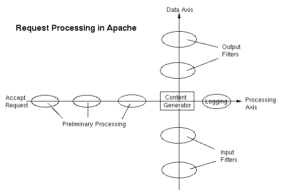

.. _Chapter_Filters_And_Handlers:

====================
Filters and Handlers
====================

.. index:: Filters

.. index:: Handlers

Handlers and filters are two different ways that content can be
processed on its way to the client.

Stated simply, a handler is an action that is called when a particular
file, or type of file, is requested. A filter, on the other hand, is a
process that modifies data as it flows into or out of the server.

The relationship between filters and handlers might best be explained
by the below diagram, from the Filters documentation on the Apache
httpd website.

Filters are applied to the data stream before and after the
traditional request processing phases. Most of the filters that we'll
discuss in this chapter happen after the request processing, and in
some way alter that data before it is finally sent to the client.

In this chapter, we'll cover some of the filters and handlers provided
by the Apache http server.

Certain Other of filters and handlers
constitute their own chapters, which appear elsewhere in the book:

* The ``INCLUDES`` filter and the ``cgi-script`` handler are covered 
  in :ref:`Chapter_Dynamic_content`, **Dynamic Content**
* All aspects of SSL and TLS are covered in :ref:`Chapter_SSL_and_TLS`, **SSL and TLS**
* The ``server-info`` and ``server-status`` handlers have their own
  chapter, :ref:`Chapter_info_and_status`, **mod_info and mod_status**

.. _Recipe_AddHandler:

Assigning a handler to a file type
----------------------------------

.. index:: AddHandler

.. index:: Handler,AddHandler

.. index:: Handler,adding to a file type

.. _Problem_AddHandler:

Problem
~~~~~~~

You want to associate a particular handler with all files with a
particular file extension.

.. _Solution_AddHandler:

Solution
~~~~~~~~

Use the ``AddHandler`` directive to associate a file extension with a
handler.

.. code-block:: text

   AddHandler cgi-script .py

.. _Discussion_AddHandler:

Discussion
~~~~~~~~~~

The specific example given creates a mapping from any ``.py`` file and
the ``cgi-script`` handler. That is, it indicates that any ``.py`` file is
a CGI script, and should be executed by ``mod_cgi``. CGI itself is
covered in greater detail in :ref:`Chapter_Dynamic_content`, *Dynamic
Content*.

In general, though, the ``AddHandler`` directive creates an association
between a particular file extension and a handler.

.. note::

   A handler can also be an action that you create yourself. See
   :ref:`Recipe_Action` for further discussion of this technique.

.. _See_Also_AddHandler:

See Also
~~~~~~~~

* :ref:`Recipe_Action`

* :ref:`Recipe_SetHandler`

* :ref:`Chapter_Dynamic_content`, **Dynamic Content**

.. _Recipe_SetHandler:

Assigning a handler to a broader scope of requests
--------------------------------------------------

.. index:: SetHandler

.. index:: Handler,SetHandler

.. index:: Handler,adding to many files

.. _Problem_SetHandler:

Problem
~~~~~~~

You want to associate a particular handler with a group of files, or
other URLs, but
need to specify something other than just a file extension. For
example, and entire directory, or files that match a particular
pattern.

.. _Solution_SetHandler:

Solution
~~~~~~~~

Define the scope of the requests using ``<Directory>``, ``<Location>``,
and then use ``SetHandler`` to indicate the handler desired.

For example, to set the ``server-status`` handler for all requests for
the URL ``/server-status``:

.. code-block:: text

   <Location /server-status>
       SetHandler server-status
   </Location>

(See :ref:`Chapter_info_and_status`, **mod_info and mod_status**, for
further discussion of the ``server-status`` handler.)

To invoke the ``mod_php`` handler for all files that end in ``.php``:

.. code-block:: text

   <FilesMatch "\.php$">
       SetHandler application/x-httpd-php
   </FilesMatch>

(See :ref:`Recipe_Multiple_Extensions` for discussion as to why you might
want to do that.)

.. code-block:: text

   <FilesMatch "\.php$">
       SetHandler none
   </FilesMatch>

.. _Discussion_SetHandler:

Discussion
~~~~~~~~~~

``AddHandler`` is the right tool when all of the files you which to
effect have the same file extension. But sometimes that's not the case
* you want to add a handler to everything in a particular directory,
or URL scope, or which matches a particular pattern.

``SetHandler`` gives you a way to apply a handler to a broader scope of
files. Or, in the example shown for ``server-status``, to a range of
URLs that don't necessary correspond to anything in the filesystem.

``SetHandler`` must appear inside a container (such as ``<Directory>``,
``<Location>``, or ``<VirtualHost>``).

.. _See_Also_SetHandler:

See Also
~~~~~~~~

* http://httpd.apache.org/docs/current/mod/core.html#sethandler
  - SetHandler documentation

* :ref:`Recipe_Multiple_Extensions`

* :ref:`Recipe_AddHandler`

* :ref:`Chapter_info_and_status`, **mod_info and mod_status**

.. _Recipe_Multiple_Extensions:

Multiple_Extensions
-------------------

.. index:: Multiple extensions

.. index:: File extensions

.. index:: Handlers,multiple file extensions

.. _Problem_Multiple_Extensions:

Problem
~~~~~~~

When a file has multiple file extensions (**e.g.**, ``ponies.html.en``),
Apache httpd tries to honor all of them with the appropriate handler
or mime type. This can sometimes cause conflicts.

You want to specifically handle one of the extensions, and ignore the
others.

.. _Solution_Multiple_Extensions:

Solution
~~~~~~~~

Use a pattern match, and ``SetHandler``, to specify which of the file
extensions you want to honor.

For example: 

.. code-block:: text

   <FilesMatch "\.php$">
       SetHandler application/x-httpd-php
   </FilesMatch>

.. _Discussion_Multiple_Extensions:

Discussion
~~~~~~~~~~

The specific example given solves a common problem with, in this case,
PHP files, which are getting handled incorrectly. More generally, t
solves the problem where a file is being processed by the wrong
handler due to having multiple file extensions.

Consider a case where you have a file named ``ducks.php.txt.en``. The
file extensions indicate that it is a php program, that it is a plain
text file, and that the language of the file is English.

Under normal circumstances, Apache httpd will probably serve it as a
plain text file, and will send a ``Content-Language`` header indicating
that the language is ``en``. This is because the ``.txt`` extension
appears later, and overrides the effect of the ``.php`` extension.

However, it's possible, depending on how you've configured php itself,
that the file might get executed as a php script, and the results sent
to the client rather than the source code. Or perhaps that's what you
intended.

Using the technique shown above, you can be very specific as to what
you expect to happen. In this case, we're saying that a file should
have the php handler set only if the file **ends in** ``.php``, rather
than merely having it as one of its multiple file extensions.

Alternately, if you wanted any file, with a ``.php`` extension anywhere
in the name, to be processed by the php handler, you could do the
following:

.. code-block:: text

   <FilesMatch "\.php">
       SetHandler application/x-httpd-php
   </FilesMatch>

Notice that in this example, the ``$`` has been removed from the regular
expression, and thus it will match ``.php`` anywhere in the file name.

You can remove a handler that has been applied **via** ``SetHandler`` by
specifying the argument ``none``:

.. code-block:: text

   <FilesMatch "\.php">
       SetHandler none
   </FilesMatch>

.. _See_Also_Multiple_Extensions:

See Also
~~~~~~~~

* http://httpd.apache.org/docs/mod/mod_mime.html#multipleext
  - Documentation page about multiple extensions

* :ref:`Recipe_SetHandler`

.. _Recipe_RemoveHandler:

RemoveHandler
-------------

.. index:: RemoveHandler

.. index:: Handler,RemoveHandler

.. index:: Handler,removing

.. _Problem_RemoveHandler:

Problem
~~~~~~~

You wish to remove a handler that has been applied to a particular
file type with ``AddHandler``.

.. _Solution_RemoveHandler:

Solution
~~~~~~~~

Remove the association with ``RemoveHandler``.

.. code-block:: text

   RemoveHandler .xml

.. _Discussion_RemoveHandler:

Discussion
~~~~~~~~~~

This technique might be used, for example, if you have associated a
particular file type with a handler, but wish to remove that for a
subdirectory.

Consider a case where you wish to have php files executed for most of
your site, but for a ``source`` subdirectory you want to return those
files as plain text, so that a user can examine the source code:

.. code-block:: text

   AddHandler application/x-httpd-php php
   
   <Directory /var/www/html/source>
       RemoveHandler php
   </Directory>

For the techique for removing handlers that have been applied using ``SetHandler``, 
see :ref:`Recipe_SetHandler`.

.. _See_Also_RemoveHandler:

See Also
~~~~~~~~

* :ref:`Recipe_AddHandler`

* :ref:`Recipe_SetHandler`

.. _Recipe_Action:

Creating your own handler using a CGI script
--------------------------------------------

.. index:: Creating your own handler

.. index:: Handler,creating your own handler

.. _Problem_Action:

Problem
~~~~~~~

You want to create your own handler using a CGI script, and associate
it with a particular file type.

.. _Solution_Action:

Solution
~~~~~~~~

This scenario is covered in :ref:`Chapter_Dynamic_content`, *Dynamic
Content*, in the recipe :ref:`Recipe_CGI_Action`.

.. _Recipe_mod_deflate:

Compressing content with mod_deflate
------------------------------------

.. index:: mod_deflate

.. index:: Modules,mod_deflate

.. index:: Filter,mod_deflate

.. index:: Content compression,mod_deflate

.. index:: Compression,mod_deflate

.. index:: gzip compression

.. _Problem_mod_deflate:

Problem
~~~~~~~

You wish to compress the content that is sent to the client, to
conserve bandwidth and deliver content more quickly.

.. _Solution_mod_deflate:

Solution
~~~~~~~~

Use the ``DEFLATE`` filter provided by ``mod_deflate`` to compress the
output:

.. code-block:: text

   AddOutputFilterByType DEFLATE text/html text/plain

.. _Discussion_mod_deflate:

Discussion
~~~~~~~~~~

The ``DEFLATE`` output filter compresses content as it is sent to the
client. This results in a substantial bandwidth savings for text-based
content, and a subsequent speed inprovement of your website.

In the example show, we are choosing to compress only content of type
``text/html`` and ``text/plain``, which is a fairly safe choice. You may
wish to expand this to other text content types:

.. code-block:: text

   AddOutputFilterByType DEFLATE text/html text/plain text/xml text/css text/javascript application/javascript

However, you should avoid compressing non-text file types, such as
images, as this will usually confuse the browser, which will then be
unable to display them correctly.

See ``mod_brotli`` for an alternative compression method.

.. tip::

   A frequent question that is asked about ``mod_deflate`` is the tradeoff
   between the time and resources needed to compress content, and the
   savings gained by doing so.

   In most real-world scenarios, compressing output still works out in your favor, and
   results in an overall speedup. While results may vary greatly from one
   website to another, depending on how text-heavy your content is, some
   people observe significant speedups when using ``mod_deflate``.

.. _See_Also_mod_deflate:

See Also
~~~~~~~~

* :ref:`Recipe_Serving_precompressed`

* :ref:`Recipe_Multiple_Filters`

* http://httpd.apache.org/docs/mod/mod_deflate.html -
  mod_deflate documentation

* :ref:`Recipe_mod_brotli`

.. _Recipe_Serving_precompressed:

Serving pre-compressed content with mod_deflate
-----------------------------------------------

.. index:: mod_deflate,pre-compressed content

.. index:: Serving pre-compressed content,mod_deflate

.. index:: Pre-compressed content,mod_deflate

.. index:: Modules,mod_deflate

.. index:: Content compression,pre-compressed content with mod_deflate

.. index:: Compression,pre-compressed content with mod_deflate

.. index:: gzip compression,pre-compressed content

.. _Problem_Serving_precompressed:

Problem
~~~~~~~

You want to save time and server resources by pre-compressing content
in the file system.

.. _Solution_Serving_precompressed:

Solution
~~~~~~~~

Use the following configuration to tell ``mod_deflate`` to serve pre-compressed 
content without re-compressing it:

.. code-block:: text

   # Serve gzip compressed CSS and JS files if they exist
   # and the client accepts gzip.
   RewriteCond "%{HTTP:Accept-encoding}" "gzip"
   RewriteCond "%{REQUEST_FILENAME}\.gz" "-s"
   RewriteRule "^(.*)\.(css|js)"         "$1\.$2\.gz" [QSA]
   
   # Serve correct content types, and prevent mod_deflate double gzip.
   RewriteRule "\.css\.gz$" "-" [T=text/css,E=no-gzip:1]
   RewriteRule "\.js\.gz$"  "-" [T=text/javascript,E=no-gzip:1]
   
   <FilesMatch "(\.js\.gz|\.css\.gz)$">
     # Serve correct encoding type.
     Header append Content-Encoding gzip
   
     # Force proxies to cache gzipped &
     # non-gzipped css/js files separately.
     Header append Vary Accept-Encoding
   </FilesMatch>

.. _Discussion_Serving_precompressed:

Discussion
~~~~~~~~~~

While most people observe a substantial speed improvement using
``mod_deflate``, it is possible to get even more improvement by
pre-compressing files that don't change very often, and telling
``mod_deflate`` to serve them directly rather than compressing the files
on the fly.

The example shown above serves pre-compressed ``.js`` and ``.css`` files
directly rather than attempting to compress the uncompressed version
of the files.

You'll need to manually recompress these files each time the content
changes.

The rewrite configuration has two ``RewriteCond`` directives:

.. code-block:: text

       RewriteCond "%{HTTP:Accept-encoding}" "gzip"

The first ``RewriteCond`` reqiures that the request has asked for the
content to be compressed.

.. code-block:: text

       RewriteCond "%{REQUEST_FILENAME}\.gz" "-s"

The second ``RewriteCond`` verifies that the gzipped version of the
requested file in fact exists in the filesystem. Thus, you can have
some of the files pre-compressed, and have other files - perhaps those
that change more frequently - compressed at request time.

In the case that the request is rewritten to the pre-compressed
alternative, the configuration sets the ``no-gzip`` environment variable
so that ``mod_gzip`` will decline to recompress the content.

You can use the same technique for other file types, such as ``.html``
files. However, as these tend to change more frequently than your
``.css`` and ``.js`` files, this may prove more trouble than it's worth,
as you'll have to recompress the files each time. If you have an
effective way to automate this, this may be a beneficial technique.

.. _See_Also_Serving_precompressed:

See Also
~~~~~~~~

* :ref:`Recipe_mod_deflate`

.. _Recipe_mod_brotli:

Compressing content with mod_brotli
-----------------------------------

.. index:: mod_brotli

.. index:: Modules,mod_brotli

.. index:: Filter,mod_brotli

.. index:: Content compression,mod_brotli

.. index:: Compression,mod_brotli

.. index:: brotli compression

.. _Problem_mod_brotli:

Problem
~~~~~~~

You wish to compress content sent to the client using the Brotli
compression algorithm.

.. _Solution_mod_brotli:

[role="v24"]
Solution
~~~~~~~~

``mod_brotli`` is a new module in httpd 2.4 which provides content
compression **via** the ``brotli`` compression library.

Load ``mod_brotli``, and enable compression:

.. code-block:: text

   AddOutputFilterByType BROTLI_COMPRESS text/html text/plain text/xml

.. _Discussion_mod_brotli:

Discussion
~~~~~~~~~~

Brotli is a compression algorithm - much like deflate or gzip, but
with improved compression ratios.

``mod_brotli`` provides the ``BROTLI_COMPRESS`` filter.

``mod_brotli`` was added in httpd 2.4.26, and so may not be available,
at the time of this writing, in some third-party distributions of
Apache httpd.

As with ``mod_deflate``, you should avoid compressing non-textual
content, such as images or video, as many browsers decline to
decompress non-textual formats.

.. _See_Also_mod_brotli:

See Also
~~~~~~~~

* https://en.wikipedia.org/wiki/Brotli - Brotli on
  Wikipedia

* https://github.com/google/brotli - Brotli on Github

* https://httpd.apache.org/docs/mod/mod_brotli.html -
  mod_brotli documentation

* :ref:`Recipe_mod_deflate`

.. _Recipe_Precompressed_brotli:

Serving pre-compressed content with mod_brotli
----------------------------------------------

.. index:: mod_brotli,pre-compressed content

.. index:: Serving pre-compressed content,mod_brotli

.. index:: Pre-compressed content,mod_brotli

.. index:: Modules,mod_brotli

.. index:: Content compression,pre-compressed content with mod_brotli

.. index:: Compression,pre-compressed content with mod_brotli

.. index:: brotli compression,pre-compressed content

.. _Problem_Precompressed_brotli:

Problem
~~~~~~~

You want to serve pre-compressed content using brotli compression.

.. _Solution_Precompressed_brotli:

Solution
~~~~~~~~

Use the following configuration to tell ``mod_brotli`` to serve
pre-compressed content without re-compressing it:

.. code-block:: text

   # Serve brotli compressed CSS and JS files if they exist
   # and the client accepts brotli.
   RewriteCond "%{HTTP:Accept-encoding}" "br"
   RewriteCond "%{REQUEST_FILENAME}\.br" "-s"
   RewriteRule "^(.*)\.(js|css)"              "$1\.$2\.br" [QSA]
   
   # Serve correct content types, and prevent double compression.
   RewriteRule "\.css\.br$" "-" [T=text/css,E=no-brotli:1]
   RewriteRule "\.js\.br$"  "-" [T=text/javascript,E=no-brotli:1]
   
   <FilesMatch "(\.js\.br|\.css\.br)$">
     # Serve correct encoding type.
     Header append Content-Encoding br
   
     # Force proxies to cache brotli &
     # non-brotli css/js files separately.
     Header append Vary Accept-Encoding
   </FilesMatch>

.. _Discussion_Precompressed_brotli:

Discussion
~~~~~~~~~~

This recipe is almost the same as the one presented in
:ref:`Recipe_Serving_precompressed`, except that it uses ``mod_brotli``
rather than ``mod_deflate``. As such, we'll refrain from the detailed
explanation of what's happening.

In short, though, we're instructing ``mod_brotli`` to look for
pre-compressed versions of requested files, and, if they are found,
serve those rather than recompressing the raw files.

.. _See_Also_Precompressed_brotli:

See Also
~~~~~~~~

* :ref:`Recipe_Serving_precompressed`

* :ref:`Recipe_mod_brotli`

* https://httpd.apache.org/docs/mod/mod_brotli.html#precompressed
  - ``mod_brotli`` documentation

.. _Recipe_mod_sed:

Modifying the content stream with mod_sed
-----------------------------------------

.. index:: mod_sed

.. index:: Modules,mod_sed

.. index:: Filters,mod_sed

.. index:: Modifying content sent to client

.. index:: Modifying content received from client

.. _Problem_mod_sed:

Problem
~~~~~~~

You wish to modify the content that is sent to the client after it is
generated, or the content received from the client before it is
processed.

.. _Solution_mod_sed:

Solution
~~~~~~~~

Use the ``InputSed`` or ``OutputSed`` filters to apply ``sed`` syntax to
input and output streams, modifying the data as it is sent or
received.

For output:

.. code-block:: text

   <Directory /var/www/comments>
     AddOutputFilter Sed html
     OutputSed "s/MON/Monday/g"
     OutputSed "s/SUN/Sunday/g"
   </Directory>

And for Input (**i.e.**, data received from the client):

.. code-block:: text

   <Directory /var/www/comments>
     AddInputFilter Sed html
     InputSed "s/MON/Monday/g"
     InputSed "s/SUN/Sunday/g"
   </Directory>

.. _Discussion_mod_sed:

Discussion
~~~~~~~~~~

``mod_sed`` provides content substitution filters for input and output,
using the full vocabulary and syntax of the ``sed`` program. It's
therefore the ideal substitution module for people already familiar
with ``sed`` for pattern substitution.

``sed`` is more than 40 years old, and has a poweful syntax for
arbitrary text searching and replacement. As such, it allows for
complex substitution that may be difficult with other techniques.

For those less familiar with ``sed`` syntax, you might consider
``mod_substitute`` as an alternative method of doing the same thing.

The examples given above replace ``MON`` with ``Monday`` and ``SUN`` with
``Sunday`` in the output stream, and input stream, respectively.

Filtering the input stream is a useful technique for sites that accept
comments from the public. You could, for example, set up a "naughty
word" filter to remove undesired words or phrases from user comments.

Likewise, filtering the output stream is a great way to alter content
that you don't have direct control over, replacing various words or
phrases as it passes through the output filter.

It's also a great way to handle proxied content that contains embedded
URLs. For example, if you have a back-end server that produces content
with self-referential URLs, you may want to swap these out for URLs
that refer to your public interface, so that they are usable by
external clients.

.. code-block:: text

   <Location /app/>
   
     # Proxy this content to the back-end server
     ProxyPass        http://backend.local/app/
     ProxyPassReverse http://backend.local/app/
   
     # Fix up the references to the backend
     AddOutputFilter Sed html
     OutputSed "s/backend.local/www.corp.com/g"
   
   </Location>

This recipe will replace ``backend.local`` URLs embedded within the
generated HTML with ``www.corp.com`` URLs before they are presented back
to the client.

.. _See_Also_mod_sed:

See Also
~~~~~~~~

* :ref:`Recipe_mod_substitute`

* http://www.gnu.org/software/sed/manual/sed.txt - sed
  documentation

* http://httpd.apache.org/docs/mod/mod_sed.html -
  ``mod_sed`` documentation

.. _Recipe_mod_substitute:

Filtering content with mod_substitute
-------------------------------------

.. index:: mod_substitute

.. index:: Modules,mod_substitute

.. index:: Filters,mod_substitute

.. index:: Modifying content sent to client

.. _Problem_mod_substitute:

Problem
~~~~~~~

You wish to perform regular expression and simple string subtitutions on the 
response that is sent to the client.

.. _Solution_mod_substitute:

Solution
~~~~~~~~

Use ``mod_substitute`` to perform string replacement:

.. code-block:: text

   <Location "/app">
   
     # Replace embedded URLs with the front-end server
     AddOutputFilterByType SUBSTITUTE text/html
     Substitute "s/backend\.local/www.corp.com/i"
   
   </Location>

.. _Discussion_mod_substitute:

Discussion
~~~~~~~~~~

``mod_substitute`` provides a simplified syntax (as compared to
``mod_sed``, that is) for doing string substitution on content which is
sent to the client. While it superficially appears to implement
exactly the same functionality as ``mod_sed``, the simpler syntax makes
it easier for those who are not already familiar with the power of
``sed``.

Flags can be put on the end of the replacement to modify the meaning
of the pattern replacement. In the above example, the flag used is the
``i`` on the end of the replacement string, indicating a
case-insensitive match.

Available flags are:

.. _mod_substitute_flags:

.mod_substitute flags

+------+---------------------------------------------------------------------------------------+
| Flag | Meaning                                                                               |
+------+---------------------------------------------------------------------------------------+
| i    | Perform a case-insensitive match.                                                     |
+------+---------------------------------------------------------------------------------------+
| n    | By default the pattern is treated as a regular expression. Using the n flag forces    |
+------+---------------------------------------------------------------------------------------+
| f    | The f flag causes mod_substitute to flatten the result of a substitution allowing for |
+------+---------------------------------------------------------------------------------------+
| q    | The q flag causes mod_substitute to not flatten the buckets after each substitution.  |
+------+---------------------------------------------------------------------------------------+

It is customary to use a slash as the demilier - that is, the
character that goes between the search pattern and the replacement
string. As with any regular expression, slashes (and other special
characters) may be escaped with a backslash:

.. code-block:: text

   Substitute "s/ / /i"

However, you can avoid cluttering your string with backslashes
 [#leaning_toothpicks]_ by using an alternate delimiter in your ``Substitute`` directive.

.. code-block:: text

   Substitute "s|https?://example.org/|https://example.com/|i"

Another module - ``mod_proxy_html`` - exists to do more comprehensive
replacement of URLs within proxied content. See
:ref:`Recipe_mod_proxy_html` for further discussion of that module.

.. _See_Also_mod_substitute:

See Also
~~~~~~~~

* :ref:`Recipe_mod_sed`

* http://httpd.apache.org/docs/mod/mod_substitute.html
  - ``mod_substitute`` documentation

* :ref:`Recipe_mod_proxy_html`

.. _Recipe_mod_asis:

mod_asis
--------

.. index:: Modules,mod_asis

.. index:: mod_asis

.. index:: send-as-is

.. index:: asis

.. index:: Embedded headers

.. index:: Using embedded headers

.. _Problem_mod_asis:

Problem
~~~~~~~

You want to have complete control over the headers used to serve a
file, rather than allowing ``httpd`` to generate them automatically for
you.

.. _Solution_mod_asis:

Solution
~~~~~~~~

Embed the headers directly into the file you're serving, and use
``mod_asis`` to serve the file "as is", using those embedded headers.

Configure ``mod_asis`` with the ``send-as-is`` header:

.. code-block:: text

   AddHandler send-as-is asis

Then put the headers directly into a file with the specified file
extension:

.. code-block:: text

   Status: 301
   Location: https://newsite.example.org/
   Set-Cookie: lunch=fishsticks; Expires=Wed, 25 Oct 2022 07:48:00 GMT; Secure; HttpOnly
   Content-type: text/html
   
   <html>
     <head>
       <title>Not here any more</title>
     </head>
     <body>
       
The content you've requested isn't here any more.
       In a moment you'll be redirected to where this resource lives now.
       Have a nice day.

     </body>
   </html>

.. _Discussion_mod_asis:

Discussion
~~~~~~~~~~

There are various other methods for injecting headers, such as
the directives from ``mod_headers``, and sending them directly with CGI
or other dynamic content provider.

``mod_asis``, on the other hand, gives you way to have complete control
over what content is sent to the client, in the event that other tools
don't give you enough control.

.. _See_Also_mod_asis:

See Also
~~~~~~~~

* http://httpd.apache.org/docs/mod/mod_asis.html -
  ``mod_asis`` documentation.

* http://httpd.apache.org/docs/mod/mod_headers.html -
  ``mod_headers`` documentation.

.. _Recipe_mod_imagemap:

mod_imagemap
------------

.. index:: mod_imagemap

.. index:: Modules,mod_imagemap

.. index:: Imagemaps

.. _Problem_mod_imagemap:

Problem
~~~~~~~

You wish to process imagemap request on the server side.

.. _Solution_mod_imagemap:

Solution
~~~~~~~~

Use the ``imap-file`` handler to associate image clicks with coordinates
in an imagemap file.

.. code-block:: text

   AddHandler imap-file map

Create an image map file which associates click coordinates with link
targets. The syntax for creating this file is discussed in detail
below.

.. _Discussion_mod_imagemap:

Discussion
~~~~~~~~~~

We should start this discussion by noting that nobody actually does
this any more, because every browser supports this on the client side.
This module exists because, historically, this had to be done on the
server side. However, client-side image maps were introduced in HTML
version 3.2, in November of 1995, and have been supported by every
major browser since shortly after that time.

However, since this functionality was already in the Apache web server
by this time, it has remained in since that time.

.. note::

   This module used to be called ``mod_imap``, but this name was changed in
   the 2.2 release to remove confusion with the IMAP (Internet Message
   Access Protocol) standard.

Imagemaps allow you to associate clicks on various parts of an image
with particular click destinations. This used to be a much more
popular technique than it is now.

For example, you may have a national map, and have different states or
regions linked to pages about those states. An imagemap allows clients
to click directly on those regions on the image, and be directed to
the appropriate destination.

An imagemap, whether client side or server side, defines particular
regions on the map by pixel coordinates. In a server side image map
file, you will define regions by a region type, followed by the
coordinates that define that region. Examples appear below.

Regions can be any of the following:

.. _Imagemap_regions:

**Imagemap region types**

+--------+---------------------------------------------------------------+
| Name   | Definition                                                    |
+--------+---------------------------------------------------------------+
| poly   | A polygon, defined by the coordinates of three to one hundred |
+--------+---------------------------------------------------------------+
| circle | A circle, defined by the center and a point on the circle     |
+--------+---------------------------------------------------------------+
| rect   | A rectangle, defined by the coordinates of two opposing       |
+--------+---------------------------------------------------------------+
| point  | A single point. The point closest to the point where the      |
+--------+---------------------------------------------------------------+

Other directives that can appear in a map file are as follows:

.. _Imagemap_directives:

**Imagemap directives**

+---------+-----------------------------------------------------------+
| Name    | Definition                                                |
+---------+-----------------------------------------------------------+
| base    | Non-absolute URLs are taken to be relative to this value. |
+---------+-----------------------------------------------------------+
| default | The action taken if the click does not fit in any of the  |
+---------+-----------------------------------------------------------+

Lines in the map file will look like:

.. code-block:: text

   directive value "optional menu text" x,y x,y ...

In some browsers, particularly those that cater to vision impaired
users, a menu can be displayed of the various options present in the
imagemap. These menu items are generated from the menu text, if
provided.

The value specified can be one of the following:

.. _Imagemap_values:

**Imagemap values**

+-----------+---------------------------------------------------------------+
| Value     | Meaning                                                       |
+-----------+---------------------------------------------------------------+
| URL       | A URL can be absolute, or relative to the defined ``base``    |
+-----------+---------------------------------------------------------------+
| map       | If the keyword ``map`` is specified, a menu will be generated |
+-----------+---------------------------------------------------------------+
| referer   | Links back to the refering document.                          |
+-----------+---------------------------------------------------------------+
| nocontent | Returns a 204 ``No Content`` response, telling the cvlient    |
+-----------+---------------------------------------------------------------+
| error     | Returns a 500 ``Server Error``                                |
+-----------+---------------------------------------------------------------+

So, for example, an actual map file might looks like

.. code-block:: text

   # World map
   base http://example.org/world/
   default /index.html
   poly map "Menu" 0,0 0,10 10,15 20,18 11,35
   rect china.html "China" 20,5 40,22
   circle http://example.com/kenya "Kenya" 150,54 150,112

Generating map files is usually assisted by a graphical tool that
identifies the coordinates and regions for you, and outputs the
resulting map file. However, since the move to client-side image maps,
most of the tools you'll find online produce client-side, not
server-side, image maps.

To use the imagemap in your HTML, link to the map file using the
``ismap`` keyword:

.. code-block:: text

   

Having said all of that, in virtually all cases, you will, instead,
want to use client-side image maps, which are defined in the HTML
itself, and processed on the client (browser) side. Thus, this recipe
is here mostly for historical interest.

.. _See_Also_mod_imagemap:

See Also
~~~~~~~~

* https://httpd.apache.org/docs/mod/mod_imagemap.html -
  ``mod_imagemap`` documentation

* https://www.w3schools.com/tags/tag_map.asp - Client-side
  image maps, at w3schools.com

.. _Recipe_multiviews:

Content negotiation
-------------------

.. index:: type-map

.. index:: MultiViews

.. index:: Options,MultiViews

.. index:: Content negotiation

.. _Problem_multiviews:

Problem
~~~~~~~

You want httpd to figure out the best match to the requested URL,
based on browser preferences, such as preferred language or content type.

.. _Solution_multiviews:

Solution
~~~~~~~~

Create a ``type-map`` file associating particular browser preferences
with target resources. Enable a type-map file with ``AddHandler``:

.. code-block:: text

   AddHandler type-map .var

And then put the document attributes in a ``.var`` file:

.. code-block:: text

   URI: document.html
   
   Content-language: en
   Content-type: text/html
   URI: document.html.en
   
   Content-language: fr
   Content-type: text/html
   URI: document.html.fr
   
   Content-language: de
   Content-type: text/html
   URI: document.html.de

Or turn on the ``MultiViews`` option to tell httpd
to take its best guess, based on the file name and other attributes.

.. code-block:: text

   Options +MultiViews

.. _Discussion_multiviews:

Discussion
~~~~~~~~~~

Content negotiation may be used, in the case that a requested resource
does not exist, to make a best guess for the resource that best
satisfies the request.

Language negotiation
^^^^^^^^^^^^^^^^^^^^

For example, in the recipe above, a request for ``document.html`` will
be satisfied by one of the three variants - ``document.html.en``,
``document.html.fr``, or ``document.html.de``, depending on the preferred
language configured in the user's browser.

The language preference is sent as a request header with each HTTP
request. A client might specify a single preferred language, or a list
of languages, ranked by preference.

For example, a client would include the following header to indicate
that Danish is preferred, but English is also acceptable:

.. code-block:: text

   Accept-Language: da, en-gb;q=0.8, en;q=0.7

The ``q=`` values indicate a relative weighting of preferences. In this
case, Danish (``da``) is specied without weight, indicating a default
weight of 1. This is followed by ``en-gb`` (English, Great Britain) at a
weight of 0.8, and then any other variant of English at a weight of
0.7.

If the languages specified are not available, the server will make a
determination based on the setting of the ``LanguagePriority``
directive.

.. code-block:: text

   LanguagePriority en fr de

Finally, if no variant satisfies any of the requirements, a `406 NOT
ACCEPTABLE` response will be returned to the client.

Negotiation on other criteria
^^^^^^^^^^^^^^^^^^^^^^^^^^^^^

While language negotiation is the most common, and probably the most
useful, way that content negotiation is used, ``mod_negotiation`` can
also negotiate on other criteria.

In addition to the ``Accept-Language`` header, a client can send headers
indicating preferred content type and encoding.

The ``Accept`` request header indicates a preferred content type and
subtype.  Example ``Accept`` headers might be:

.. code-block:: text

   Accept: */*
   Accept: text/*
   Accept: text/html, application/xhtml+xml, application/xml;q=0.9, */*;q=0.8

The first example above indicates that the client has no content type
preference, and will accept any type.

The second one indicates that a client prefers text formats over other
formats such as images or audio files.

The third example lists prefered content types in order of preference,
with a ``q=`` - the relative quality or prerences value - associated with each.
When no ``q=`` value is specified, it is assumed to be the default
weight of 1.

Content types can also be specified in a map file, so that when a
resource is requested, it can be returned in different formats,
depending on browser preferences.

For example, consider a request for a photograph, which can be
returned in several formats based on browser preferences. This might
be codified in a map file as follows:

.. code-block:: text

   URI: photo
   
   URI: photo.png
   Content-type: image/png; qs=0.9
   
   URI: photo.jpg
   Content-type: image/jpeg; qs=0.8
   
   URI: photo.gif
   Content-type: image/gif; qs=0.5
   
   URI: photo.txt
   Content-type: text/plain; qs=0.1

In almost all cases, the ``.png`` version of the image will be returned.
However, in some cases, such as a request from a screen-reader browser
(**i.e.**, one optimized for blind users) the server can return the
textual version of the resource, which might be a text file describing
the photograph.

Multiviews
^^^^^^^^^^

``mod_negotiation`` may also be turned to automatic mode, using the
``Options Multiviews`` directive. This will tell ``mod_negotiation`` to
negotiate by attempting to match the requests various ``Accept`` headers
to file extensions indicating file type.

This has the additional side effect that resources can be requested
without any file extension at all, and the appropriate resource will
be provides. For example, a request for a resource ``example`` might be
served by a file named ``example.html`` or ``example.php``, since the
content-type of those resources matches the client's specified
preferences.

To turn on multiviews, specify the ``MultiViews`` option in your server
configuration or ``.htaccess`` file.

.. code-block:: text

   Options +MultiViews

The functionality of ``MultiViews`` negotiation has some overlap with
the functionality provided by ``mod_speling``. Thus, you should be
cautious enabling both in the same directory or location, as it may
result in unexpected results in the event of ambiguity as to which
resource might satisfy a particular request.

``MultiViews`` may also apply to the file served by a ``DirectoryIndex``
directive. For example, you might specify:

.. code-block:: text

   DirectoryIndex index

``mod_negotiation`` will then determine, at request time, whether to
serve ``index.html``, or ``index.php``, or some other on-disk file that
matches the basename of the request.

In the case that many factors are at play, the various factors are
weighed based on an algorithm which is described in more detail in the
Content Negotition document on the Apache httpd documentation site, at
http://httpd.apache.org/docs/content-negotiation.html#methods

.. _See_Also_multiviews:

See Also
~~~~~~~~

* https://httpd.apache.org/docs/mod/mod_negotiation.html -
  ``mod_negotiation`` documentation

* http://httpd.apache.org/docs/content-negotiation.html
  - Detailed content negotiation documentation

* :ref:`Recipe_mod_speling`

.. _Recipe_mod_data:

mod_data
--------

.. todo:: Write a recipe here once Graham Leggett responds to the docs@ message

.. _Problem_mod_data:

Problem
~~~~~~~

.. _Solution_mod_data:

Solution
~~~~~~~~

.. _Discussion_mod_data:

Discussion
~~~~~~~~~~

.. _See_Also_mod_data:

See Also
~~~~~~~~

.. _Recipe_mod_ext_filter:

Defining your own filter with mod_ext_filter
--------------------------------------------

.. index:: Modules,mod_ext_filter

.. index:: mod_ext_filter

.. index:: External filter

.. index:: Filters,mod_ext_filter

.. index:: Filters,external

.. index:: Creating your own content filter

.. index:: ExtFilterDefine

.. _Problem_mod_ext_filter:

Problem
~~~~~~~

There's no filter module that does exactly what you want, and you want
to write your own external filter script.

.. _Solution_mod_ext_filter:

Solution
~~~~~~~~

``mod_ext_filter`` provides a means to call an external command to
provide content filtering of your own design.

.. code-block:: text

   ExtFilterDefine my-filter mode=output \
       intype=text/html outtype=text/html \
       cmd="/usr/bin/myfilter.py"
   
   <Directory "/var/www/docs">
       SetOutputFilter my-filter
   </Directory>

The script or program needs to accept input on ``STDIN`` and send output
to ``STDOUT``.

.. _Discussion_mod_ext_filter:

Discussion
~~~~~~~~~~

When there's not a readily available module to do what you want,
Apache httpd provides various means of injecting your own processing.
``mod_ext_filter`` is one such mechanism, allowing you to insert your
own code into the filter chain.

This can be used to do a number of things, and several examples are
given in the documentation, from compressing content, to inserting a
delay in the request, to doing syntax highlighting of a source code
file.

.. warning::

   This mechanism is much slower than using a filter which is written for
   the Apache API, as you have to invoke an external program, with the
   overhead which that entails.

For example, to perform syntax highlighting of C source code, consider
this example.

.. code-block:: text

   # mod_ext_filter directive to define a filter
   # to HTML-ize text/c files using the external
   # program /usr/bin/enscript, with the type of
   # the result set to text/html
   ExtFilterDefine c-to-html mode=output \
       intype=text/c outtype=text/html \
       cmd="/usr/bin/enscript --color -w html -Ec -o - -"
   
   <Directory "/var/www/sourcecode/c">
       AddType text/c .c
       SetOutputFilter c-to-html
   </Directory>

In this example, we run ``enscript`` on files of type ``text/c`` to
convert them to syntax-highlighted HTML output. Then, in the directory
where we wish to invoke this filter, we associate ``.c`` files with the
``text/c`` mime type so that the filter will be run on them.

.. _See_Also_mod_ext_filter:

See Also
~~~~~~~~

* http://httpd.apache.org/docs/mod/mod_ext_filter.html

.. _Recipe_filtering_as_a_service:

Filtering as a service
----------------------

.. index:: Filtering,as a service

.. index:: Modules,mod_reflector

.. index:: mod_reflector

.. index:: reflector

.. _Problem_filtering_as_a_service:

Problem
~~~~~~~

You want to make a filter available to external clients as a service.

.. _Solution_filtering_as_a_service:

Solution
~~~~~~~~

Use ``mod_reflector`` to make a filter available to external clients **via**
the filter stack.

.. code-block:: text

   <Location "/compress">
       SetHandler reflector
       SetOutputFilter DEFLATE
   </Location>

.. _Discussion_filtering_as_a_service:

Discussion
~~~~~~~~~~

On its own, ``mod_reflector`` reflects a requext body back to the
client. You can, however, configure it to also pass the request body
through a filter, so that the reflected body is the output of that
process.

If you create your own custom filter, you could then make this
available to external clients. For example, if you had a filter which
converted a movie clip into an animaged gif, you could make this
available as a service:

.. code-block:: text

   <Location "/gifcreator">
       SetHandler reflector
       SetOutputFilter GIFCREATOR
   </Location>

Clients would then post their movie clip **via** HTTP, and receive the gif
file **via** the HTTP response.

.. _See_Also_filtering_as_a_service:

See Also
~~~~~~~~

* http://httpd.apache.org/docs/mod/mod_reflector.html -
  ``mod_reflector`` documentation

.. _Recipe_Multiple_Filters:

Using more than one filter at the same time
-------------------------------------------

.. index:: Filter,using multiple filters

.. index:: Using multiple filters

.. index:: Multiple filters

.. _Problem_Multiple_Filters:

Problem
~~~~~~~

You want to run several filters in the same context.

.. _Solution_Multiple_Filters:

Solution
~~~~~~~~

You may chain several filters together with either ``AddOutputFilter``
or ``SetOutputFilter``, separating them with semicolons, in the order in
which they should process the content.

.. code-block:: text

   AddOutputFilter INCLUDES;DEFLATE shtml

.. _Discussion_Multiple_Filters:

Discussion
~~~~~~~~~~

Be careful not to run your filtes in the wrong order. For example, you
will generally want to run ``DEFLATE`` last, since once the content is
deflated, other filters will not work on the compressed stream.

.. _See_Also_Multiple_Filters:

See Also
~~~~~~~~

* http://httpd.apache.org/docs/mod/mod_mime.html#addoutputfilter
  - ``AddOutputFilter`` documentation

* http://httpd.apache.org/docs/mod/mod_mime.html#addoutputfilterbytype
  - ``AddOutputFilterByType`` documentation

* http://httpd.apache.org/docs/mod/mod_mime.html#setoutputfilter
  - ``SetOutputFilter`` documentation

.. _Recipe_smart_filtering:

Dynamically configuring filters at request time
-----------------------------------------------

.. index:: Smart filtering

.. index:: Filters,smart filtering

.. index:: mod_filter

.. index:: Modules,mod_filter

.. index:: Dynamic filtering

.. _Problem_smart_filtering:

Problem
~~~~~~~

You want to configure filters dynamically at request time, based on
what is requested and other environmental variables.

.. _Solution_smart_filtering:

Solution
~~~~~~~~

``mod_filter`` provides methods for dynamically configuring the filter
chain based on the request.

.. code-block:: text

   FilterDeclare SSI
   FilterProvider SSI INCLUDES "%{CONTENT_TYPE} =~ m|^text/html|"
   FilterChain SSI

.. _Discussion_smart_filtering:

Discussion
~~~~~~~~~~

``mod_filter`` allows you to make smart decisions at request time about
what filters to run, based on attributes of the request or the
response. You can use the expression engine (See :ref:`Recipe_expr`) to
express the conditions on which particular filters should be used.

For example, if you had image thumbnail filters for GIF, JPEG, and PNG
files, and wanted to dynamically configure which one to run at request
time, based on the content type:

.. code-block:: text

   FilterProvider thumbnail jpeg_thumb "%{CONTENT_TYPE} = 'image/jpeg'"
   FilterProvider thumbnail gif_thumb  "%{CONTENT_TYPE} = 'image/gif'"
   FilterProvider thumbnail png_thumb  "%{CONTENT_TYPE} = 'image/png'"
   
   <Location /thumbnails>
       FilterChain thumbnail
   </Location>

In conjunction with the technique described in
:ref:`Recipe_filtering_as_a_service`, you could then have a thumbnail
service that allowed the posting of arbitrary image types and returned
a thumbnail image.

.. _See_Also_smart_filtering:

See Also
~~~~~~~~

* http://httpd.apache.org/docs/current/mod/mod_filter.html
  - ``mod_filter`` documentation

* :ref:`Recipe_expr`

* :ref:`Recipe_filtering_as_a_service`

* http://httpd.apache.org/docs/mod/mod_filter.html

Summary
-------

In this chapter we discussed filters and handlers. While much of the
content you serve from your website consists of static, on-disk files,
most of it is likely to be dynamically generated in some fashion.
Filters and handlers are two important techniques for creating, and
processing, this content, to make your website responsive to the needs
of your clients.

Several handlers are large enough that they are relegated to their own
chapters elsewhere in this book.

:ref:`Chapter_Dynamic_content` covers ``mod_cgi`` and other modules that
generate dynanic content, including ``mod_php`` and ``mod_includes``.

:ref:`Chapter_info_and_status` discusses ``mod_info`` and ``mod_status``,
which are important tools for a server administrator.

There's discussion of filtering in the httpd documentation at 
http://httpd.apache.org/docs/filter.html

And a similiar document -
http://httpd.apache.org/docs/handler.html - covers
handlers.

.. rubric:: Footnotes

.. [#leaning_toothpicks] This is sometimes referred to as "Leaning toothpick syndrome." https://en.wikipedia.org/wiki/Leaning_toothpick_syndrome
