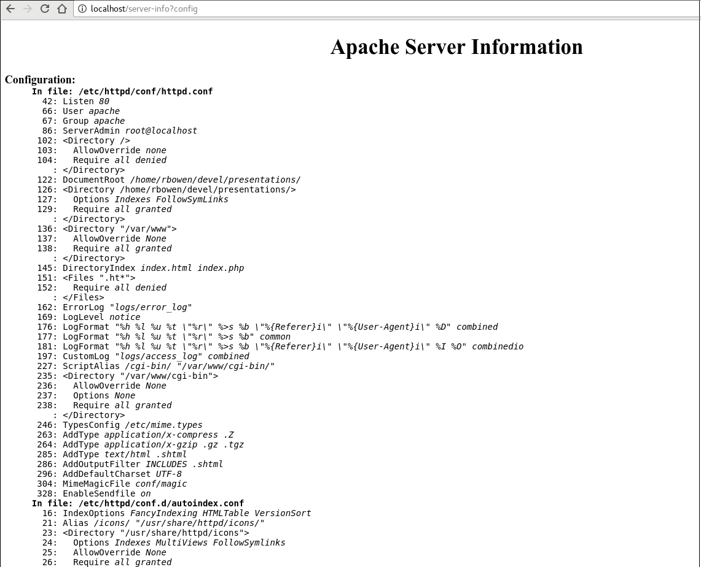
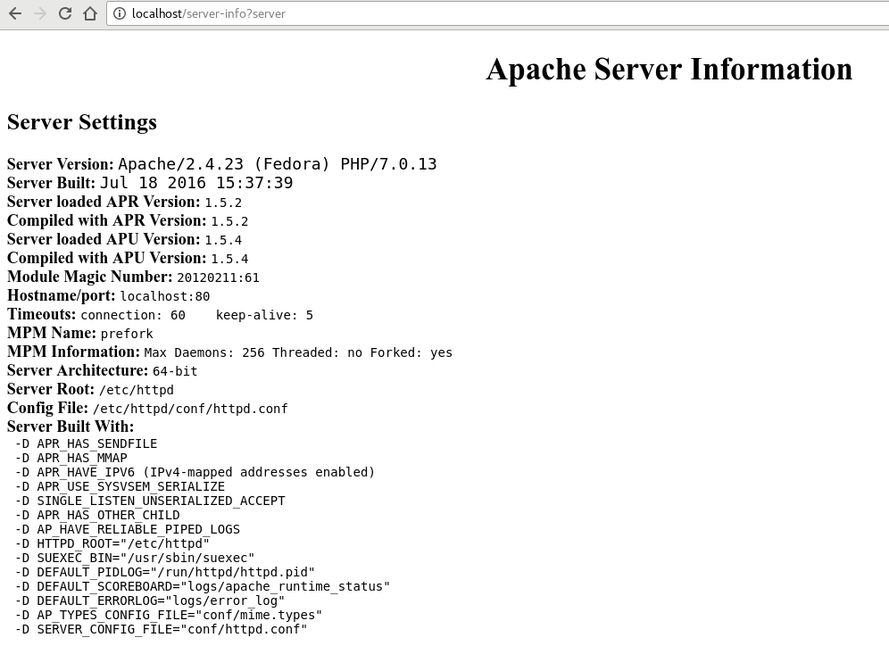
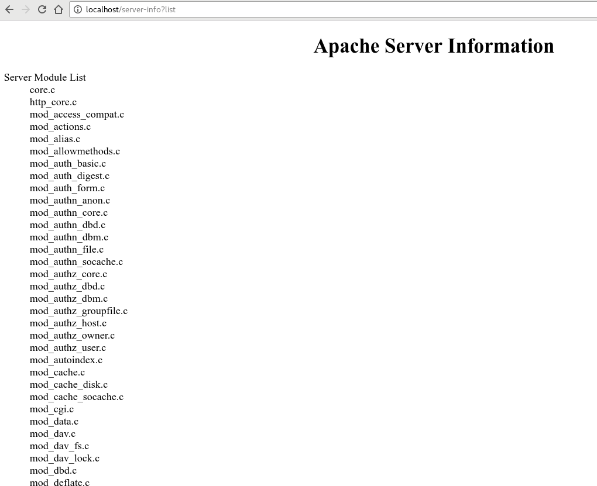
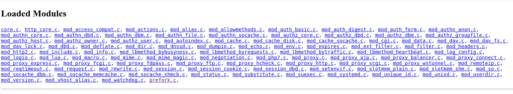
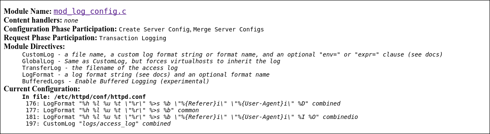
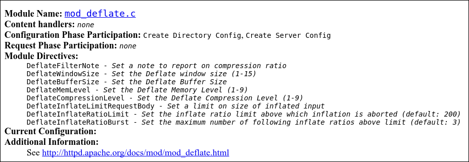
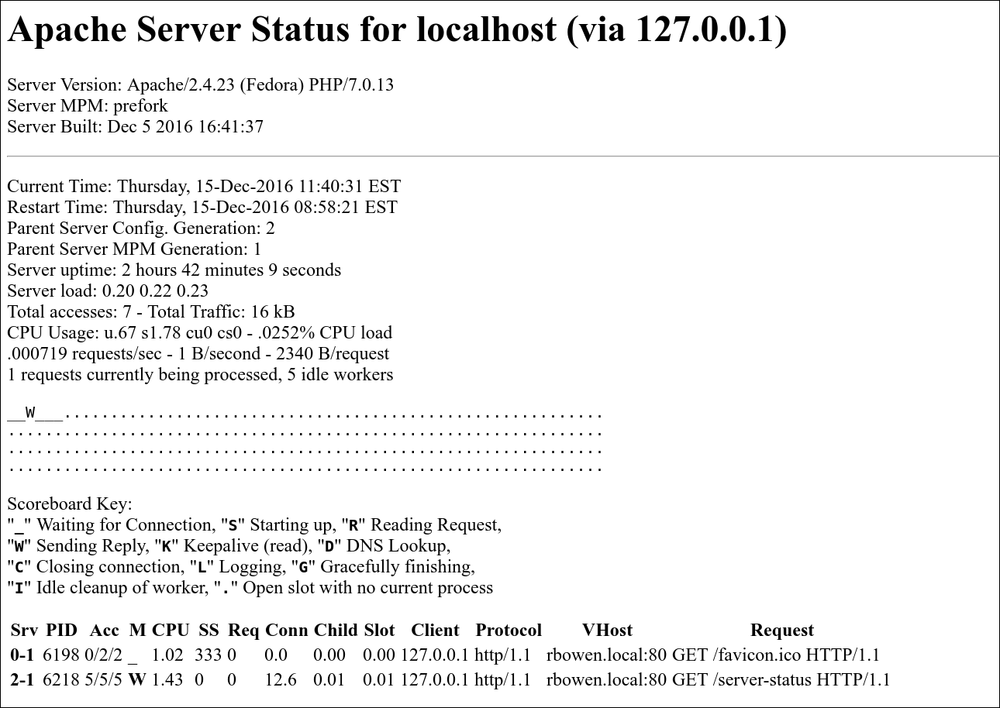
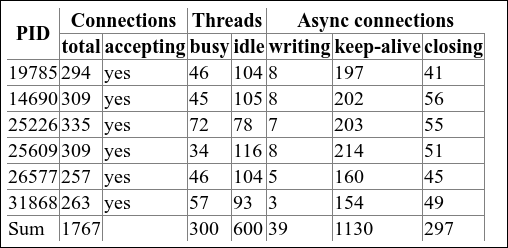

.. _Chapter_info_and_status:

=======================
mod_info and mod_status
=======================

.. epigraph::

   | Ground control to Major Tom.
   | Take your protein pills and put your helmet on.

   -- David Bowie, *Space Oddity*

.. index:: mod_info

.. index:: mod_status

.. index:: server-info

.. index:: server-status

The modules covered in this chapter, ``mod_info`` and ``mod_status``,
are two of the hidden gems in your Apache httpd toolbox. They're
standard modules, and have been for many, many years. But, I find
that many Apache httpd server admins are all but unaware that they
even exist.

The modules do what the names suggest - ``mod_info`` gives you detailed
information about your server configuration, and ``mod_status`` gives
you the current status of your server. In this chapter I'll delve
into all of the information that these modules expose to you.

.. index:: mod_info

.. index:: Modules,mod_info

.. index:: server-info

.. index:: mod_status

.. index:: Modules,mod_status

.. index:: server-status

.. admonition:: Modules covered in this chapter

   :module:`mod_info`, :module:`mod_status`

.. _Recipe_mod_info:

Enabling mod_info
-----------------

.. index:: mod_info,Enabling

.. index:: Modules,mod_info

.. index:: mod_info

.. _Problem_mod_info:

Problem
~~~~~~~

You want to enable ``mod_info`` on your server.

.. _Solution_mod_info:

Solution
~~~~~~~~

Ensure that the module is loaded:

.. code-block:: text

   LoadModule info_module modules/mod_info.so

Then configure it with the following configuration:

.. code-block:: text

   <Location /server-info>
       SetHandler server-info
   </Location>

Once you've restarted your server, you will now be able to view the
server info web pages at http://localhost/server-info

.. _Discussion_mod_info:

Discussion
~~~~~~~~~~

The information that is provided by ``mod_info`` is potentially very
sensitive, as it provides a detailed description of how your server is
configured, and will therefore be very valuable to an attacker seeking
to compromise your server.

I therefore recommend that you configure your server to protect this
information, by limiting access to this handler to requests from the
local machine:

.. code-block:: text

   <Location /server-info>
       SetHandler server-info
       Require local
   </Location>

Or, possibly, configure it to limit access to your local network:

.. code-block:: text

   <Location /server-info>
       SetHandler server-info
       Require IP 192.168.0
   </Location>

In this way, you will ensure that unauthorized people don't have
access to these details of your configuration.

The information that is displayed by ``mod_info`` is detailed in the
following recipes.

.. _See_Also_mod_info:

See Also
~~~~~~~~

* https://httpd.apache.org/docs/mod/mod_info.html

* http://localhost/server-info

* All of the following recipes, which detail what information is
  provided by ``mod_info``.

.. _Recipe_mod_info_config:

Displaying what's in your configuration
---------------------------------------

.. index:: mod_info,?config

.. index:: Current configuration

.. index:: server-info,Current configuration

.. _Problem_mod_info_config:

Problem
~~~~~~~

You want to see a snapshot of what your current server configuration
is, and what configuration files are being used.

.. _Solution_mod_info_config:

Solution
~~~~~~~~

Visit the URL http://localhost/server-info?config or
http://YourServer.tld/server-info?config to see the current
configuration.

.. _server_info_config:

.server-info?config

.. _Discussion_mod_info_config:

Discussion
~~~~~~~~~~

Passing the ``?config`` query string to the ``server-info`` handler
invokes the functionality that displays the current loaded
configuration. 

The output indicates what file, and what line number, each directive
is being loaded from. This can be very useful in determining which
files are being loaded, and the order in which the various directives are
being applied.

Comments and whitespace are not shown, nor are
directives which are executed immediately on server startup, such as
``LoadModule``.

.. _See_Also_mod_info_config:

See Also
~~~~~~~~

* http://localhost/server-info?config

* https://httpd.apache.org/docs/mod/mod_info.html#queries

.. refcosplay

.. _Recipe_mod_info_server:

Displaying basic server settings
--------------------------------

.. index:: mod_info,?server

.. index:: Server settings

.. index:: server-info,Server settings

.. index:: Version

.. _Problem_mod_info_server:

Problem
~~~~~~~

You want to see what the current basic server settings are, such as
server version, MPM in use, main configuration file, and so on.

.. _Solution_mod_info_server:

Solution
~~~~~~~~

From the command line, type

.. code-block:: text

   httpd -V

Or, with ``mod_info`` loaded, visit
http://localhost/server-info?server to see the same
information:

.. _server_info_server:

   Server settings with mod_info

.. _Discussion_mod_info_server:

Discussion
~~~~~~~~~~

Some query string keywords, such as ``?config``, display information
that is not shown by default on the ``server-info`` output. However, the
basic server settings may be accessed in two different ways - either
as a stand-alone page, or as a section on the default page.

The screenshot above shows the stand-alone info page which is displayed
when ``server-info`` is loaded using the ``?server`` query string. The
same information is also displayed when the ``#server`` page anchor is
used - that is, when the URL
http://localhost/server-info#server is loaded.

.. _See_Also_mod_info_server:

See Also
~~~~~~~~

* `http://localhost/server-info?server <http://localhost/server-info?server>`_

* https://httpd.apache.org/docs/mod/mod_info.html#queries

.. refcosplay

.. _Recipe_mod_info_modules:

mod_info_modules
----------------

.. index:: mod_info,?list

.. index:: server-info,module list

.. index:: Module list

.. index:: Loaded modules

.. _Problem_mod_info_modules:

Problem
~~~~~~~

You want to see what modules are loaded.

.. _Solution_mod_info_modules:

Solution
~~~~~~~~

From the command line type:

.. code-block:: text

   httpd -M

Or, with ``mod_info`` loaded, visit the URL
http://localhost/server-info?list.

.. _server_info_list:

.server-info?list

Or, for addtional information about each module, you can go to the
``#modules`` anchor on the main ``server-info`` page - that is, go to the
URL http://localhost/server-info#modules.

.. _server_info_loaded:

.server-info#modules

.. _Discussion_mod_info_modules:

Discussion
~~~~~~~~~~

As with the ``?server`` keyword, the module list is available in two
different ways - both as a stand-alone page, and as a section on the
default ``server-info`` page. It can be accessed with the ``?list`` query
string, or at the ``#modules`` page anchor, where you'll see a list of
modules, with each module name being a link.

(See the :ref:`Recipe_mod_info_module_details` recipe for additional
information about that option.)

.. _See_Also_mod_info_modules:

See Also
~~~~~~~~

* http://localhost/server-info?list

* https://httpd.apache.org/docs/mod/mod_info.html#queries

.. _Recipe_mod_info_module_details:

mod_info_module_details
-----------------------

.. index:: mod_info,module details

.. index:: server-info,module details

.. index:: Module details

.. index:: Detailed module information

.. _Problem_mod_info_module_details:

Problem
~~~~~~~

You want to know how you're using a particular module, and what
directives it's using.

.. _Solution_mod_info_module_details:

Solution
~~~~~~~~

With ``mod_info`` loaded, you can load a section about a particular
module. For example, to find out how ``mod_log_config`` is configured,
you might load the URL
http://localhost/server-info#mod_log_config.c

.. _server_info_log_config:

.server-info#mod_log_config.c

.. _Discussion_mod_info_module_details:

Discussion
~~~~~~~~~~

``mod_info`` provides detailed information about each module which you
have loaded. In particular, it tells you which directives the module
makes available, and which ones you are actually using, and where.

In the screenshot shown above, for example, you can see that the
configuration uses ``LogFormat`` three times, and ``CustomLog`` once. It
shows which configuration file, and which line, invokes these
directives.

.. _See_Also_mod_info_module_details:

See Also
~~~~~~~~

* http://localhost/server-info#mod_log_config.c

* http://localhost/server-info#modules

.. _Recipe_add-info:

Adding your own module info
---------------------------

.. index:: AddModuleInfo

.. index:: mod_info,AddModuleInfo

.. index:: server-info,AddModuleInfo

.. index:: Adding module details

.. _Problem_add-info:

Problem
~~~~~~~

You want to add your own information to a module's ``mod_info`` listing.

.. _Solution_add-info:

Solution
~~~~~~~~

Use the ``AddModuleInfo`` directive to add information to amodule's
``mod_info`` output.

.. code-block:: text

   AddModuleInfo mod_deflate.c 'See <a \
       href="http://httpd.apache.org/docs/mod/mod_deflate.html">\
       http://httpd.apache.org/docs/mod/mod_deflate.html</a>'
   
   AddModleInfo mod_pony.c 'No, you may not have a pony.'

.. _Discussion_add-info:

Discussion
~~~~~~~~~~

While this is particularly useful for custom modules you have loaded
on your server, you may also wish to add additional information to the
``mod_info`` output for standard modules, to make the module description
more useful.

The directives shown above add a new section to the module details
section, titled 'Additional Information:', with the text provided.

You may, as shown in the example, add HTML to the value, which will be
rendered on the page.

.. _addmoduleinfo:

   AddModuleInfo

.. _See_Also_add-info:

See Also
~~~~~~~~

* http://httpd.apache.org/docs/mod/mod_info.html#addmoduleinfo

.. _Recipe_config_at_cli:

Dumping the configuration at the command line
---------------------------------------------

.. index:: mod_info,Display configuration at the command line

.. index:: Display configuration

.. index:: Show configuration at startup

.. index:: -DDUMP_CONFIG

.. index:: mod_info,?config

.. index:: server-info,?config

.. index:: server-info,show configuration

.. _Problem_config_at_cli:

Problem
~~~~~~~

You want to show the loaded configuration at the command line.

.. _Solution_config_at_cli:

Solution
~~~~~~~~

You can dump the pre-parsed configuration at the command line during
startup by adding the ``-DDUMP_CONFIG`` command line option:

.. code-block:: text

   httpd -DDUMP_CONFIG -k start

The output of this command is roughly the same as the output produced
by the ``?config`` query string argument.

.. _Discussion_config_at_cli:

Discussion
~~~~~~~~~~

Running the above command on server startup will result in the parsed
configuration being printed to ``STDOUT`` (**i.e.**, to the console). Parsed
means that directives such as ``<IfModule>`` are evaluated, variables
are replaced by their values, ``mod_macro`` macros are evaluated, and so
on, and only the final evaluated configuration is shown.

.. _See_Also_config_at_cli:

See Also
~~~~~~~~

* http://httpd.apache.org/docs/mod/mod_info.html#startup

* :ref:`Recipe_mod_macro`

.. _Recipe_mod_status:

Enabling mod_status
-------------------

.. index:: mod_status,Enabling

.. index:: server-info,Enabling

.. index:: Modules,mod_status

.. index:: mod_status

.. _Problem_mod_status:

Problem
~~~~~~~

You want to enable ``mod_status`` on your server.

.. _Solution_mod_status:

Solution
~~~~~~~~

Ensure that the module is loaded:

.. code-block:: text

   LoadModule status_module modules/mod_status.so

Then configure it with the following configuration:

.. code-block:: text

   ExtendedStatus on
   <Location /server-status>
       SetHandler server-status
   </Location>

Once you've restarted your server, you will now be able to view the
server status web pages at http://localhost/server-status

.. _Discussion_mod_status:

Discussion
~~~~~~~~~~

Exactly what information is displayed by your ``server-status`` page
will depend on what MPM you are using. In general, however, it will
tell you how long the serer has been running, how much traffic it has
served in that time, over how many requests, and how busy your
operating system is performing that task.

It will also show a table of server processes, or threads, and what
the status of each of them is at the moment. That is, it will display
whether they are serving content, idle, logging, and so on, using the
following key:

.. code-block:: text

   Scoreboard Key:
   "_" Waiting for Connection, "S" Starting up, "R" Reading Request,
   "W" Sending Reply, "K" Keepalive (read), "D" DNS Lookup,
   "C" Closing connection, "L" Logging, "G" Gracefully finishing,
   "I" Idle cleanup of worker, "." Open slot with no current process

Finally, if you have ``ExtendedStatus`` set to ``on``, it will provide
detailed information for each process or thread, including how much it
has done across its entire lifetime, and what it is doing right now,
including, if it is active, the IP address of the client currently
accessing it, and what resource they have requested.

For an example of the ``server-status`` output of a busy website, look
at http://httpd.apache.org/server-status

If your server is running the prefork MPM, the output might look like
the diagram below:

.. _server-status:

.server-status output, Prefork

For a server running a threaded MPM, you will additionally get a table
of processes, and their corresponding threads, as shown in this
diagram.

.. _server-status-threads:

.server-status table, threaded MPM

Each line of the extended output contains the following fields:

+----------+-------------------------------------------------------------+
| Column   | Description                                                 |
+----------+-------------------------------------------------------------+
| Srv      | Child Server number - generation                            |
+----------+-------------------------------------------------------------+
| PID      | OS process ID                                               |
+----------+-------------------------------------------------------------+
| Acc      | Number of accesses this connection / this child / this slot |
+----------+-------------------------------------------------------------+
| M        | Mode of operation                                           |
+----------+-------------------------------------------------------------+
| CPU      | CPU usage, number of seconds                                |
+----------+-------------------------------------------------------------+
| SS       | Seconds since beginning of most recent request              |
+----------+-------------------------------------------------------------+
| Req      | Milliseconds required to process most recent request        |
+----------+-------------------------------------------------------------+
| Conn     | Kilobytes transferred this connection                       |
+----------+-------------------------------------------------------------+
| Child    | Megabytes transferred this child                            |
+----------+-------------------------------------------------------------+
| Slot     | Total megabytes transferred this slot                       |
+----------+-------------------------------------------------------------+
| Protocol | The protocol of the current request                         |
+----------+-------------------------------------------------------------+
| VHost    | The virtual host from which the request is being served     |
+----------+-------------------------------------------------------------+
| Request  | The request that was made                                   |
+----------+-------------------------------------------------------------+

For example, one such row might look like:

.. code-block:: text

   5-10    26577   0/399/72780 _   885.25  0   0   0.0 10.06   3524.23
   190.131.200.8   www.openoffice.org:80   
   GET /ProductUpdateService/check.Update HTTP/1.1

The ``generation`` of a particular slot indicates how many times a
particular process has been reaped and restarted.

As with ``mod_info``, you probably want to restrict access to this
resource to requests either from the server itself, or from your local
network. Alternatively, you might wish to protect the resource using a
password.

.. _apacheckbk-CHP-11-NOTE-120:

.. warning::

   The server status display shows activity across the entire
   server—including virtual
   hosts. If you are providing hosting services for others, you may not
   want them to be able to see this level of detail about each
   other.

.. _See_Also_mod_status:

See Also
~~~~~~~~

* http://httpd.apache.org/docs/mod/mod_status.html

* http://httpd.apache.org/server-status

* http://localhost/server-status

* :ref:`Recipe_mod_info`

.. _Recipe_server-status-refresh:

server-status-refresh
---------------------

.. index:: server-status,Automatic updates

.. index:: Automatic updates of server status

.. index:: mod_status,Automatic updates

.. index:: mod_status,?refresh

.. _Problem_server-status-refresh:

Problem
~~~~~~~

You want the ``server-status`` page to automatically update, so that it
shows a live view of your server's status.

.. _Solution_server-status-refresh:

Solution
~~~~~~~~

Tell the ``server-status`` page to automatically refresh every N seconds
by adding the query string argument ``?refresh=N``. For example to
update your status page every 5 seconds, use the URL
http://localhost/server-status?refresh=5

.. _See_Also_server-status-refresh:

See Also
~~~~~~~~

* http://httpd.apache.org/docs/mod/mod_status.html#autoupdate

* http://localhost/server-status?refresh=5

.. _Recipe_server-status-auto:

Machine readable output from server-status
------------------------------------------

.. index:: server-status,Machine readable output

.. index:: mod_status,Machine readable output

.. index:: server-status,?auto

.. index:: mod_status,?auto

.. index:: Machine readable output from server-status

.. _Problem_server-status-auto:

Problem
~~~~~~~

You'd like for ``server-status`` to output a machine-readable output.

.. _Solution_server-status-auto:

Solution
~~~~~~~~

Add the ``?auto`` query string to the end of a ``server-status`` URL to
have the output in machine-readable format rather than the usual
human-readable format. For example you might use the URL
http://localhost/server-status?auto

.. _Discussion_server-status-auto:

Discussion
~~~~~~~~~~

The most common reason for wanting a machine-readable output for
``server-status`` is in order to write a script of some kind that
consumes this output for some reason. For example you might want to
log the output over time, or you might want to draw graphs of the
data.

The data that is provided is the same as what is provided in the
regular view of ``server-status``, except that the per-process request
information is not shown, even when ``ExtendedStatus`` is set to ``on``.

Example output from the ``?auto`` argument is shown below:

.. code-block:: text

   localhost
   ServerVersion: Apache/2.4.23 (Fedora) PHP/7.0.13
   ServerMPM: prefork
   Server Built: Dec  5 2016 16:41:37
   CurrentTime: Thursday, 15-Dec-2016 12:21:42 EST
   RestartTime: Thursday, 15-Dec-2016 08:58:21 EST
   ParentServerConfigGeneration: 2
   ParentServerMPMGeneration: 1
   ServerUptimeSeconds: 12201
   ServerUptime: 3 hours 23 minutes 21 seconds
   Load1: 0.23
   Load5: 0.35
   Load15: 0.31
   Total Accesses: 43
   Total kBytes: 193
   CPUUser: 2.37
   CPUSystem: 7.09
   CPUChildrenUser: 0
   CPUChildrenSystem: 0
   CPULoad: .0775346
   Uptime: 12201
   ReqPerSec: .0035243
   BytesPerSec: 16.198
   BytesPerReq: 4596.09
   BusyWorkers: 1
   IdleWorkers: 8
   Scoreboard:
   ________W..............................................
----------------------------------------------------------
----------------------------------------------------------
----------------------------------------------------------
----------------------------------------------------------

An example Perl program named ``log_server_status`` is provided in the
``/support`` directory of your httpd installation, which
generates a simple log file of active vs idle server processes, and
CPU load. It may be run periodically **via** a ``cron`` job to log this
information as frequently as you require.

There are also a variety of third-party utilities which use
``server-status`` as their information source, and generate statistical
reports over time. See the ``See Also`` section below for a link to one
article describing how to graph ``server-status`` output using Cacti.

The ``server-status`` output is also available in machine-readable
format using the ``?auto`` query string parameter, which can be
parsed by monitoring tools.

.. _See_Also_server-status-auto:

See Also
~~~~~~~~

* http://httpd.apache.org/docs/mod/mod_status.html#autoupdate

* http://localhost/server-status?auto

* https://jose-manuel.me/2014/10/graph-apache-statistics-cacti-updated/

* :ref:`Recipe_server-status-fancy`

.. _Recipe_server-status-troubleshoot:

Using server-status to troubleshoot problems
--------------------------------------------

.. index:: server-status,troubleshooting with

.. index:: mod_status,troubleshooting with

.. index:: Troubleshooting,with server-status

.. _Problem_server-status-troubleshoot:

Problem
~~~~~~~

You want to use ``server-status`` to idenfity which requests or
processes are causing problems on your server, and possibly take
corrective action.

.. _Solution_server-status-troubleshoot:

Solution
~~~~~~~~

By comparing the output of the ``server-status`` page, and the output of
a command line utility such as ``top``, you can identify specific
requests which are generating high server load, and take action
against them. For example, if you notice a particular ``httpd`` process,
in top, which is consuming an unsual amount of server resources
(memory or CPU time), you can then search for that specific process
ID (PID) in the ``server-status`` page, and, from there, correlate it to
a specific client or request.

The ``server-status`` page can also be very beneficial in identifying
the fact that a large percentage of your requests are going to a
particular virtual host, or to a particular URL, so that you can focus
your attentions on optimizing that specific resource.

.. _Discussion_server-status-troubleshoot:

Discussion
~~~~~~~~~~

This is more art than science, but it's a pretty good way to get
started on investigating either attacks on your server, or resources
on your server which are consuming an inordinate amount of server
resources. Most of the actual troubleshooting is going to happen in
the error logs.

Watching the ``server-status`` page can, however, be a great way to
identify the problems in the first place.

.. _See_Also_server-status-troubleshoot:

See Also
~~~~~~~~

* :ref:`Recipe_Correlating_error_access`

.. _Recipe_server-status-hide-ip:

Obfuscating the IP address in server-status output
--------------------------------------------------

.. index:: server-status,Obfuscating IP addresses

.. index:: Obfuscating IP addresses in server-status

.. index:: Hiding IP addresses in server-status

.. _Problem_server-status-hide-ip:

Problem
~~~~~~~

You'd like to hide, or obscure, IP addresses in server-status output
to protect the identity of your visitors.

.. _Solution_server-status-hide-ip:

Solution
~~~~~~~~

Use ``mod_substitute`` to modify the IP addresses in the output:

.. code-block:: text

   <Location /server-status>
     SetHandler server-status
     AddOutputFilterByType SUBSTITUTE text/html
     Substitute s/(\d+\.\d+\.)\d+\.\d+/$1x.x/
   </Location>

.. _Discussion_server-status-hide-ip:

Discussion
~~~~~~~~~~

The recipe shown will replace the last two digits of an IP address
with ``x``. Thus, an address of ``172.20.15.99`` will instead be displayed
as ``172.20.x.x``, providing a degree of privacy for your visitors.

.. admonition:: DRAFT — Review needed

   The following content needs editorial review.
   Check technical accuracy, voice/tone, and fit with surrounding content.

**Why you might want this.** The ``server-status`` page displays the
IP address of every client currently being served. If you expose this
page to a wider audience (for monitoring dashboards, for example),
you may want to protect your visitors' privacy by partially
redacting those addresses.

**ExtendedStatus and what it reveals.** The ``ExtendedStatus On``
directive (which is automatically enabled when :module:`mod_status` is
loaded in httpd 2.4) causes httpd to track per-request details in
the scoreboard, including the client IP, the request URI, and the
virtual host being served. Without ``ExtendedStatus``, the
``server-status`` page shows only basic worker state (idle, reading,
sending, etc.) with no client-identifying information at all. If
privacy is your primary concern, you could simply set
``ExtendedStatus Off``, though you'll lose all the useful
request-level detail.

**IPv6 addresses.** To also match IPv6 addresses, you'll need to add
a regex to match them, which can be surprisingly difficult to get
right. IPv6 addresses can appear in many different notations
(full, compressed, mixed IPv4-mapped, etc.).

If you need to obfuscate IPv6 addresses in ``server-status``, you might
consider using the solution discussed in
:ref:`Recipe_server-status-fancy`.

.. _See_Also_server-status-hide-ip:

See Also
~~~~~~~~

* Regular Expressions Cookbook by Jan Goyvaerts and Steven Levithan -
  https://www.oreilly.com/library/view/regular-expressions-cookbook/9781449327453/

* The :module:`mod_status` documentation at
  https://httpd.apache.org/docs/current/mod/mod_status.html

* :ref:`Recipe_server-status-fancy`

.. _Recipe_server-status-fancy:

Graphical output from server-status
-----------------------------------

.. index:: server-status,fancy output

.. index:: mod_status,fancy output

.. index:: Fancy output from mod_status

.. index:: Humbedooh

.. _Problem_server-status-fancy:

Problem
~~~~~~~

You'd like for the output from mod_status to be more attractive, and
possibly more graphical.

.. _Solution_server-status-fancy:

Solution
~~~~~~~~

There have been a number of third-party add-ons to ``mod_status`` over
the years, which render the output more graphically, with various
graphs and charts.

The current best-of-breed solution for this is from Github user
Humbedooh, also known as Daniel Gruno, who provides the ``mod_lua``
based solution available at
https://github.com/Humbedooh/server-status

The code provided there can be enabled one of two ways, once you have
``mod_lua`` installed.

To install it as a handler, add the following to your ``httpd.conf``:

.. code-block:: text

   LuaMapHandler ^/server-status$ /path/to/server-status.lua

To install as a plain web-app, enable ``.lua`` scripts to be handled by
``mod_lua``, by adding the following to your configuration:

.. code-block:: text

   AddHandler lua-script .lua

Then, put the provided ``.lua`` script somewhere in your document root and
visit the page.

.. _Discussion_server-status-fancy:

Discussion
~~~~~~~~~~

The results of the above configuration
will be a live-updating graphical representation of your
current server status. It will show most of the information provided
by ``mod_status`` itself, a few live-udpating graphs of server resource
usage, and a list of the most expensive (in server resources) requests
that your server has handled recently.

This utility is a third-party program - meaning that it is not a
standard part of httpd, and thus has no guarantees
attached to it. However, it is developed by someone who is actively
involved in the httpd project, and so is likely to continue to be
developed in the future.

You must have ``mod_lua`` installed in order to use this script.

.. _See_Also_server-status-fancy:

See Also
~~~~~~~~

* https://github.com/Humbedooh/server-status

Summary
-------

The modules ``mod_status`` and ``mod_info`` are often discussed together,
since they provide related functionality - providing additional
information about your server, and what it is doing. These resources
are very helpful to server administrations trying to find out more
about the servers that they are responsible for.

